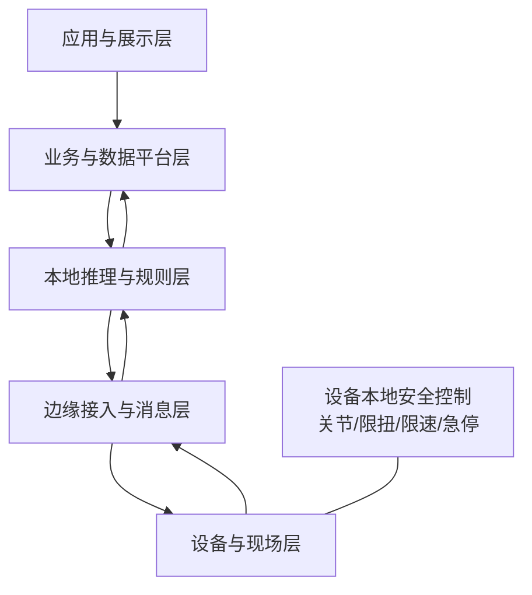

# EWOH 总体技术架构

## 组件
- 设备与现场层：外骨骼控制器、IMU、力矩、穿戴生理、UWB/视觉/环境传感器。
- 边缘接入层：协议适配、时间同步、消息标准化、缓存补传、设备心跳。
- 本地推理层：动作识别、姿态/负荷/疲劳趋势、风险规则、任务打分。
- 数据与业务层：人员、设备、任务、区域、遥测、推理、事件、审计。
- 应用层：实时态势、事件、回放、任务协同、场景评估、本地助手。

## 不可变控制边界
人体关节控制、限扭、限速、急停、异常退出和设备失联安全态必须留在设备控制器。平台和大模型不得绕过。

## Mermaid

