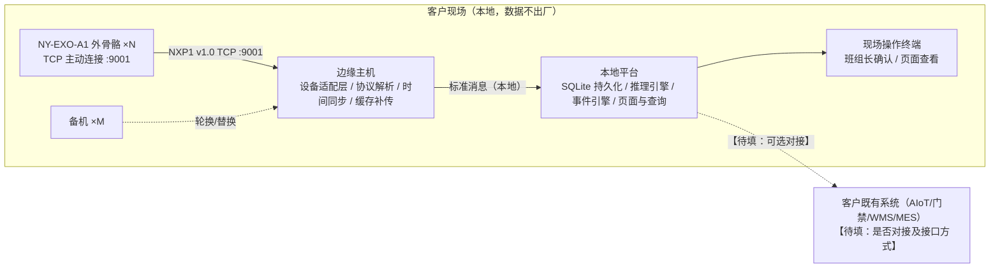

# 03 系统部署拓扑

## 1. 总体拓扑

## 2. 组件与端口

| 组件 | 部署位置 | 端口/协议 | 说明 |
|---|---|---|---|
| NY-EXO-A1 设备 | 作业人员穿戴 | TCP 客户端，主动连接边缘主机，默认端口 9001 | 协议 NXP1 v1.0，心跳 1s、遥测 20Hz |
| 边缘主机 | 客户现场机房/机柜【待填：位置】 | 监听 TCP 9001 | 设备接入、协议解析、断线缓存补传接收 |
| 本地平台服务 | 边缘主机或现场服务器【待填】 | 页面访问端口【待填】 | 存储/推理/事件/页面，全部本地运行 |
| 操作终端 | 班组现场 | 浏览器访问本地平台 | 任务确认、事件查看 |

## 3. 网络与离线说明
- 系统默认**全本地运行，不依赖公网**；断公网不影响采集、推理、事件与页面功能。
- 设备与边缘主机之间断连：设备本地缓存（最多 300 条），重连后先发 IDENT 再 BACKFILL 补传；平台 5s 未收任何帧判离线并明确显示，恢复后无需人工重启平台。
- 任何数据外传须经字段级清单、脱敏与书面授权（见《05_数据处理协议》）。

## 4. 部署清单

| 项 | 数量 | 位置 | 责任人 | 状态 |
|---|---|---|---|---|
| 边缘主机 | 【待填】 | 【待填】 | 【待填】 | 【待填】 |
| 本地平台服务器 | 【待填】 | 【待填】 | 【待填】 | 【待填】 |
| 网络（交换机/无线覆盖） | 【待填】 | 【待填】 | 【待填】 | 【待填】 |
| 充电与存放柜 | 【待填】 | 【待填】 | 【待填】 | 【待填】 |

## 5. 现场前置条件确认
- 电源与网络点位：【待填】
- 客户 IT 安全审批：【待填】
- 数据不出厂确认：【待填：是/否及具体要求】
