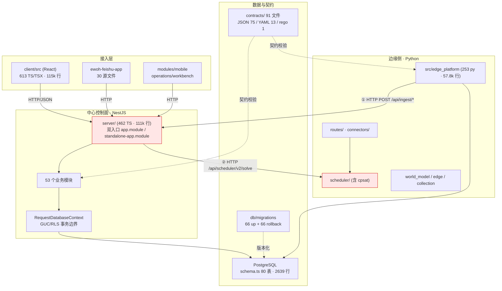
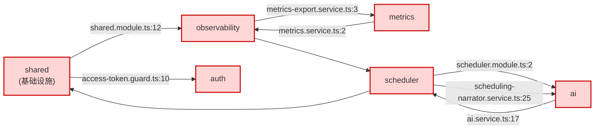
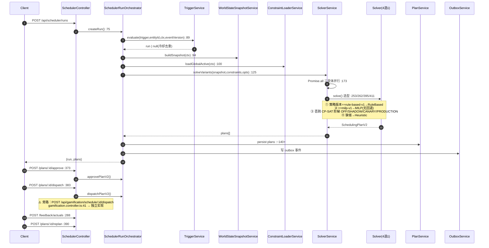
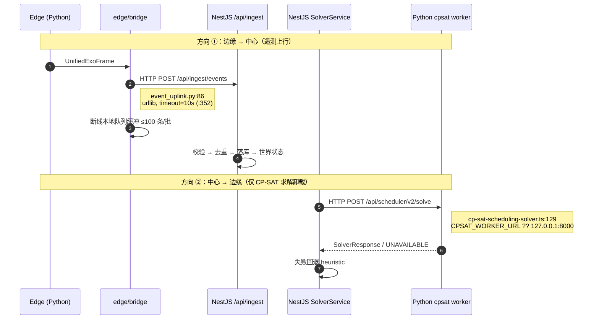
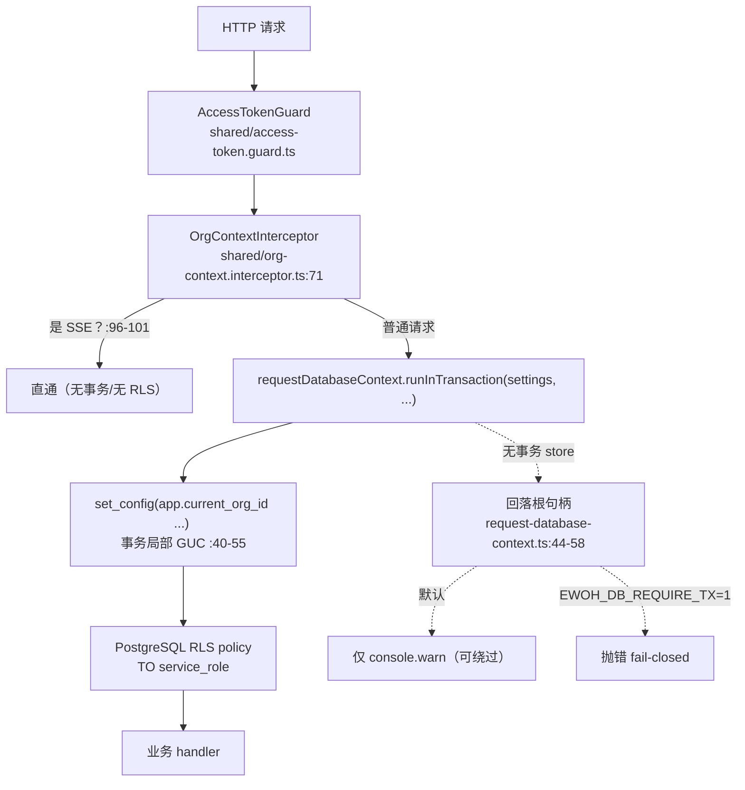

# EWOH 平台架构层深度测绘与薄弱点诊断

> 作者：高见远（架构师）｜范围：架构层（模块划分 / 依赖拓扑 / 核心链路 / 数据架构 / 分层模型）
> 基线：仓库根 `/Volumes/Extra/CodeProj/EWOH`
> 方法：直接 Glob/Grep/Read 取证 + 脚本化依赖图构建（非人工估算）
> 说明：**本报告只做分析，未修改任何源码**。所有结论附 `文件:行号` 证据；无法证实的标注「未验证」。

---

## 0. 执行摘要

1. **server 实际有 53 个模块，不是 38 个**（`server/modules/` 目录实测），任务书清单遗漏了 `spatial / control / approval / resource / world-cursor / files / health / mes / oee / erp / events / policy / onboarding / workflow / identity / maintenance / workorder / inference` 等 18 个模块。
2. **发现一个此前未被记录的严重缺陷：调度派工（dispatch）存在两套并行实现**——`scheduler.controller.ts:383` 与 `gamification.controller.ts:41`，后者在 gamification 模块内**独立重写**了方案校验、租户校验、冲突检测与状态落库（`gamification.service.ts:537-620`）。
3. **求解器实为 4 个而非 2 个**：heuristic(2000行) / cp-sat(925) / milp(659) / rule-based(354)，且选型与回退语义**三套互相不一致**。
4. **任务书给定前提 ① 被证伪**：NestJS 侧**不存在** `SCHEDULING_READ_ONLY` 守卫（全仓 TS/JSON/YAML 零命中）。该约束**只在 Python 侧实现**，属于单边强制。
5. Python `scheduler/` 与 NestJS `scheduler/` **判定为重复实现（非合理分层）**——决定性证据是 production 下 Edge 方案在云重连时被**整体删除**（`scheduler_service.py:193-222`），不存在任何收敛回中心的执行路径。
6. **`shared` 是全局耦合枢纽且自身成环**：被 52 个模块引用（226 处 import），同时反向依赖 `observability` 与 `auth`，形成超大环簇。
7. **双入口代价被低估**：legacy 入口比 standalone 少装配 12+ 模块、缺 `TracingInterceptor`、缺 `FilesModule`/`HealthModule`，且 legacy 默认**已被禁用**（`main.ts:48-53`）。
8. 数据架构整体健康度好于代码架构：80 张表、66 个正向迁移 **全部配 rollback**、RLS 角色模型正确（`NOBYPASSRLS` + 继承 `service_role`）；但存在 **2 个迁移编号断号**（`standalone_033`、`standalone_055`）。

---

## 1. 系统全景与分层模型

### 1.1 物理分层

### 1.2 分层契约评估

| 维度 | 判定 | 证据 |
|---|---|---|
| 中心 ↔ 边缘通信方式 | **HTTP，双向但用途单一** | 边缘→中心：`edge/bridge/event_uplink.py:86` POST `/api/ingest/events`；`edge_to_spark.py`（docstring 第 3-5 行）POST `/api/ingest/exoskeleton`。中心→边缘：`cp-sat-scheduling-solver.ts:129` `CPSAT_WORKER_URL ?? 'http://127.0.0.1:8000'` |
| 契约是否共享 | **是（强项）** | `contracts/` 91 文件被 TS 与 Python 共同引用；`scheduler/__tests__/solver-contract-parity.spec.ts:1-9` 显式做 TS↔Python golden fixture 对拍 |
| 跨层直连 | **存在** | Python `scheduler/routes/scheduler.py:9` 自行暴露完整调度 API（`/api/assignments/{id}/start\|pause\|complete\|cancel\|override`），与 NestJS `scheduler.controller.ts` 形成**两个平行的调度 API 面** |
| 反向依赖 | **存在** | `modules/shared/`（基础设施层）反向依赖业务模块 `observability` 与 `auth`，见 §3.3 |

**分层结论**：分层意图清晰（中心权威 / 边缘 advisory / 契约共享），并投入了跨语言契约对拍测试，**这在同类项目中属于做得好的部分**。但存在两处分层破损：① 边缘侧自行暴露了与中心同构的调度 API 面；② 基础设施层 `shared` 反向依赖业务层。

---

## 2. 模块划分与职责边界

### 2.1 53 个模块职责表

> 按代码规模降序。`Fan-in` = 有多少个其他模块 import 它。

| # | 模块 | 文件 | 行 | Fan-in | 职责一句话 |
|---|---|---:|---:|---:|---|
| 1 | **scheduler** | 75 | 30,778 | 10 | 调度域全栈：世界状态、候选生成、4 种求解器、方案/审批/派工/重排/反馈闭环 |
| 2 | operations | 14 | 4,230 | 0 | 运维工作台聚合：资产/工具/任务 CRUD + 角色工作台 + 视图导出 + 危险动作二次确认 |
| 3 | work-orchestration | 4 | 2,767 | 0 | **AI 智能体研发交付编排**（WorkItem/Wave/Gate/Handoff/Evidence/Git-Sync），非制造工单域 |
| 4 | scale | 4 | 2,248 | 0 | 规模化复制：工厂模板/配置档/资产包/复制会话 |
| 5 | ingest | 5 | 2,123 | 1 | 多源数据摄取（外骨骼/环境/相机/MES/空间扫描/定位/通用事件）+ 校验去重落库 |
| 6 | mes | 3 | 1,606 | 3 | MES 订单与工序同步 |
| 7 | **shared** | 18 | 1,597 | **52** | **横切基础设施**：鉴权 guard、租户 GUC、审计、幂等、限流、Redis、分页 |
| 8 | agent | 6 | 1,555 | 1 | 智能体清单注册、执行、监督者、审批与工具集 |
| 9 | files | 8 | 1,548 | 0 | 文件对象存储（S3 预签名上传下载） |
| 10 | learning | 7 | 1,424 | 0 | 学习提案/结果标注/影子评估/回滚（策略自优化回路） |
| 11 | ai | 4 | 1,398 | 2 | LLM 接入（Ark）、调度建议、方案生成、对话 |
| 12 | dashboard | 4 | 1,397 | 0 | 看板聚合指标 |
| 13 | gamification | 3 | 1,262 | 0 | 资源分配/任务编排/积分激励 —— **含第二套派工实现** |
| 14 | simulator | 4 | 939 | 0 | 仿真运行时控制（start/stop/status）+ 数据保留 |
| 15 | control | 3 | 882 | 0 | 设备控制指令下发、回执、撤销（闭环控制面） |
| 16 | notification | 6 | 873 | 2 | 通知生成、投递、已读与重试 |
| 17 | approval | 4 | 840 | 1 | 通用审批流（步骤推进/待办/**绕过 bypass**） |
| 18 | exo | 5 | 836 | 1 | 外骨骼设备会话与配置 |
| 19 | observability | 8 | 779 | 2 | Prometheus 指标导出、慢查询、边缘指标接收 |
| 20 | world | 3 | 757 | 0 | 世界状态查询、事件链溯源、重放 |
| 21 | resource | 3 | 670 | 0 | 资源发放/回收与状态 |
| 22 | oee | 3 | 667 | 0 | 设备综合效率计算、安灯呼叫 |
| 23 | auth | 5 | 608 | 1 | 认证与令牌校验 |
| 24 | parameters | 3 | 594 | 0 | 参数中心（版本化键值 + 审批） |
| 25 | onboarding | 3 | 573 | 0 | 入驻引导清单与样例工厂 |
| 26 | organization | 3 | 534 | 0 | 组织与租户主数据 |
| 27 | erp | 3 | 482 | 0 | ERP 订单与出库同步 |
| 28 | knowledge | 3 | 474 | 1 | 知识条目与共享 |
| 29 | world-cursor | 3 | 441 | 0 | 世界状态游标（增量快照/delta 读取） |
| 30 | tracing | 4 | 412 | 1 | 分布式追踪 span 采集与查询 |
| 31 | workflow | 4 | 407 | 0 | 工作流实例推进 |
| 32 | system | 3 | 407 | 0 | 系统配置键值 |
| 33 | identity | 3 | 403 | 1 | 身份映射解析 |
| 34 | reliability | 3 | 390 | 1 | 死信队列重投/丢弃 |
| 35 | simulation | 3 | 380 | 1 | 仿真运行结果查询（只读） |
| 36 | workorder | 3 | 339 | 3 | 工单状态机流转 |
| 37 | task | 3 | 339 | 1 | 任务状态机流转 |
| 38 | inference | 3 | 324 | 2 | 推理结果读写 |
| 39 | maintenance | 3 | 321 | 0 | 设备维保条件状态机 |
| 40 | quality | 3 | 309 | 0 | 质量发现状态机 |
| 41 | mobile | 3 | 298 | 0 | 移动端工位作业（扫码/报工） |
| 42 | rule-engine | 2 | 291 | 2 | 规则评估引擎 |
| 43 | aas | 3 | 288 | 0 | 资产管理壳（AAS）语义模型 |
| 44 | metrics | 4 | 271 | 2 | 指标采集与暴露 |
| 45 | spatial | 3 | 270 | 0 | 空间实体/拓扑/层级 |
| 46 | model | 3 | 246 | 0 | 模型注册表状态机 |
| 47 | timeline | 4 | 224 | 0 | 时间线事件查询 |
| 48 | alert | 3 | 221 | 0 | 告警状态机 |
| 49 | reasoning | 3 | 216 | 0 | 规则推理评估 |
| 50 | audit | 3 | 211 | 0 | 审计日志 |
| 51 | policy | 3 | 166 | 0 | 策略评估（OPA 风格） |
| 52 | health | 3 | 146 | 0 | 存活/就绪探针 |
| 53 | events | 3 | 100 | 0 | 事件目录（catalog） |
| 54 | view | 2 | 26 | 0 | 兜底路由/视图渲染（必须最后注册） |

> 注：上表 54 行含 `view`；`server/modules/` 下目录数为 53（`scheduler` 计数包含 `__tests__` 内非 spec 辅助文件）。

### 2.2 职责重叠 / 命名混淆判定

| 混淆对 | 实际差异 | 判定 | 证据 |
|---|---|---|---|
| **simulation vs simulator** | simulation=仿真结果**只读查询**（1 路由 `GET :runId`）；simulator=仿真**运行时控制**（start/stop/status）+ retention | ⚠️ **命名混淆，职责尚可区分**。建议改名 `simulation-runs` / `simulation-runtime` | `simulation.controller.ts:39`；`simulator.controller.ts:14,19,24` |
| **task vs workorder vs work-orchestration** | task=制造任务状态机；workorder=工单状态机；**work-orchestration=AI 智能体研发交付编排**，与制造工单**完全不是同一域** | 🔴 **work-orchestration 严重误命名**，应改名 `agent-delivery-orchestration` 或 `devops-orchestration` | `work-orchestration.service.ts:36-60`（WorkItem/WorkEdge/wave/agents）；`work-orchestration.controller.ts:20-124`（agents/gates/risks/handoffs/git-sync） |
| **world vs world-cursor vs scheduler/world-state.service** | world=世界状态查询+事件链+重放；world-cursor=增量快照/delta；**scheduler 下另有一套 `world-state.service.ts`(1072行)** | 🔴 **三处世界状态实现**。scheduler 内的 `world-state.service.ts:1072` 与 `world` 模块职责高度重叠 | `world.controller.ts:11,26,34`；`world-cursor.controller.ts:16,21`；`scheduler/world-state.service.ts`（1072 行） |
| **ai vs agent vs reasoning vs inference vs learning** | ai=LLM 接入与建议；agent=智能体注册执行；reasoning=规则推理；inference=推理结果存储；learning=策略自优化 | ⚠️ **五模块切分过细但边界基本清晰**。真正问题是 `ai ↔ scheduler` 双向依赖（§3.3） | `ai.controller.ts:139,212,254`；`agent.controller.ts:54,77`；`reasoning.controller.ts:20` |
| **operations vs work-orchestration** | operations=现场运维工作台（资产/工具/任务+角色工作台+导出+危险动作）；work-orchestration=研发交付编排 | 🟡 **名称相似但域不同**；operations 自身是 4 合 1 的杂物抽屉，应拆分 | `operations.controller.ts`（role-workbench / workbench / dangerous / assets / tasks / tools） |

### 2.3 需合并 / 重命名 / 废弃建议

| 动作 | 目标 | 理由 |
|---|---|---|
| **重命名** | `work-orchestration` → `agent-delivery-orchestration` | 名称与制造工单域混淆，实为 AI 研发交付编排 |
| **归并** | `world` + `world-cursor` + `scheduler/world-state.service.ts` → 单一 `world-state` 域 | 三处世界状态实现，语义漂移风险高 |
| **拆分** | `operations` → `ops-assets` / `role-workbench` / `workbench-export` / `dangerous-action` | 单模块承载 4 类无关关注点，含 940 行 `role-workbench.service.ts` |
| **重命名** | `simulation` → `simulation-runs`；`simulator` → `simulation-runtime` | 消除近似命名 |
| **废弃评估** | `gamification` 内的派工实现 | 与 scheduler 派工重复（见 §5.1） |
| **未验证** | 20 个「薄模块」（3 文件 / ~330 行：quality/maintenance/model/alert/…）是否为纯 CRUD 桩 | 需逐个读 service 实现，本轮未逐文件核实 |

---

## 3. 依赖拓扑与耦合

### 3.1 度量方法

脚本遍历 `server/modules/**/*.ts`（排除 `.spec.ts`/`.d.ts`），解析 `from '...'` 与动态 `import('...')` 的相对路径，取 `(../)+<模块名>/` 首段作为目标模块。实测**跨模块 import 共 304 条**。

### 3.2 枢纽模块（耦合热点）

**Fan-in（被依赖最多）**

| 排名 | 模块 | 被 N 个模块依赖 | import 次数 |
|---|---|---:|---:|
| 1 | **shared** | **52** | **226** |
| 2 | scheduler | 10 | 18 |
| 3 | workorder | 3 | 6 |
| 3 | mes | 3 | 6 |
| 5 | inference / ai / metrics / rule-engine | 2 | 4 |

**Fan-out（依赖别人最多）**

| 排名 | 模块 | 依赖 N 个模块 | import 次数 |
|---|---|---:|---:|
| 1 | **scheduler** | 5 | **70** |
| 2 | ingest | 8 | 17 |
| 3 | observability | 5 | 13 |
| 4 | agent | 4 | 12 |
| 5 | ai | 3 | 8 |

> **结论**：`shared` 是**入度枢纽**（52/53 模块依赖它，其中 60 次来自 scheduler 单模块），`scheduler` 是**出度枢纽**（70 次对外依赖）。二者构成系统的耦合十字路口。

### 3.3 循环依赖检测

**检测到的环（DFS 全量枚举）**

| 环 | 严重度 | 证据 |
|---|---|---|
| `scheduler → ai → scheduler` | 🔴 高（**含 Nest Module 级环**） | `scheduler/scheduler.module.ts:2` import `../ai/ai.module`；`ai/ai.service.ts:17` import `../scheduler/plan-tenant-guard` |
| `shared → observability → shared` | 🔴 高 | `shared/shared.module.ts:12` import `../observability/slow-query.service`；而 observability 依赖 scheduler，scheduler 依赖 shared（60 次） |
| `shared → auth → shared` | 🟡 中 | `shared/access-token.guard.ts:10` import `../auth/auth.service` |
| `observability → metrics → observability` | 🟡 中 | `observability/metrics-export.service.ts:3` ↔ `metrics/metrics.service.ts:2` |
| 其余 15 条环 | 🟡 | 均为「`shared → observability → X → shared`」形态，根因同为 shared 反向依赖 |

> **根因诊断**：所有环的**最小割点是 `shared`**。它作为基础设施层却 import 了业务层的 `observability` 与 `auth`，而全系统 52 个模块又 import `shared`，导致环簇规模爆炸（20 条环中 15 条经过 shared）。
> **修复方向**：把 `slow-query.service` 与 `auth.service` 的依赖反转（下沉类型 / 改为 `@Optional()` 注入 / 提取 `shared-kernel` 无依赖内核），即可一次性消除 15 条环。

### 3.4 跨模块私有实现泄漏

| 泄漏点 | 问题 | 证据 |
|---|---|---|
| `ai/ai.service.ts:17` → `../scheduler/plan-tenant-guard` | AI 模块直接引用 scheduler **内部**守卫实现，而非其公开接口 | 同上 |
| `scheduler/narration/scheduling-narrator.service.ts:25` → `../../ai/ark.service` | 直接引用 ai 的**内部服务** `ark.service`，非 `AiModule` 导出面 | 同上 |
| `shared/` 被全量引用但**无 barrel/index 收敛** | 18 个文件散装暴露，任何模块可引用任意内部符号 | `shared/` 目录无 `index.ts` |
| `gamification` 直接操作 `ewohSchedulePlan` 表 | 绕过 scheduler 领域边界，直接读写调度核心表 | `gamification.service.ts:546-548, 616-617` |

---

## 4. 核心链路梳理

### 4.1 调度主链路

**入口 → 关键节点 → 出口**

| 环节 | 位置 | 标注 |
|---|---|---|
| ① 触发 | `scheduler.controller.ts:233` → `scheduler-run-orchestrator.service.ts:75` | — |
| ② 触发评估/冷却去重 | `trigger.service.evaluate()` @ `:89` | 手动触发用**秒级时间戳**作幂等键（`:88`，曾因毫秒超 int4 上限致 500） |
| ③ 世界状态快照 | `world-state.service.ts` (1072行) @ `:94` | 🔴 **同步阻塞**：全量快照构建在请求线程内 |
| ④ 约束加载 | `constraint-loader.service.ts` @ `:98-101` | `constraintLoader` 为 `undefined` 时**静默降级为空约束**（`:101`），人工 LOCK 可能丢失，无告警 |
| ⑤ 求解 | `solver.service.ts:139` `solveVariants` → `:173` 三变体 `Promise.all` 并行 | ⚠️ 三变体并行 = 3× CPU；共享 `routeCostMemo` 已优化（`:168`） |
| ⑥ 求解器选型 | `solver.service.ts:253 / :262 / :387-415` | 🔴 **语义不一致**（见 §5.2） |
| ⑦ 落库 + 事件 | `plan.service.ts` (1336行) + `outbox.service.ts` | — |
| ⑧ 审批 | `scheduler.controller.ts:373` `approvePlan` | 🔴 **双路径**：另有 legacy `confirmPlan` @ `:194` |
| ⑨ 派工 | `scheduler.controller.ts:383` `dispatchPlanV2` | 🔴 **双实现**：`gamification.controller.ts:41` 独立重写（见 §5.1） |
| ⑩ 执行反馈 | `scheduler.controller.ts:288` `recordTaskActuals` | — |
| ⑪ 重排 | `scheduler.controller.ts:390` → `replan-coordinator.service.ts` (1177行) | ⚠️ 无补偿动作记录（未验证） |

**链路上的单点 / 同步阻塞 / 无补偿**

- **单点**：`SolverService` 与 `PlanService` 均为进程内单例；`shared` 的 `Redis` 故障域未验证。
- **同步阻塞**：`buildSnapshot`（步骤③）与三变体求解（步骤⑤）均在 HTTP 请求线程内同步等待；CP-SAT 虽有超时回退，但 `Promise.all` 下三变体同时阻塞。
- **无补偿**：`solveVariants` 抛错时 run 状态闭合依赖 `try/catch`（`scheduler-run-orchestrator.service.ts:120-136`，注释称系修复「run 永久滞留 queued」），但**求解成功而落库失败**的路径未见显式补偿（未验证）。
- **无补偿**：`constraintLoader` 缺失静默降级（`:101`），无 retry/告警。

### 4.2 数据摄取链路

| 环节 | 位置 | 说明 |
|---|---|---|
| 入口（7 个） | `ingest.controller.ts:47` exoskeleton / `:57` batch / `:74` environment / `:85` camera / `:97` mes / `:110` spatial-scan / `:122` location / `:135` events | 统一在 `IngestService`（1357 行） |
| 鉴权 | `ingest.guard.ts`（10KB，独立 guard） | 与全局 `AccessTokenGuard` 并行，双鉴权面 |
| 批处理 | `ingest.service.ts:112` `ingestExoskeletonBatch` → `:408` `ingestEventBatch` → `:731` `processOneFrame` | — |
| 校验 | `ingest.service.ts:383` `frameSemantics`（时钟漂移/迟到判定）、`:1047` `assessQuality` | — |
| 去重 | `ingest.service.ts:1090` `isDuplicateRawRef` + `:1331` `computeRawRef`；DB 侧 `ewoh_ingest_event_dedup` 表 | — |
| 落库 | `ingest.service.ts:1112` `upsertDevice` 等 | — |
| 世界状态更新 | `:1192` `detectFaultTransition` → `:1235` `fireDeviceOfflineReplan` | ⚠️ **fire-and-forget**：`fireDeviceOfflineReplan` 返回 `void`，重排触发**无重试/无补偿**（`:1235`） |
| 副作用 | `:901` `projectExoSessionEvent`、`:1258` `fireDataQualityEvent` | — |

**链路风险**：`ingest.service.ts` 单文件 1357 行承载 7 类数据源，**是全仓第 5 大文件**；设备故障重排为 fire-and-forget（`:1235`），失败即静默丢失。

### 4.3 实时推送链路

| 项 | 事实 | 证据 |
|---|---|---|
| SSE 端点 | **全仓仅 1 个** | `scheduler/scheduler.controller.ts:594` `@Sse('v2/stream')` |
| WebSocket | **0 个** | `@WebSocketGateway` 全仓零命中 |
| 底层机制 | **2 秒轮询 outbox 表** | `scheduler-stream.service.ts:10` `POLL_INTERVAL_MS = 2_000`；`:11` `POLL_BATCH = 500`；`:16` `DRAIN_MAX_BATCHES = 10` |
| 低延迟优化 | LISTEN/NOTIFY 唤醒，**默认关闭** | `:25` `SCHEDULER_STREAM_NOTIFY_LISTENER`；注释「scheduler.module 仅在 `SCHEDULER_STREAM_NOTIFY=1` 时提供」 |
| 重放/断点续传 | 支持 `Last-Event-ID` / `afterSequence` + 缺口检测 | `:107` `replaySince`，返回 `resyncNeeded`/`gap` |
| 去重 | 有界 LRU（上限 5000） | `:51` `SEEN_CAP = 5000`，`:74` 超限淘汰最老一半 |

**链路风险**

1. 🔴 **SSE 绕过 RLS**：`org-context.interceptor.ts:99-101` 显式 return `next.handle()`，**不进入 `runInTransaction`**，租户隔离完全依赖应用层内存过滤（`:93` 注释自认）。若任一事件映射遗漏 org 过滤即跨租户泄漏。
2. 🟡 **2s 轮询 + 全表 listSince**：`scheduler-stream.service.ts:120` 注释说明重放**故意不做 org 下推**（避免假缺口），故每 tick 拉取全局序列后在内存过滤 —— 事件量增长时 DB 与内存压力线性上升。
3. 🟡 **单实例假设**：`lastSequence` 为**进程内存态**（`:50`）。多副本部署时每个副本独立轮询，且 `seenEventIds` 不共享 —— **水平扩展语义未定义**（未验证是否有 sticky session）。

### 4.4 边缘协同链路（NestJS ↔ Python edge_platform）

| 方向 | 机制 | 证据 | 可靠性设计 |
|---|---|---|---|
| 边缘→中心 | HTTP POST（标准库 urllib） | `edge/bridge/event_uplink.py:86`、`:350-352` | 本地队列 + 指数退避 + 批量补传（`edge_to_spark.py` docstring 第 16-19 行） |
| 中心→边缘 | HTTP POST 至 CP-SAT worker | `cp-sat-scheduling-solver.ts:129`；Python 侧 `routes/scheduler.py:21-23` | 超时 + 熔断器 `cp-sat-circuit-breaker.ts`；失败回退 heuristic |

**链路风险**：
- 两个方向**没有任何共享的传输/重试抽象**（一边 urllib 手工实现，一边 NestJS HttpService），契约一致性靠 golden fixture 测试兜底（`solver-contract-parity.spec.ts`）。
- 中心→边缘**仅用于 CP-SAT 卸载**，不是通用协同通道。

---

## 5. 重点疑点判定

### 5.1 🔴 调度派工存在两套并行实现（本轮最严重发现）

| | 路径 A（正统） | 路径 B（旁路） |
|---|---|---|
| 端点 | `POST /api/scheduler/plans/:planId/dispatch` | `POST /api/gamification/schedule/:planId/dispatch` |
| 控制器 | `scheduler.controller.ts:383` | `gamification.controller.ts:41-48` |
| 实现 | `schedulerService.dispatchPlanV2()` | `gamificationService.dispatchPlan()` @ `gamification.service.ts:537-620` |
| 方案校验 | scheduler 域统一 | 自行 `select from ewohSchedulePlan`（`:544-548`） |
| 租户校验 | scheduler 域统一 | 自行调用 `assertPlanTenantVisible`（`:554`） |
| 冲突检测 | scheduler 域统一 | **自行实现**：从 `metricsJson` 抽实体、检查离线（`:562-567`） |
| 状态落库 | scheduler 域统一 | 自行 `update ewohSchedulePlan` → `dispatched`（`:616-617`） |

**影响**：同一关键状态跃迁（`ewoh_schedule_plan.status → dispatched`）存在两份独立实现，冲突检测逻辑不同 → **同一方案经 A 路径派工成功、经 B 路径报 conflict**（或反之）。且 B 路径位于 gamification（积分激励）模块，**授权面、审计面、限流面是否与 A 一致均未验证**。

**架构级修复方向**：删除 `gamification` 的 `dispatchPlan`，前端/调用方统一收敛到 `scheduler` 域；若确需保留语义，改为 gamification **调用** `SchedulerService.dispatchPlanV2`（依赖方向反转），而非重写。

### 5.2 🔴 四求解器并存且选型/回退语义三套不一致

| 求解器 | 行数 | 选型条件 | 回退语义 |
|---|---:|---|---|
| Heuristic | 2000 | **缺省/兜底** | — |
| CP-SAT (Python ortools) | 925 | 策略 `cpSat.activation` 阶梯 | ✅ 有回退：UNAVAILABLE/超时 → heuristic + canary 归 0（`solver.service.ts:494-508`） |
| Rule-based | 354 | `policy.solverVersion === RULE_BASED_SOLVER_VERSION`（`:253`） | ❌ **无回退**，不参与阶梯（`:259-260` 注释明示） |
| MILP (HiGHS WASM) | 659 | `policy.solverVersion === MILP_SOLVER_VERSION`（`:258`） | ❌ **无回退**，不参与阶梯，不隐式回退（`:259-261`） |

**证据**：`solver.service.ts:80-83`（四个实例字段）、`:103-130`（四个构造函数）、`:253-262`（选型分支）、`:387-415`（CP-SAT 阶梯）。

**影响**：
1. 任务书前提「双 solver 并存」**低估了实际复杂度**（实为 4 个）。
2. **语义一致性风险确认存在**：rule-based 与 MILP 走**完全不同的代码路径且无兜底**，一旦策略被配成 `milp-v1` 而 HiGHS WASM 加载失败，生产链路**直接失败而非降级**。
3. 四个求解器共享 `SchedulingObjectiveEvaluator`（`:123,:129`）是唯一的一致性锚点，但 rule-based/MILP 在 `objectiveEvaluator` 缺省时**各自 `new` 一个**（`:123`、`:129`），存在评估语义漂移。

**修复方向**：统一为「策略声明 solver → 统一激活阶梯 → 统一回退到 heuristic」单一机制；`objectiveEvaluator` 强制单例注入。

### 5.3 🔴 Python `scheduler/` vs NestJS `scheduler/`：判定为**重复实现**

这是任务书最关心的疑点，结论如下。

**先分离出「合理」的部分**：

| 部分 | 判定 | 证据 |
|---|---|---|
| `src/edge_platform/scheduler/cpsat/`（contract/objective/solver/worker） | ✅ **合理且必要**——这是 NestJS 通过 HTTP 调用的 CP-SAT worker，属**单一实现的客户端/服务端两侧**，非重复 | `cp-sat-scheduling-solver.ts:129` → `routes/scheduler.py:21-23`；`cpsat/solver.py` docstring 明写「若未安装 solve() 返回 UNAVAILABLE，由控制面安全回退到 HeuristicSchedulingSolver」 |

**再判定「重复」的部分**：`src/edge_platform/scheduler/` 的**核心域**（`optimizer.py` / `planner.py` / `scoring.py` / `priority.py` / `reservation.py` / `replanner.py` / `world_state.py` / `scheduler_service.py` / `models.py` / `candidate.py`）与 NestJS `modules/scheduler/` 是**两套完整、独立、可各自闭环的调度栈**：

| 维度 | Python 侧 | NestJS 侧 | 是否重复 |
|---|---|---|---|
| 领域模型 | `SchedulePlan` / `CandidateAssignment`（`models.py`） | `SchedulingPlanV2`（`@shared/api.interface`） | ✅ 两套模型 |
| 候选生成 | `candidate.py` `CandidateGenerator` | `candidate-engine.service.ts` | ✅ 重复 |
| 贪心优化 | `optimizer.py` `GreedyOptimizer` | `heuristic-scheduling-solver.ts`（2000 行） | ✅ 重复 |
| 评分/优先级 | `scoring.py` / `priority.py` | `priority-engine.ts` / `scheduling-objective-evaluator.service.ts` | ✅ 重复 |
| 预约/冲突 | `reservation.py` | `resource-reservation.service.ts` / `conflict.service.ts`（1217 行） | ✅ 重复 |
| 重排 | `replanner.py` | `replan-coordinator.service.ts`（1177 行） | ✅ 重复 |
| 世界状态 | `world_state.py` | `world-state.service.ts`（1072 行） | ✅ 重复 |
| HTTP API | `routes/scheduler.py:9`（含 `/api/assignments/{id}/start\|pause\|complete\|cancel\|override`） | `scheduler.controller.ts`（40+ 路由） | ✅ **两个平行 API 面** |
| 持久化 | `repository.py` | `plan.service.ts` | ✅ 重复 |

**决定性证据（为什么不是"合理分层"）**：

若为「边缘离线求解 vs 中心编排」的合理分层，则边缘解必须**有回流中心的路径**。但实测：

1. production/development 下 Edge 写路径**全部被禁** —— `scheduler_service.py:156-161` `_assert_writable` 抛 `AdvisoryOnlyError`（confirm/execute/replan/写库一律拒绝）。
2. 边缘只能产出 advisory 建议 —— `scheduler_service.py:163-166` `advisory_plan()` 仅打标记。
3. **云重连时边缘方案被整体删除** —— `scheduler_service.py:193-222`：advisory 模式下遍历 `repository.list_plans()` 逐条 `storage.delete_schedule_plan(plan_id)`。
4. 因此：**边缘算出的 advisory 计划没有任何回流通道，重连即销毁**。不存在"离线求解 → 重连同步 → 中心采纳"的闭环。

> 反证法：若真是"边缘离线求解"分层，第 3 条的实现应是 **upload/sync**，而不是 **delete**。当前实现恰恰证明它只是**被冻结的第二套实现**。

**附带发现（守卫的显式例外）**：`reconcile_from_cloud` **不经过** `_assert_writable`，是文档化的守卫例外（`scheduler_service.py:181-190` 注释自认「本方法删除持久化 plan 属 reconcile 语义的显式例外……此处文档化该例外，防止被误读为绕过守卫」）。这本身合理，但说明守卫并非无死角。

**判定结论**

> **重复实现，而非合理分层。** 保留 `cpsat/`（唯一真实价值）；核心域（`optimizer/planner/scoring/priority/reservation/replanner/world_state/scheduler_service/repository` + `routes/scheduler.py` 的写路由）应**冻结并评估下线**，或明确转为「纯仿真/沙箱」定位并从生产部署中移除。
>
> **架构代价**：Python 侧 6,812 行（scheduler 域）+ 19,047 行测试，其中相当部分维护的是一条**永不上线的执行路径**。

### 5.4 ⚠️ 任务书前提 ① 证伪：NestJS 侧不存在 `SCHEDULING_READ_ONLY`

| 检索 | 结果 |
|---|---|
| `SCHEDULING_READ_ONLY`（TS/TSX，server+client） | **0 命中** |
| `scheduling_read_only` / `schedulingreadonly` / `read_only_schedul`（含 JSON/YAML/contracts，大小写不敏感） | **0 命中** |
| scheduler 域内 `403` | 仅 2 处，均与调度控制权无关：`scheduling-feedback.service.ts:464`（assignment 回填 fail-closed）、`__tests__/r2-ssv-regression.spec.ts:361`（测试） |
| Python 侧 `advisory_only` | ✅ 存在且严谨：`run.py:60-78`（`scheduling_write_allowed_in_mode` / `ensure_scheduling_write_permitted` fail-closed）、`scheduler_service.py:156-161` |

**结论**：该边界**只在 Python（advisory 侧）强制**，NestJS（真正持有写权限的一侧）**无对应守卫**。任务书描述的「写路径 403 SCHEDULING_READ_ONLY」在代码中不存在。

**影响**：约束是**单边**的。但这**不构成安全漏洞**——因为 NestJS 本就是调度写权限的合法持有者，无需自我守卫。真正的风险在别处：**没有任何机制阻止运维把 `DATABASE_URL` 指向同一库后以 `development` 模式启动 Edge 并设 `EWOH_EDGE_SCHEDULING_WRITE=1`**，此时 Edge 获得完整写权限（`run.py:118-124`），与 NestJS 形成 split-brain。

---

## 6. 双入口与多运行时

### 6.1 `app.module.ts`（legacy）vs `standalone-app.module.ts`

| 项 | legacy `app.module.ts` | standalone `standalone-app.module.ts` |
|---|---|---|
| 装配模块数 | **28** | **48** |
| 平台依赖 | `PlatformModule.forRoot()`（`@lark-apaas/fullstack-nestjs-core`） | 无 |
| 缺失业务模块 | **`files / health / mes / oee / erp / mobile / scale / events / policy / onboarding / workflow / identity / maintenance / quality / workorder / agent / knowledge / inference / reasoning / learning / reliability`**（约 20 个） | 全量 |
| `TracingInterceptor` | ❌ 无 | ✅ 有（`:153-156`） |
| `RateLimitGuard` / `MetricsInterceptor` | ✅ 已补齐（注释见 `:44-46`） | ✅ 有 |
| 视图引擎 | hbs 渲染 `dist/client`（`main.ts:25-27`） | 静态资源 + SPA fallback（`standalone-main.ts:121-149`） |
| 安全头/CORS/`trust proxy` | ❌ 无 | ✅ 有（`standalone-main.ts:20-98`） |
| 默认可用性 | **默认禁用**，需 `EWOH_LEGACY_ENABLED=1` | `EWOH_DEPLOY_TARGET=standalone` 或 `STANDALONE=1` |

**证据**：`app.module.ts:50-96`；`standalone-app.module.ts:67-157`；`main.ts:41-54`（未设 env 时**直接抛错**）；`main.ts:32-36`（启动告警自认「missing 12 modules」）。

### 6.2 架构代价

1. **两套装配需同步维护**：新增模块必须记得在两处注册，实测已不同步（差 20 个模块）。
2. **行为不对等却共用同一套业务代码**：legacy 缺 `TracingInterceptor`，意味着**同一业务逻辑在两个入口下可观测性不同**。
3. **`resolveBootstrapMode()` 三分支**（`main.ts:41-54`）增加部署认知负担；legacy 默认抛错说明**团队已知 legacy 不可用于生产**。
4. **收益存疑**：legacy 保留的价值仅为「平台托管部署」，但既然默认禁用且官方建议 standalone（`main.ts:33`），其存在主要是历史包袱。

**建议**：legacy 入口保留但**冻结**（加 deprecation 标记 + 启动告警已存在），新模块只注册进 standalone；或直接删除 legacy 路径。

### 6.3 多运行时并存

| 运行时 | 规模 | 定位 |
|---|---|---|
| NestJS (TS) | 462 TS / 111k 行 | 中心控制面，**调度唯一写权限方** |
| Python edge_platform | 253 py / 57.8k 行 | 边缘采集 + CP-SAT worker + **被冻结的第二调度栈** |
| 飞书应用 | 30 源文件 | 接入端 |

---

## 7. 数据架构

### 7.1 规模与聚合根

| 项 | 事实 | 证据 |
|---|---|---|
| 表数量 | **80** | `schema.ts` 中 `pgTable(` 计数（2639 行，146 KB） |
| 单文件承载 | 全部 80 张表集中在 1 个 2639 行文件 | `server/database/schema.ts` |
| 生成方式 | 代码生成（非手写） | `package.json` `gen:db-schema` → `@lark-apaas/db-schema-sync` |
| 核心聚合根 | `ewoh_schedule_plan`（方案）、`ewoh_scheduling_run`（运行）、`ewoh_world_state*` / `ewoh_world_snapshot`（世界状态，共 5 张）、`ewoh_production_task` / `ewoh_schedule_task`（任务，双轨）、`ewoh_work_order`（工单） | 表名清单见下 |

**80 张表清单（按 schema.ts 顺序）**
`ewoh_ai_suggestion, ewoh_production_task, ewoh_schedule_task, ewoh_schedule_task_step, ewoh_resource_preorder, ewoh_resource_binding, ewoh_task_template, ewoh_task_step, ewoh_device_config, ewoh_device_binding, ewoh_personnel, ewoh_organization, ewoh_scheduler_config, ewoh_environment, ewoh_model_registry, ewoh_schedule_audit, ewoh_schedule_plan, ewoh_event_chain, ewoh_world_state, ewoh_topology, ewoh_spatial_entity, ewoh_telemetry, ewoh_event, ewoh_factory_template, ewoh_factory_profile, ewoh_asset_package, ewoh_notification, ewoh_agent_approval, ewoh_device, ewoh_resource_locks, ewoh_handoffs, ewoh_git_sync_state, ewoh_evidence_metadata, ewoh_factory_replication_sessions, ewoh_idempotency_keys, saved_views, workbench_export_tasks, ewoh_scheduling_run, ewoh_scheduling_plan_assignment, ewoh_scheduling_constraint, ewoh_world_state_snapshot, ewoh_world_snapshot, ewoh_world_delta_log, ewoh_snapshot_version_counter, ewoh_identity_mapping, ewoh_maintenance_condition, ewoh_quality_finding, ewoh_work_order, ewoh_ingest_event_dedup, ewoh_agent_manifest, ewoh_agent_task, ewoh_knowledge_entry, ewoh_inference_result, ewoh_learning_evaluation, ewoh_trace_span, ewoh_dead_letter, ewoh_simulation_run, ewoh_exo_session, ewoh_exo_config, ewoh_outcome_annotation, ewoh_learning_proposal, ewoh_scheduling_conflict, ewoh_route_cost_matrix, ewoh_route_node, ewoh_route_edge, ewoh_assignment_event, ewoh_resource_reservation, ewoh_outbox, ewoh_scheduling_policy, ewoh_replan_trigger, ewoh_scheduling_feedback, prediction_shadow_observation, ewoh_scheduling_execution, ewoh_scheduling_kpi, ewoh_policy_replay, ewoh_policy_activation, ewoh_control_request, ewoh_control_command, ewoh_control_result, ewoh_audit_log`

> ⚠️ 命名不一致：`ewoh_` 前缀 77 张，但 `saved_views`、`workbench_export_tasks`、`prediction_shadow_observation` 无前缀。

### 7.2 事务边界与多租户隔离

| 机制 | 评价 | 证据 |
|---|---|---|
| 租户传递 | ✅ 事务局部 GUC，设计正确 | `org-context.interceptor.ts:33-55` `ORG_CONTEXT_GUC_ORDER` / `buildGucSettings` |
| 同一请求同一连接 | ✅ 已激活事务则复用 | `request-database-context.ts` `runInTransaction` |
| RLS 角色模型 | ✅ **正确**：`ewoh_api` 为 `NOBYPASSRLS` 且 `GRANT service_role TO ewoh_api`（INHERIT），策略授予 `service_role` → 策略对 ewoh_api 生效且不可绕过 | `standalone_003_runtime_role.sql:6,12,14` |
| `FORCE ROW LEVEL SECURITY` | ⚠️ **0 处**。若应用以表 owner 连接则 RLS 被绕过；当前靠 `ewoh_api` 非 owner 规避，但属**配置约定而非强制** | 全量 grep 零命中 |
| 🔴 根句柄回落 | **默认仅 warn，不 fail-closed** —— HTTP 请求路径内若无事务 store，会**无 GUC/无 RLS 直连**，生产需显式开 `EWOH_DB_REQUIRE_TX=1` | `request-database-context.ts:44-58` |
| 🔴 SSE 绕过 RLS | SSE 端点直接 `next.handle()`，**不走事务**，租户隔离仅靠应用层过滤 | `org-context.interceptor.ts:88-101` |
| `systemTransaction` | 有意跳过 GUC（跨 org 系统表），文档化清晰；对应 3 张无租户列表（`ewoh_handoffs` / `ewoh_git_sync_state` / `ewoh_evidence_metadata`），均属 work-orchestration 域 | `request-database-context.ts` 注释；schema 检测 |

### 7.3 迁移治理

| 项 | 事实 |
|---|---|
| 文件总数 | 132（66 up + **66 rollback**，**rollback 覆盖率 100%** ✅） |
| 编号体系 | 两套并存：`001/002`（平台托管）、`standalone_001` ~ `standalone_066` |
| 🔴 **编号断号** | **`standalone_033` 缺失**（032 → 034）；**`standalone_055` 缺失**（054 → 056） |
| RLS 覆盖 | 81 条 `ENABLE ROW LEVEL SECURITY`；28 个文件含 `CREATE POLICY`；策略授予对象 202 处 `TO service_role` |
| 幂等性 | ✅ 显式设计（幂等可重复执行） |
| 历史缺陷已修 | `standalone_025_scheduler_rls.sql:1-12` 修复了 `standalone_023` 的 **GUC 名不一致**（`app.primary_org_id` vs `app.current_org_id`） |

> **`standalone_025` 的注释揭示了一个真实的历史事故**：023 的策略读 `app.primary_org_id`，而应用实际设置 `app.current_org_id`，「真实 PG 下该 policy 将过滤掉全部 org 行」。说明 **RLS 策略与拦截器 GUC 之间缺乏自动化一致性校验**，靠人工 review 才发现。

---

## 8. Top 8 架构薄弱环节

### #1 🔴 调度派工存在两套并行实现（gamification 旁路重写）

- **【问题】** 关键状态跃迁 `ewoh_schedule_plan.status → dispatched` 有两个独立入口与两份独立实现，冲突检测逻辑不同。
- **【证据】** `gamification.controller.ts:41-48`（第二入口）；`gamification.service.ts:537-620`（自行 select/租户校验/冲突检测/update）；`scheduler.controller.ts:383`（正统入口）。
- **【影响】** 同一方案走不同入口结果不一致；B 路径位于积分模块，其授权/审计/限流面与调度域是否对齐**未验证**；修复调度逻辑需改两处，漏改即行为分叉。
- **【修复方向】** 删除 gamification 的 `dispatchPlan`，调用方收敛到 scheduler 域；如必须保留，改为依赖反转调用 `SchedulerService.dispatchPlanV2`。

### #2 🔴 四求解器并存，选型与回退语义三套不一致

- **【问题】** rule-based 与 MILP 由策略版本字符串直接选中，**不参与激活阶梯、无回退**；CP-SAT 才有完整回退；heuristic 兜底。
- **【证据】** `solver.service.ts:253`（rule-based）、`:258-261`（MILP，注释明示「不参与 CP-SAT 激活阶梯，亦不隐式回退」）、`:387-415`（CP-SAT 阶梯）、`:80-83`（四实例）。
- **【影响】** 配成 `milp-v1` 且 HiGHS WASM 不可用时**生产直接失败而非降级**；四套 solver 的语义漂移难以对拍。
- **【修复方向】** 统一为「策略声明 → 单一激活阶梯 → 统一回退 heuristic」；`objectiveEvaluator` 强制单例（当前 `:123`/`:129` 各自 new）。

### #3 🔴 Python `scheduler/` 核心域为被冻结的重复实现

- **【问题】** 与 NestJS scheduler 构成两套完整调度栈（模型/候选/优化/评分/预约/重排/世界状态/API/持久化全部重复），且 production 下被 advisory 冻结、云重连即删，无回流路径。
- **【证据】** 重复矩阵见 §5.3；`scheduler_service.py:156-161`（写路径拒绝）、`:163-166`（仅打 advisory 标记）、`:193-222`（**重连删除全部本地方案**）。
- **【影响】** Python 侧 6,812 行 + 19,047 行测试维护一条永不上线的路径；两个平行调度 API 面（`routes/scheduler.py:9` vs `scheduler.controller.ts`）令运维认知混乱；未来若误开 `EWOH_EDGE_SCHEDULING_WRITE=1`（`run.py:118-124`）即 split-brain。
- **【修复方向】** 保留 `cpsat/`（唯一真实价值）；核心域冻结并评估下线，或明确定位为仿真沙箱并从生产镜像移除。

### #4 🔴 `shared` 基础设施层反向依赖业务层，形成 20 条环

- **【问题】** `shared` 被 52/53 模块依赖（226 处 import），同时反向 import `observability` 与 `auth`，导致 20 条环中 15 条经过它。
- **【证据】** `shared/shared.module.ts:12`（→ observability）、`shared/access-token.guard.ts:10`（→ auth）；`observability/metrics-export.service.ts:3` ↔ `metrics/metrics.service.ts:2`；`scheduler/scheduler.module.ts:2` ↔ `ai/ai.service.ts:17`。
- **【影响】** 无法对任何单模块做独立编译/测试/部署；`shared` 的任何改动是全系统回归面；Nest DI 环需靠 `forwardRef` 等手段绕过，掩盖真实耦合。
- **【修复方向】** 提取无依赖的 `shared-kernel`（errors/pagination/类型）；`slow-query.service` 与 `auth.service` 改 `@Optional()` 注入或接口下沉。

### #5 🟡 调度主链路同步阻塞 + 约束加载静默降级

- **【问题】** 世界状态全量快照构建与三变体求解均在 HTTP 请求线程内同步等待；约束加载器缺失时静默返回空约束。
- **【证据】** `scheduler-run-orchestrator.service.ts:94`（`buildSnapshot`）、`:98-101`（`constraintLoader ? ... : []`，无告警）、`:125`（`solveVariants` 三变体 `Promise.all`）；`world-state.service.ts` 1072 行。
- **【影响】** 大规模数据下请求线程被长占（连接池 max=20 时少量请求即可打满，见 `org-context.interceptor.ts:91` 注释）；人工 LOCK/EXCLUDE 约束可能在静默降级中丢失而不被发现。
- **【修复方向】** `createRun` 改为「同步建 run + 异步求解 + outbox/SSE 通知」；约束加载缺失改为 fail-closed 或至少 `logger.error` + 指标。

### #6 🟡 实时推送为 2s 轮询且 SSE 绕过 RLS

- **【问题】** 全仓仅 1 个 SSE 端点、0 个 WebSocket，底层依赖 2 秒轮询 outbox；SSE 路径显式跳过事务，租户隔离仅靠应用层内存过滤。
- **【证据】** `scheduler-stream.service.ts:10-16`（`POLL_INTERVAL_MS=2000`、`POLL_BATCH=500`）、`:25`（NOTIFY 默认关闭）；`scheduler.controller.ts:594`（唯一 SSE）；`org-context.interceptor.ts:88-101`。
- **【影响】** 事件延迟下限 2s；`lastSequence` 与 `seenEventIds` 为进程内存态，**多副本水平扩展语义未定义**；任一事件映射漏掉 org 过滤即跨租户泄漏。
- **【修复方向】** 默认开启 LISTEN/NOTIFY；将游标与去重集外置（Redis/DB）；为 SSE 事件流引入独立的租户断言测试。

### #7 🟡 RLS 根句柄回落默认仅告警 + 全局无 `FORCE RLS`

- **【问题】** HTTP 请求路径内若未建立事务 store，会**无 GUC、无 RLS** 直连根句柄，默认只 `console.warn`；`EWOH_DB_REQUIRE_TX=1` 才 fail-closed，但该开关默认关闭。
- **【证据】** `request-database-context.ts:44-58`（回落分支 + warnOnce + `EWOH_DB_REQUIRE_TX` 判定）；`FORCE ROW LEVEL SECURITY` 全量 grep **0 命中**。
- **【影响】** 新增代码若绕过拦截器直连 `db`，**静默丢失租户隔离**，且只有一行日志。历史同类问题已有真实案例：`standalone_025` 修复了 `standalone_023` 的 GUC 名不一致（曾导致「过滤掉全部 org 行」），说明该链路缺自动化校验。
- **【修复方向】** 生产强制 `EWOH_DB_REQUIRE_TX=1`（改为默认开）；对 owner 角色连接加 `FORCE ROW LEVEL SECURITY`；加 CI 检查：比对 `buildGucSettings` 的 GUC 名与所有 RLS policy 中 `current_setting(...)` 的参数名。

### #8 🟡 迁移编号断号 + 模块命名混淆 + 单文件巨石

- **【问题】** 迁移序列存在 2 处断号；多组模块命名混淆；server 侧存在多个 1000+ 行单文件。
- **【证据】**
  - 断号：`standalone_033`、`standalone_055` 缺失（目录实测 `standalone_032 → 034`、`054 → 056`）。
  - 命名：`work-orchestration` 实为 AI 研发交付编排（`work-orchestration.service.ts:36-60`）；`world` / `world-cursor` / `scheduler/world-state.service.ts` 三处世界状态。
  - 巨石：`heuristic-scheduling-solver.ts` 2000、`scale.service.ts` 1807、`work-orchestration.service.ts` 1617、`mes.service.ts` 1379、`ingest.service.ts` 1357、`plan.service.ts` 1336、`scheduler-query.service.ts` 1295、`conflict.service.ts` 1217、`replan-coordinator.service.ts` 1177、`gamification.service.ts` 1178、`schema.ts` 2639。
- **【影响】** 断号使「已应用到第几版」无法从文件系统判断，回滚/审计困难；命名混淆导致新成员在错误模块中找/加代码；巨石文件改动冲突率高、难以单测。
- **【修复方向】** 补占位迁移或加 `db/verify` 中的序号连续性校验（`db/verify/` 已存在 68 个文件，可挂一个）；按 §2.3 表执行重命名/拆分；巨石文件按职责切分（优先 `ingest.service.ts` 按数据源切、`plan.service.ts` 按读写切面切）。

---

## 9. 未验证 / 待补

| 项 | 原因 |
|---|---|
| 20 个「薄模块」（3 文件/~330 行）是否纯 CRUD 桩 | 本轮按目录/路由取证，未逐文件读 service 实现 |
| 各模块单元测试覆盖率分布 | 属 software-qa-engineer（严过关）范围 |
| `gamification.dispatchPlan` 的授权/审计/限流是否与 scheduler 一致 | 需逐项比对 guard 装饰器，本轮未做 |
| 多副本部署下 SSE 行为 | 未见部署编排对 sticky session 的处理（未查 `deploy/`） |
| `db/verify/` 68 个校验脚本的具体覆盖面 | 本轮未逐个读 |
| Python 侧 `connectors/`（modbus/opcua/sparkplug 等）与 NestJS 的接入关系 | 本轮聚焦双 scheduler，未深挖采集侧 |
| 求解成功但落库失败时的补偿动作 | 未找到显式补偿代码，标注未验证 |

---

## 10. 附：关键证据索引

| 结论 | 文件:行号 |
|---|---|
| legacy 装配 28 模块 | `server/app.module.ts:50-96` |
| standalone 装配 48 模块 | `server/standalone-app.module.ts:67-123` |
| legacy 默认禁用 | `server/main.ts:41-54` |
| 双派工入口 | `server/modules/scheduler/scheduler.controller.ts:383` + `server/modules/gamification/gamification.controller.ts:41` |
| gamification 重写派工 | `server/modules/gamification/gamification.service.ts:537-620` |
| 双审批路径 | `server/modules/scheduler/scheduler.controller.ts:194`（confirm）/ `:373`（approve） |
| 四求解器 | `server/modules/scheduler/solver.service.ts:80-83, 103-130, 253, 258-261, 387-415` |
| 调度主链路 | `server/modules/scheduler/scheduler-run-orchestrator.service.ts:75-140` |
| 约束静默降级 | `server/modules/scheduler/scheduler-run-orchestrator.service.ts:98-101` |
| SSE 唯一端点 | `server/modules/scheduler/scheduler.controller.ts:594` |
| SSE 2s 轮询 | `server/modules/scheduler/scheduler-stream.service.ts:10-16, 25` |
| SSE 绕过 RLS | `server/modules/shared/org-context.interceptor.ts:88-101` |
| RLS 回落仅告警 | `server/database/request-database-context.ts:44-58` |
| GUC 定义 | `server/modules/shared/org-context.interceptor.ts:33-55` |
| 运行时角色 | `db/migrations/standalone_003_runtime_role.sql:6,12,14` |
| GUC 名不一致历史缺陷 | `db/migrations/standalone_025_scheduler_rls.sql:1-12` |
| 80 张表 | `server/database/schema.ts`（2639 行） |
| 迁移 66 up / 66 rollback，断号 033、055 | `db/migrations/`（132 文件） |
| 中心→边缘 CP-SAT | `server/modules/scheduler/cp-sat-scheduling-solver.ts:129`；`src/edge_platform/routes/scheduler.py:21-23` |
| 边缘→中心摄取 | `src/edge_platform/edge/bridge/event_uplink.py:86,350-352` |
| Python advisory 守卫 | `src/edge_platform/scheduler/scheduler_service.py:156-161` |
| Python 重连删除方案 | `src/edge_platform/scheduler/scheduler_service.py:193-222` |
| Python 守卫显式例外 | `src/edge_platform/scheduler/scheduler_service.py:181-190` |
| Edge 写权限 fail-closed | `src/edge_platform/run.py:60-78, 114-124` |
| 模块环（含 Module 级） | `scheduler/scheduler.module.ts:2` ↔ `ai/ai.service.ts:17` |
| shared 反向依赖 | `shared/shared.module.ts:12`、`shared/access-token.guard.ts:10` |
