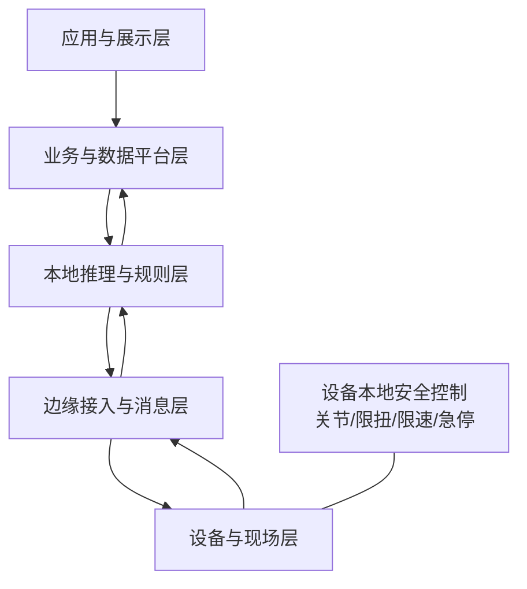
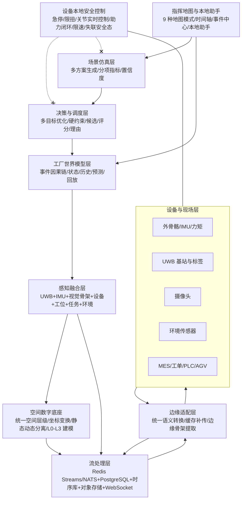

# EWOH 总体技术架构

## 组件
- 设备与现场层：外骨骼控制器、IMU、力矩、穿戴生理、UWB/视觉/环境传感器。
- 边缘接入层：协议适配、时间同步、消息标准化、缓存补传、设备心跳。
- 本地推理层：动作识别、姿态/负荷/疲劳趋势、风险规则、任务打分。
- 数据与业务层：人员、设备、任务、区域、遥测、推理、事件、审计。
- 应用层：实时态势、事件、回放、任务协同、场景评估、本地助手。

## 不可变控制边界
人体关节控制、限扭、限速、急停、异常退出和设备失联安全态必须留在设备控制器。平台和大模型不得绕过。

## Mermaid

---

# 工厂具身智能操作系统（Embodied Factory OS）九层架构（扩展）

本节在 V0.6 受控试点基线已确立的五层架构与四区部署基础上，扩展为九层架构，用于支撑空间数字底座、感知融合、工厂世界模型、决策与调度、场景仿真与指挥地图。**原有五层架构与四区部署予以保留，不删除、不重写**；九层架构是五层架构在具身智能方向上的细化与扩展：原「设备与现场层/边缘接入层」拆分为「设备与现场层/边缘适配层/流处理层」，原「本地推理层」扩展为「感知融合层/工厂世界模型层」，原「数据与业务层」与「应用层」之间新增「决策与调度层/场景仿真层」，应用层收敛为「指挥地图与本地助手」。四区部署结构（设备区/边缘区/平台区/展示区）原样保留，九层均映射到该四区之上。

## 九层定义

1. **设备与现场层**：外骨骼控制器、IMU、力矩、穿戴生理、UWB 基站与标签、摄像头、环境传感器（温度/振动/噪声/空气质量）、MES/工单/PLC/AGV 接口。急停、限扭、关节实时控制、助力闭环、限速、失联安全态保留在设备控制器本地，平台不得绕过。
2. **边缘适配层**：在原统一适配层契约（身份/心跳/电量/故障/遥测/缓存补传/安全状态/real/controlled_test/simulated 来源隔离）基础上，新增摄像头、UWB、MES/工单、环境传感器适配器；统一语义转换，厂商私有字段不泄漏到上层；摄像头在边缘侧完成人体检测与骨架提取。
3. **流处理层**：Redis Streams 或 NATS 承载实时事件流，PostgreSQL 承载业务数据，时序数据库承载高频遥测，对象存储承载图片/视频/点云/三维资产，WebSocket 推送前端。负责事件防抖、去重、时序对齐、质量打标。
4. **空间数字底座**：集团→工厂→车间→产线→区域→工位→设备/人员/任务的统一空间层级与坐标体系；每个实体具备唯一 ID、父级空间、坐标、朝向、边界框、状态、数据来源、置信度、更新时间、版本；静态空间底图与动态实体分离；统一空间坐标变换 API；输出 GeoJSON/GLB/3D Tiles/点云/Gaussian Splat/JSON 拓扑，建模分 L0/L1/L2/L3 四级。
5. **感知融合层**：融合 UWB 坐标 + 外骨骼 IMU + 视觉检测骨架 + 设备状态 + 工位占用 + MES 任务 + 环境信息，输出人员统一位置、人体姿态、当前动作、工位占用、人员—设备—任务绑定、数据质量与置信度、异常冲突；融合规则可解释，产生传感器冲突事件；摄像头不可用时降级到 UWB 与外骨骼继续推断。
6. **工厂世界模型层**：以事件驱动结构维护当前状态、历史状态、实体关系、事件因果链、短期预测、模型不确定性；支持沿时间轴回放与决策解释；事件链覆盖进入区域→与外骨骼绑定→领取任务→到达工位→开始搬运→累计负荷上升→电量下降→工位积压→生成调度建议→班组长确认→任务重分配→结果回流。
7. **决策与调度层**：多目标优化（产量/准时率/安全风险/人体负荷/移动距离/换岗成本），权重可配置且记录每次调整；硬约束过滤（技能资质/工位授权/健康禁忌/禁区/班次休息/外骨骼型号兼容/设备故障/安全规则）；候选生成→评分→方案模拟→理由生成→人工确认→结果回流；首期影子运行只记录不执行。
8. **场景仿真层**：调度前生成至少三个方案（保持现状/最小调整/产能优先/安全负荷均衡/设备异常应急），每个方案展示预计产量、延误风险、人员负荷变化、行走距离、电量消耗、拥堵变化、受影响人员、关键假设、置信度；方案对比显示分项指标而非仅总分。
9. **指挥地图与本地助手**：独立于现有静态页面的 `ui/command_map/` 前端；中央地图+左侧组织图层+右侧实体详情+顶部概况+底部时间轴事件流+右下助手；至少 9 种地图模式（生产/人员/外骨骼/人体负荷/安全风险/设备/环境/调度/数据质量）；时间轴回放、调度方案比较、事件中心、数据质量中心、模型规则管理、本地自然语言助手。本地大模型仅承担解释/总结/查询/报告，不直接实时控制，不取代调度优化器。

## 九层 Mermaid 流程图

## 四区部署保留说明
九层架构沿用 V0.6 已冻结的四区部署：设备区（设备与现场层）、边缘区（边缘适配层 + 边缘视觉推理 + 流处理层边缘侧）、平台区（流处理层中心侧 + 空间数字底座 + 感知融合层 + 工厂世界模型层 + 决策与调度层 + 场景仿真层）、展示区（指挥地图与本地助手）。四区之间的网络分区、身份权限、审计与离线运行策略原样保留，本扩展不改变四区边界与安全控制策略。

## 不可变安全边界（沿用并扩展）
在 V0.5/V0.6 已冻结的「急停、限扭、关节实时控制、助力闭环、限速、失联安全态必须保留在外骨骼设备控制器本地，平台不得绕过」基础上扩展为：平台下发实时关节或安全控制指令为 0；调度系统不得绕过人工确认直接执行；未经授权自动调度为 0；安全控制不进入平台的原则同样适用于决策与调度层、场景仿真层与本地大模型。

## 版本路线
V0.7 空间底座与地图 → V0.8 多传感器融合 → V0.9 世界模型和回放 → V1.0 受控调度建议 → V1.1 场景仿真 → V2.0 多车间和跨工厂协同。详细架构见 [docs/architecture/embodied_factory.md](../../docs/architecture/embodied_factory.md)。
