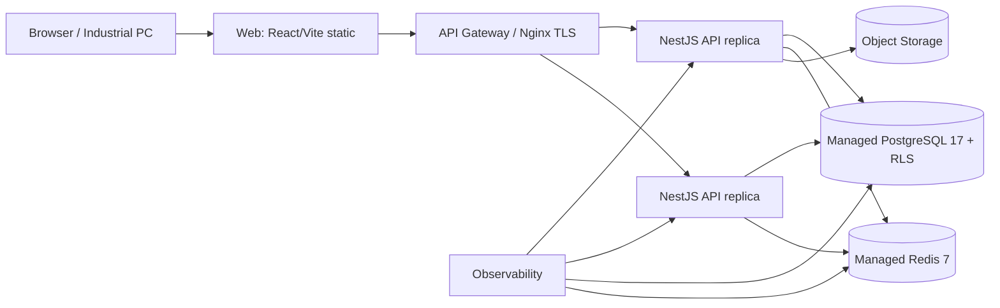

# EWOH Cloud Production Architecture

Status: adopted 2026-08-03

## Decision

Miaoda was a no-server demo vehicle only. The deliverable is a standalone,
cloud-deployable, high-availability, high-concurrency industrial product.

## Target Topology

## Portability Requirements

1. Remove runtime dependency on Miaoda platform:
   - `@lark-apaas/fullstack-nestjs-core` PlatformModule/configureApp
   - `@lark-apaas/client-toolkit` axios/logger
   - `/app/<appId>` base path and platform CSRF/session
   - `SUDA_DATABASE_URL` / `dataloom_db` / workspace schema
   - `user_profile` composite DB type
2. Replace with standard cloud primitives:
   - NestJS standalone bootstrap, standard Drizzle/postgres-js
   - JWT auth + RBAC guards
   - PostgreSQL with org_id + RLS
   - Redis for cache, rate limit, idempotency, session/refresh
   - React/Vite static assets behind TLS
3. Deliver cloud artifacts:
   - Docker images for API and Web
   - Docker Compose for single-node cloud VM
   - Kubernetes manifests/Helm for HA
   - Terraform-ready env contract
   - Backup, migration, rollback, healthcheck, monitoring

## Milestones

- M1: standalone NestJS bootstrap without PlatformModule
- M2: standard JWT auth and client HTTP layer without Miaoda toolkit
- M3: standard PostgreSQL schema/DDL without workspace-specific types
- M4: Redis-backed rate limit/idempotency/cache
- M5: Docker + Compose + K8s + CI/CD
- M6: HA/concurrency/perf/security verification and delivery pack

## Acceptance

- `npm run build:prod` produces standalone server+client artifact.
- API and Web start with only standard env vars.
- Horizontal replicas behind a load balancer pass health checks.
- Managed Postgres/Redis supported; RLS and audit chain verified.
- 50+ concurrent users target sustained, with scaling evidence.
