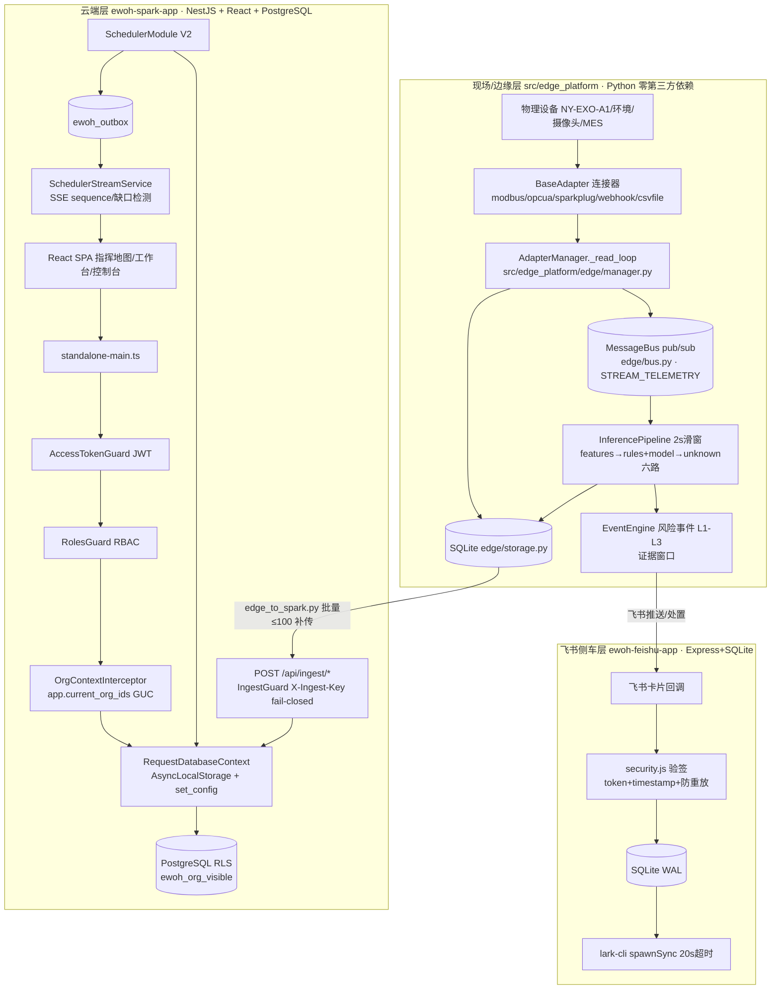

# EWOH 仓库系统性走读报告

**日期**：2026-08-09
**版本**：0.6.0-rc4（273 commits，main@6dc14b5）
**执行**：软件开发团队（架构师高见远 · 架构级走读 / 工程师寇豆码 · 代码级走读，只读分析，未修改任何文件）
**走读边界**：排除 node_modules/dist/logs/playwright-report/test-results/output/delivery/release/__pycache__/demo.db*/.git/.playwright-cli/*.tsbuildinfo/tmp/models；ui/ 仅注明历史原型

---

## 0. 执行摘要

EWOH（Exoskeleton Worker Operation & Harmony）是面向制造现场的外骨骼人员作业协同与风险分析平台，**多运行时单仓库**：Python 边缘运行时（零第三方依赖）+ NestJS/React 云侧主产品 + Express 飞书侧车 + 契约/治理层。

**总体评价**：工程质量高。契约驱动治理是真实执行（state-machine 双向校验、OpenAPI 路由 TS-AST 零漂移、事实源审计、6 个 TCK 族）；安全 fail-closed 纪律一致（验签/防重放/常量时间比较/RLS 纵深防御/内部异常脱敏）；调度闭环工程成熟（outbox 先写后发、SSE 缺口检测、CAS 防重复派工、SAFETY_BLOCK 硬约束）。

**问题统计**：P0 共 3 项（1 功能缺陷 + 1 多租户越权风险 + 1 潜伏死代码），P1 共 14 项，P2 约 20 项。核心清单见 §6。

---

## 1. 整体架构总览

### 1.1 系统分层

### 1.2 多运行时关系

| 运行时 | 技术栈 | 定位 | 数据边界 |
|---|---|---|---|
| 边缘（src/edge_platform） | Python ≥3.9 标准库 | 设备接入/推理/规则/边缘调度/本地 API（离线可用） | SQLite 单文件，进程内总线 |
| 云侧（ewoh-spark-app） | NestJS 10 + Drizzle + PostgreSQL 17 + React 19/Vite | 主产品：组织/权限/世界/调度V2/回放/复制 | PG RLS 多租户，outbox→SSE |
| 飞书侧车（ewoh-feishu-app） | Express + SQLite + lark-cli | 消息推送/卡片处置/事件同步 | SQLite，经 lark-cli 调飞书 OpenAPI |
| 契约层（contracts/ openapi/ db/ catalog/） | YAML/JSON/SQL 资产 | 跨运行时唯一事实源 | 被审计脚本与门禁消费 |

### 1.3 架构风格判定

- **主风格**：分层 + 模块化单仓（edge 按功能包组织；云侧 NestJS 34+ 业务模块）
- **消息模式**：双总线——`MessageBus`（edge/bus.py 流式数据通道，handler 回调语义，正式契约）与 `EventBus`（edge/scheduler/events.py 队列语义 SSE 广播；云侧 `OutboxService` 可靠领域事件先写后发）；`kafka` 仅为兼容命名别名
- **驱动模式**：事件驱动重排（ADR-002）+ REST + SSE 实时推送；outbox 模式保证 dispatch 与事件一致性
- **工程范式**：契约驱动（state-machine yaml ↔ Python/TS 双向校验、OpenAPI 路由零漂移、事实源审计）+ 6 个 CI workflow 门禁

---

## 2. 目录层级走读表

| 一级目录 | 职责 | 关键子模块/入口 | 备注 |
|---|---|---|---|
| `src/edge_platform/` | 边缘运行时（重点） | 入口 `run.py`→`edge_platform.run.main`；装配 `runtime/bootstrap.py`+`dependencies.py`+`protocols.py`；采集 `edge/adapters/*`+`edge/{manager,bus,storage}.py`；推理 `inference/{pipeline,features,rules,events,model,model_card,spatial_rules}`；调度 `scheduler/{orchestrator,planner,optimizer,priority,candidate,constraints,replanner,events,cpsat/*}`；感知 `perception/{ark_vision,pose_fusion,uwb_fusion,quality}`；治理 `governance/*`；其余 auth/rbac/audit/aas/connectors/spatial/twin/world_model/collection/backup/policy | 146 个运行模块 ≈2.9 万行；SQLite 20 表；`static/cm` 指挥地图静态页 |
| `ewoh-spark-app/server/` | NestJS 云侧后端 | 入口 `standalone-main.ts`（生产）/`main.ts`（legacy）；34+ 业务模块（scheduler/ingest/world/spatial/task/resource/organization/auth/audit/work-orchestration/scale/...）；DB 层 `database/*`；公共 `common/*` | 250 个 TS 文件；全局链：AccessTokenGuard→RolesGuard→OrgContextInterceptor→RequestDatabaseContext→RLS；`schema.ts` 反向生成 |
| `ewoh-spark-app/client/` | React 前端 | `src/pages/`（22 页）、`src/api/*.ts`（20+ 门面）、`src/hooks/useSchedulerStream.ts`、`src/components/` | 484 个 TS/TSX；React Query + Redux/zustand |
| `ewoh-feishu-app/` | 飞书侧车 | `server/index.js`（入口）+ `server/{api,auth,db,events,feishu,rules,security,sync,simulator}.js` | Express + SQLite WAL；验签四道校验；30s 全量同步；lark-cli 20s 硬超时 |
| `contracts/` | 跨运行时契约 | `state-machines/{task,plan,alert,approval,control,fleet}.yaml`、`events/event-catalog.yaml`、`factory/*`、`artifact-schemas/`、`mapping/`、`policy/`、`workflow/`、`repository-facts/` | Python 仅消费 task/plan；其余主要为 TS/门禁消费 |
| `openapi/` | API 契约 | `ewoh.yaml`（238 path keys）+ `work-orchestration.yaml`（24） | README 声称 304 条路径，实测 262 → 口径待确认（§7-1） |
| `db/` | Schema 唯一事实源 | `migrations/standalone_001..010`（+rollback）；`runner/run_migrations.js`；`verify/*.sql`；`seed/` | standalone_001 含 56 张 CREATE TABLE；`001_ewoh_managed_tables.sql` 已 DEPRECATED |
| `catalog/` | 工厂复制资产 | `connectors/{erp,mrp,wms}`、`scenarios/*`（4 场景）、`mappings/*.yaml`、`factory-sites/*` | 被 audit-* 门禁校验 |
| `scripts/` | 门禁/审计/发布 | 48 个脚本：audit-openapi-routes / audit-event-catalog / audit-repo-facts / truth-manifest / connector-tck / aas-tck / rego-tck / pilot-readiness-check / cross-tenant-tck / generate-sbom 等 | 契约优先流程的强制执行层 |
| `tools/` | 治理工具 | gate-engine、resource-registry、factory-replication、work-console、work-indexer、handoff-service、semantic-rules、git-sync、run_demo.py | 与 scripts/ 互补：工具=领域治理，脚本=门禁 |
| `deploy/` | 部署编排 | `cloud/`（compose + 3 Dockerfile）、`k8s/`、`helm/ewoh/`（networkpolicy/pdb/hpa/migration-job） | migrate 服务自动跑 run_migrations.js |
| `docs/` | 文档 | `architecture/adr-*.md`、`decisions/ADR-001..003 + OPEN-DECISIONS.md`（4 未决）、`audit/`、`remediation/`、`acceptance/`、`operations/production-runbook.md` | 走读记录丰富 |
| `tests/` | 仓库级契约/验收测试 | test_production_assembly / test_bus_contract / test_state_machine_contract / test_cpsat_worker_contract / test_edge_bridge_ingest / test_connector_runtime | 与 `src/edge_platform/tests/`（33 个 unittest）分层 |
| `security/` | 安全资产 | access-matrix.yaml、gitleaks.toml/baseline、bandit-suppressions.json | CI security.yml 引用 |
| 根级 | 入口与元数据 | `run.py`、`pyproject.toml`（dependencies=[]）、`Makefile`、`version.json`、`CHANGELOG.md`、`SECURITY.md` | demo.db 110MB 在根目录（卫生问题） |

---

## 3. 核心运行时时序/调用链

### a) Web 请求链（云侧）

`React → Axios → standalone-main.ts（CORS 白名单+安全头+1MB body）→ AccessTokenGuard → RolesGuard → OrgContextInterceptor（actor.primaryOrgId → GUC app.current_org_ids）→ RequestDatabaseContext.runInTransaction（AsyncLocalStorage 单连接单事务 + set_config）→ Drizzle → PostgreSQL RLS（ewoh_org_visible）→ Service → GlobalExceptionFilter（统一 {error:{code,message,request_id}}，内部异常脱敏）`

### b) 实时设备数据链（边缘 → 云）

`设备 → BaseAdapter → AdapterManager._read_loop（daemon 线程）→ unified_to_telemetry_row（frame_adapter.py 分组帧→扁平行）→ Storage.insert_telemetry + MessageBus.publish(STREAM_TELEMETRY) → InferencePipeline.handle_telemetry（2s 滑窗步长1s → 规则+模型混合 → unknown 六路 → consent 钩子）→ EventEngine（risk_event 含证据窗口）`

上行：`edge/bridge/edge_to_spark.py（批量≤100、指数退避、断网队列补传）→ POST /api/ingest/exoskeleton[/batch]（X-Ingest-Key 常量时间比较 + fail-closed + 100 req/min/IP）→ IngestService → PG → 指挥地图（轮询 2s + SSE 双通道）`

### c) 调度闭环（Scheduler V2，云侧 canonical）

`POST /api/scheduler/runs → SchedulerService.createRun → WorldStateSnapshotService.buildSnapshot（WS-YYYYMMDD-NNNN）→ PriorityEngine → EligibilityService（硬约束，SAFETY_BLOCK 不可绕过）→ RoutingService（有拓扑 GraphRoutePlanner / 无拓扑 Euclidean）→ SolverService.solveVariants（HeuristicSchedulingSolver=canonical；CP-SAT=optional，UNAVAILABLE 显式回退不冒充）→ PlanService（Top-K 影子方案 + DecisionTrace + solverStatus/snapshotVersion/policyVersion）→ approve（version+snapshotVersion CAS，过期 409 PLAN_STALE）→ DispatchCoordinatorService（事务化：校验→预占 ReservationService→下发→审计→Outbox）→ OutboxService.enqueue（先写后发，全局 sequence）→ SchedulerStreamService（轮询 2s）→ SSE /api/scheduler/v2/stream（Last-Event-ID 重放/缺口 resync/seenEventIds LRU 5000）→ client useSchedulerStream`

人工覆盖：`POST /plans/:id/overrides（LOCK/EXCLUDE/PREFER/BOOST/LOCK_TIME → 约束 → ReplanCoordinator + ImpactAnalyzer 局部重排 → before/after diff）`；派工含 SAFETY_BLOCK_DISPATCH 熔断（L2/L3 open 人员/设备）。

### d) 事件处置链（边缘/飞书/云三态）

- 边缘：`规则命中 → risk_event（L1-L3）→ POST /api/event/status（确认/解决/升级）→ event_handling + audit_log`
- 飞书：`卡片回调 → security.js（token 恒等比较 + 时间窗 300s + event_id 防重放 30min + webhook_dedup 唯一约束幂等）→ 处置（closed 禁处置 409）→ SQLite + lark-cli 推送`
- 云侧：`事件写入 → outbox → SSE；回放 GET /api/world/replay + replay/context/{eventId} → POST /api/world/replay/items 派生 Issue/Task/Evidence（sourceType=replayed）`

---

## 4. 数据流与持久化

### 4.1 边缘 SQLite（edge/storage.py，20 表）

采集/推理：telemetry / inference / device / person / model_registry；事件：risk_event / event_handling / audit_log / consent_record；调度：task / assignment / scheduling_request / scheduling_plan / scheduling_plan_assignment / schedule_decision / schedule_feedback / resource_reservation / world_state_snapshot；治理：rule_registry / device_protocol_version；collection/ 自建 collection_session / collection_label。迁移：`edge_platform/migrations/v001_add_governance_tables.py`（极简内置版本迁移）。

### 4.2 云侧 PostgreSQL（standalone 链唯一事实源）

- `db/migrations/standalone_001_schema.sql`：56 表 + `ewoh_org_visible()` RLS 函数 + 角色体系 + **无物理外键**（RLS 为 org 作用域，直接 DML 已从用户角色撤销）
- 后续 standalone_004（domain 7 表）/005（workbench_prod 3 表）/006（scheduling 8 表）/010（feedback 2 表）；007/008/009 以 ALTER 为主
- 迁移机制：`db/runner/run_migrations.js`（--apply/--verify/--rollback）；每迁移配 verify/*.sql；seed 独立
- 事实源约定：standalone_* 唯一权威；`server/database/schema.ts` 由 `npm run gen:db-schema` 反向生成；生产部署禁止引用 delivery/release 的 SQL
- **RLS 边界**：50+ 业务表 RLS 覆盖；全局共享表非 RLS（ewoh_world_state_snapshot/ewoh_outbox/ewoh_assignment_event/ewoh_replan_trigger/ewoh_scheduling_run 含 org_id 列但靠应用层过滤）→ P0-2

### 4.3 数据保留

EWOH_DATA_RETENTION_DAYS（默认 30）；SECURITY.md 分级：高频遥测 7-30 天降采样、审计 ≥180 天仅追加、事件证据随事件周期归档。

---

## 5. 依赖关系

### 5.1 Python 零第三方运行时依赖（已代码级确认）

`pyproject.toml` dependencies=[]；全量 import 扫描 146 个非测试模块仅标准库 + 包内相对导入。**例外**：`collection/{session,dataset}.py` 使用 `from inference import ...` 顶层绝对导入（P0-3）。

### 5.2 TS 侧关键依赖

`@lark-apaas/fullstack-nestjs-core`（平台底座，vendor lock-in 风险 P1）+ drizzle-orm 0.45.2 + postgres.js；NestJS 10 + class-validator + jsonwebtoken + bcryptjs + ioredis（可选）+ @aws-sdk/client-s3 + OpenTelemetry；前端 React 19 + Vite 7 + Tailwind 4 + Radix UI + TanStack Query + Redux Toolkit + zustand；license:check / bundle-budget 门禁。飞书：Express + better-sqlite3 + 外部 lark-cli 子进程。

### 5.3 契约层 ↔ 代码双向约束（工程治理核心）

| 契约资产 | 消费/校验方 | 机制 |
|---|---|---|
| state-machines/task\|plan.yaml | tests/test_state_machine_contract.py ↔ scheduler.models | 单向强校验 + 负测试 |
| openapi/ewoh.yaml | scripts/audit-openapi-routes.js | TS AST 解析 vs yaml 零漂移门禁 |
| events/event-catalog.yaml | scripts/audit-event-catalog.js | 事件目录一致性 |
| factory/* + golden-factory | audit-golden-factory.js / audit-factory-profile-contracts.js | 工厂模板 schema 校验 |
| repository-facts/ | audit-repo-facts.js + truth-manifest.js | 事实源证据清单（make truth-check） |
| mapping/policy/workflow | audit-mapping/policy/workflow-contracts.js | 各自门禁 |
| TCK 族 | connector-tck.py / aas-tck.py / rego-tck.py / cross-tenant-tck.sh / deployment-tck.js / scenario-tck.js | 可执行一致性测试 |

---

## 6. 质量评估

### 6.1 优点（可验证的具体点）

1. **契约驱动治理是真执行**：state-machine 双向校验（含负测试）、OpenAPI 路由 TS-AST 零漂移、repo-facts/truth-manifest 事实源审计、6 个 TCK 族
2. **边缘生产装配 fail-fast**：RuntimeFactory + RuntimeMode（production 禁 stub）+ runtime_checkable Protocol + test_production_assembly.py 断言
3. **安全 fail-closed 一致性强**：IngestGuard（缺失→503、常量时间比较）、Feishu 验签四道校验、production POST 需认证、CORS 禁 `*`、TRUST_PROXY=true 被禁、内部异常脱敏
4. **多租户纵深防御**：RLS + 请求级 GUC + 应用层 org 过滤 + RBAC
5. **调度闭环工程成熟**：outbox 先写后发、sequence 缺口检测 + resync、CAS 防重复派工、PLAN_STALE 乐观锁、SAFETY_BLOCK 不可覆盖、solverStatus/DecisionTrace 诚实标记
6. **安全边界声明清晰**：平台只读监督、不参与设备实时控制（8 类安全能力永久保留本地）
7. **单一事实源纪律**：standalone_* SQL 唯一权威、schema.ts 反向生成、verify 去硬编码

### 6.2 问题清单（P0/P1/P2）

#### P0（3 项，立即处置）

| # | 位置 | 问题 | 来源 |
|---|---|---|---|
| P0-1 | `scheduler/scheduler_service.py:156/302/394` | **重启后已批准方案无法继续派工**：`hydrate_from_repository` 把持久化 assignments 还原为 **dict 列表**，`confirm()`/`execute()` 用属性访问（planned_end/person_id/task_id）→ 重启后对 approved 方案必然 AttributeError。与 hydrate 注释声称要修复的场景相同，修复未完成。需还原为 CandidateAssignment 对象 + 补回归测试 | 工程师 |
| P0-2 | PG 全局共享表（ewoh_world_state_snapshot/ewoh_outbox/ewoh_assignment_event/ewoh_replan_trigger/ewoh_scheduling_run） | **RLS 覆盖缺口**：非 RLS，靠应用层 org 过滤；新增查询漏 primaryOrgId 条件即跨租户越权。SECURITY.md 与 OPEN-DECISIONS 已自认。需至少补「调度读路径 org 过滤自动审计测试」 | 架构师 |
| P0-3 | `collection/{session,dataset}.py:14/17` | **潜伏死代码**：`from inference import ...` 绝对导入在标准 PYTHONPATH=src 下必炸；当前无 importer 未触发，一旦被工具链引用即 ModuleNotFoundError。需改 `edge_platform.inference`（工程师定 P2，架构师定 P0——按启用即炸风险归 P0） | 架构师/工程师 |

#### P1（14 项，高优技术债）

| # | 位置 | 问题 | 来源 |
|---|---|---|---|
| P1-1 | `edge/scheduler/events.py:31` vs `edge/bus.py:121` | **双事件总线并存违反 P0-EDGE-003 契约**：scheduler 总线仍用 queue 语义，SSE 端点依赖；统一到 MessageBus 或修订契约 | 工程师 |
| P1-2 | `feishu.js:36-92` + `index.js:204-244` | 请求路径 **spawnSync 同步子进程阻塞事件循环**（最长 20s+retry 40s），飞书 API 慢时服务卡死；改异步 spawn + 并发上限 + 熔断 | 工程师 |
| P1-3 | `outbox.service.ts:100-105` | **nextSequence 非原子**（SELECT MAX+1，无唯一约束）→ 并发 enqueue 得相同 sequence，破坏 SSE 连续性不变量；用 DB 序列/RETURNING 或唯一约束+重试 | 工程师 |
| P1-4 | `cpsat/solver.py:255-273` | CP-SAT **reservation 硬约束未按时间窗重叠判定**（任意预约即置 0），且从未在 ortools 环境跑 fixture 验证；需补时间窗判定 + 单测 + parity 固化 CI | 工程师/架构师 |
| P1-5 | `scheduler.service.ts:212-278` | 遗留 **KEEP/CAP/BAL 方案生成器全硬编码指标**（taktImprovement 8.5/3.2 等），前端若展示会被当真实方案；移除或显式 is_synthetic 标记 | 工程师 |
| P1-6 | `services.py:109-136` + `server.py:756-763` | 推荐/指标链路 **N+1 查询**（逐人 list_events + query_telemetry）；改一次 SQL 聚合 + 缓存 | 工程师 |
| P1-7 | `server.py:1077-1083` + `identity.py:50-54` | **认证降级路径**：auth 未就绪时任意用户名/密码 → admin token（24h）；预置账号明文密码（admin123 等，sha256+salt 单轮）。production 应 fail-closed（503）或启动强断言；生产禁 offline backend | 工程师 |
| P1-8 | `feishu.js:310-348` | **base_token 作为命令行参数传 lark-cli**，进程列表可见凭据；改环境变量/stdin | 工程师 |
| P1-9 | `feishu rules.js` vs `edge rules.py` | **规则引擎双份维护**（bend 45°、load 20Nm 阈值需人工同步），漂移风险；建议单一事实源 | 工程师 |
| P1-10 | README/CHANGELOG vs openapi/ | **OpenAPI 计数口径漂移**：声称 304 条，实测 262（ewoh.yaml 238 + work-orchestration 24）；work-orchestration 是否纳入 audit-openapi-routes.js 待确认 | 架构师 |
| P1-11 | `db/migrations/001_ewoh_managed_tables.sql` | 双 schema 基线残留：已标注 DEPRECATED 但仍在 runner 注册表，误用风险 | 架构师 |
| P1-12 | `ewoh-spark-app/server/` | 云侧模块单点：34+ 模块全量注册一个 app module，250 TS 文件；依赖 @lark-apaas 平台底座 + fullstack-cli sync → vendor lock-in | 架构师 |
| P1-13 | `auth.service.ts:71-76` | **Redis 隐性强依赖**：@Optional redis ?? new RedisService()，Redis 不可用可能 login/refresh 500；应显式 fail-fast 或显式降级 | 工程师 |
| P1-14 | RLS 治理 | 多租户治理不闭环：RLS 覆盖表清单为动态白名单，缺「新表默认进 RLS」自动门禁；跨 org 快照引用语义需显式设计 | 架构师 |

#### P2（约 20 项，积压优化）

- `scheduler-stream.service.ts:63` replaySince() 死代码未接线（SSE 端点不读 Last-Event-ID，客户端 lastEventIdRef 未发送）——接线或删除
- Python PLAN_TERMINAL 缺 dispatched 与 plan.yaml 漂移（且生产零使用）；optimizer.py CpSatOptimizer 占位回退 greedy 不标记 vs NestJS 明确 FALLBACK/UNAVAILABLE，回退语义不一致
- 优先级公式跨运行时不可比（Python EffectivePriorityCalculator vs TS PriorityEngine，结构/数值不同）；评分权重两套默认（(1,1,1,1,0.05,0.5) vs (0.25,0.2,0.2,0.15,0.1,0.1)）
- 飞书规则引擎与 edge 双份（P1-9）；openapi 缺 SSE 端点 `GET /api/scheduler/v2/stream`
- 巨型文件：server.py 1679 行、scheduler.service.ts 2279 行、heuristic-scheduling-solver.ts solve() 单方法 590 行、edge/storage.py 1186 行
- 多处 `except Exception: continue/pass` 掩盖错误（scheduler_service.py:150/158、server.py:120-129）至少 log
- server.py do_OPTIONS 不校验 Origin（恒 204，安全 fail-closed 但行为不一致易误判）
- ingestMes 空 org 上下文（primaryOrgId:'' → RLS 行为待确认）；IngestGuard 内存限流 Map 不清理过期 IP key；scheduler.controller.ts:328 `as never` 类型不严谨
- collection/dataset 裸 import（并入 P0-3）；双总线命名易混淆（MessageBus vs EventBus，建议更名）
- 边缘进程模型：ThreadingHTTPServer + daemon 线程 + 内存态调度，多实例/水平扩展受限
- 仓库卫生：根目录 demo.db（110MB，已跟踪）+ demo.db-wal/-shm、models/ 空目录、output/ 产物未入 .gitignore
- CP-SAT 长期 optional：parity 测试建议固化 CI 常驻
- 测试覆盖缺口：connectors(0)/collection(0)/aas(0)/twin(0)/policy(0) 无直接测试；cpsat/solver.py 无任何测试
- 字段命名跨运行时不同（Python snake_case vs PG camelCase），ingest 已处理但桥接之外无统一 schema 校验层

---

## 7. 待确认问题清单

1. **OpenAPI「304 条路径」口径**：以 paths 计实为 262；差异是 operations 口径还是文档过期？work-orchestration.yaml 是否纳入零漂移检查？
2. **collection/ 模块意图**：`from inference import ...` 是否统一为 `edge_platform.inference`？当前无消费者，是计划中的受控采集工具链还是遗留？
3. **双总线命名**：MessageBus（数据流）与 EventBus（SSE 广播）是否接受更名消除混淆？`kafka` 别名是否保留？
4. **RLS 覆盖治理**：「新表默认进 RLS 白名单」自动化门禁是否排期？调度 V2 全局共享表的 org 过滤审计测试（OPEN-DECISIONS 第 2 项）？
5. **状态机契约覆盖**：alert/approval/control/fleet 是否纳入统一校验（当前仅 task/plan 跨语言）？
6. **飞书事件目录**：飞书处置动作与 event-catalog.yaml、云侧 outbox 事件类型是否共享同一目录？
7. **@lark-apaas 平台依赖策略**：fullstack-cli sync 升级窗口/回归策略，是否影响 1.0 生产化？
8. **仓库卫生**：demo.db（110MB）与 models/ 空目录是否清理并从 git 移除？
9. **ui/ 历史原型**：是否在 1.0 前移除目录本身？

---

## 8. 改进优先级清单（按 P0→P2 可执行项）

**P0（本迭代立即修复）**
1. scheduler_service.py hydrate 还原 assignments 为 CandidateAssignment 对象（或消费侧统一转换）+ 补「重启后 confirm+execute」回归测试
2. 补调度读路径 org 过滤自动审计测试（RLS 缺口的第一道防线）；排期新表默认 RLS 门禁
3. collection/ 模块导入统一为 `edge_platform.inference`（消除潜伏炸弹）

**P1（建议下一迭代）**
4. 统一事件总线（scheduler/events.py 迁到正式契约，或修订契约承认 queue 语义）
5. 飞书 lark-cli 改异步 spawn + 并发上限 + 超时熔断；base_token 改 stdin/env
6. outbox nextSequence 原子化（DB 序列或唯一约束+重试）
7. CP-SAT：装 ortools 补 fixture 验证；reservation 按时间窗重叠判定；补单测
8. 移除/标注 generatePlans 硬编码方案为 synthetic
9. services/server N+1 聚合优化；auth 未就绪 production fail-closed + 预置账号治理
10. 飞书规则引擎与 edge 规则单一事实源；OpenAPI 计数口径校准 + 补 SSE 端点

**P2（积压队列）**
11. SSE replaySince 接线 Last-Event-ID 或删除死代码
12. 统一 Python/TS 优先级公式与默认权重（或明确定义双运行时边界）
13. 拆解巨型文件；空 except 至少 log；do_OPTIONS 行为统一
14. openapi 补 /api/scheduler/v2/stream；ingestMes org 上下文；IngestGuard Map 清理
15. 补 connectors/collection/aas/twin/policy/cpsat 测试；仓库卫生（demo.db 出 git）

---

## 9. 修复记录（2026-08-09，主理人授权一次性迭代执行）

走读报告发布后，主理人获全权授权，组建修复团队对 P0 与选定 P1/P2 项实施批量修复。**工程师修复 + QA 两轮独立回归，最终判定 NoOne（全部通过）**。

### 9.1 修复清单（15 项 + 3 项 QA 追加）

| 编号 | 原问题 | 修复内容 | 验证 |
|---|---|---|---|
| A1 [P0] | hydrate 还原 dict 致重启后 confirm/execute 崩溃 | `plan.assignments = [CandidateAssignment(**a) for a in ... if isinstance(a, dict)]`；新增 test_scheduler_hydrate.py（重启全链路回归） | 2/2 通过 |
| A2 [P0] | collection/ 裸 `from inference` 导入 | 改 `edge_platform.inference` 绝对导入；test_inference.py sys.path 补 src | make test 751 OK |
| A3 [P1] | person_metrics N+1 | 增加 events_cache 参数，recommend 预取一次；新增 test_services_recommend.py | 3/3 通过 |
| A4 [P1] | production auth 降级路径 | api_auth_login production → 503 auth_unavailable fail-closed；新增 test_auth_failclosed.py | 2/2 通过 |
| A5 [P1] | CP-SAT reservation 未按时间窗判定 | reservation 建模为 fixed interval 入 AddNoOverlap（删除任意预约→present==0）；新增 test_cpsat_reservation.py | 7 passed + 3 CI-gated |
| A6 [P2] | PLAN_TERMINAL 契约漂移 | 对齐 plan.yaml 增加 dispatched | 契约测试 5 passed |
| A7 [P2] | 空 except 吞错 | hydrate/set_assignment_status 补 logger.warning | — |
| B1 [P1] | outbox nextSequence 非原子 | 迁移 standalone_011（序列+DEFAULT+setval 对齐+rollback+verify）+ runner 登记 + enqueue 走 DB DEFAULT | 4/4 通过（迁移待 CI 实跑） |
| B2 [P1] | generatePlans 硬编码指标 | reason 加【合成数据，仅供演示】+ openapi deprecated 标注 | audit 零漂移 |
| B3 [P2] | IngestGuard Map 泄漏 | fresh 空时 delete(ip) | — |
| B4 [P2] | ingestMes 空 org 上下文 | controller 透传 userContext.primaryOrgId；缺失显式失败 | ingest 5/5 通过 |
| B5 [P2] | OpenAPI 缺 SSE 端点 + 计数口径 | yaml 补 /api/scheduler/v2/stream；audit 增加 Sse→GET 映射；README 改 307 路由 | audit exit 0，undocumented=0 |
| C1 [P1] | base_token 命令行泄露 | 4 处改 `FEISHU_BASE_TOKEN` env 优先 + 空值 fail；示例配置/README 注明 | 飞书 43/43 通过 |
| D1 | P0-1 回归测试 | test_scheduler_hydrate.py | ✅ |
| D2 [P0] | RLS org 过滤审计测试 | 新增 rls-org-filter.audit.spec.ts（AST 静态扫描 5 张非 RLS 表读路径 + allowlist + 反例用例） | 4/4 通过（含破坏性反例验证） |
| F1 [P1] | QA 发现：fixed interval start+size≠end 致 INFEASIBLE | `_fixed_interval_bounds` 统一规整（start=//MINUTE, end=max(start+1, e//MINUTE), size=end-start）；frozen×3 + reservation×1 统一替换；非整分钟 fixture | 7 passed + 3 CI-gated |
| F2 [P2] | schema.ts sequence default(0) 漂移 | 改 `default(sql`nextval('ewoh_outbox_sequence_seq')`)` 与迁移对齐 | type:check 通过 |
| F3 [P2] | nextSequence() 死代码 | 删除（确认零调用方）；同步清理审计 allowlist 条目 | grep 零命中 |

### 9.2 全量回归结果（QA 第二轮）

- Python：`make test` 751 tests OK；`make test-contract` 152 passed/5 skipped；state-machine 5；production-smoke 11
- TS：`npm run type:check` 0 错误；jest scheduler 全量 36 suites/257 tests；ingest 5/5
- 契约：`audit-openapi-routes.js` exit 0（307 控制器路由，undocumented=0/unimplemented=0）；`audit-repo-facts.js --strict` 39/39
- 飞书：`node --test` 43/43

### 9.3 遗留风险（环境受限/已知）

1. **standalone_011 迁移真实 apply/verify 未执行**（本机无 PostgreSQL）——SQL 静态审查通过，待 CI 实跑 `--apply-standalone-outbox-sequence` / `--verify-standalone-outbox-sequence`；部署顺序依赖迁移先行。
2. **CP-SAT 真实求解 fixture 未实证**（本机无 ortools，Python 3.14 无轮子）——3 条 CI-gated 用例（含非整分钟不 INFEASIBLE 验证）待 CI 自动执行。
3. **RLS 审计测试静态启发式局限**："移除既有 org 过滤但残留 org_id 字样"存在假阴性（已知能力边界，非本次引入）。
4. 非阻塞小项：ingest.controller.ts `as never` 强转、feishu env 覆盖路径无直接单测。
5. 明确未做（架构决策项）：双事件总线统一、飞书 spawnSync 异步化、规则引擎单一事实源、@lark-apaas 依赖策略、Redis 隐式依赖改造、巨型文件拆分、SSE replaySince 接线、demo.db 卫生。

### 9.4 改动文件（23 修改 + 7 新增 + F 系列 3 修改 1 测试增补）

修改：README.md / db/runner/run_migrations.js / ewoh-feishu-app/{README.md, feishu-config.example.json, server/feishu.js} / ewoh-spark-app/server/modules/ingest/{ingest.controller.ts, ingest.guard.ts, ingest.service.ts} / ewoh-spark-app/server/modules/scheduler/{outbox.service.ts, scheduler.service.ts} / ewoh-spark-app/server/database/schema.ts / ewoh-spark-app/server/modules/scheduler/__tests__/outbox-throttled.spec.ts / openapi/{ewoh.yaml, route-manifest.json} / scripts/audit-openapi-routes.js / src/edge_platform/collection/{dataset.py, session.py} / src/edge_platform/scheduler/{cpsat/solver.py, models.py, scheduler_service.py} / src/edge_platform/{server.py, services.py} / tests/test_inference.py
新增：db/migrations/standalone_011_outbox_sequence.sql(+rollback) / db/verify/standalone_011_verify.sql / ewoh-spark-app/server/modules/scheduler/__tests__/rls-org-filter.audit.spec.ts / src/edge_platform/tests/{test_scheduler_hydrate.py, test_services_recommend.py, test_auth_failclosed.py, test_cpsat_reservation.py}
（未提交 git，未 commit/push）

---

*报告完。架构级走读：高见远；代码级走读：寇豆码；修复：寇豆码；QA 回归：严过关；汇总编排：齐活林。*
