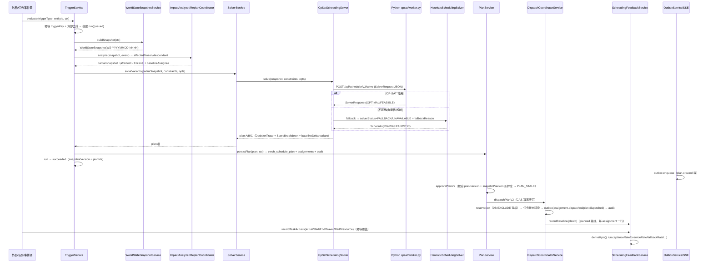
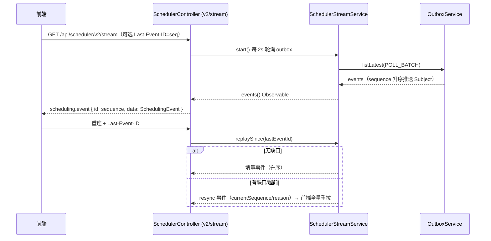

# 01 现状核验报告（Current State Review）

> 项目：EWOH 指挥地图智能调度能力升级
> 作者：架构师（software-architect）
> 范围：只读核验，不含业务实现代码
> 核验时间：以仓库当前 HEAD 为准

---

## 1. 实际读取的文件清单

### 1.1 NestJS 调度控制面（`ewoh-spark-app/server/modules/scheduler/`）

| 文件 | 行数 | 核验要点 |
|---|---|---|
| `scheduler.module.ts` | 64 | 模块装配、providers/exports 清单 |
| `scheduler.controller.ts` | 534 | 全部 REST + SSE 端点（含 deprecated 包装） |
| `scheduler.service.ts` | 2283 | **巨型服务**：legacy + V2 全部逻辑 |
| `scheduler-metrics.service.ts` / `scheduler-metrics.controller.ts` | 169/43 | Prometheus 风格 metrics |
| `world-state.service.ts` | 698 | 快照构建、freshness、**hardcode 主要来源** |
| `trigger.service.ts` | 162 | 幂等去重 + 冷却去抖 + run 排队 |
| `eligibility.service.ts` | 188 | 硬约束资格判定 |
| `routing.service.ts` | 445 | A* + route_graph/euclidean_fallback |
| `route-cost.provider.ts` | 151 | Task×Resource 路径成本（route/euclidean） |
| `priority-engine.ts` | 270 | 优先级引擎 + factors[] 可解释 |
| `constraints.ts` | 153 | 硬/软约束类型系统 + 支持性检查 + 依赖环检测 |
| `solver.service.ts` | 172 | CP-SAT → heuristic fallback 门面 |
| `cp-sat-scheduling-solver.ts` | 485 | HTTP Worker 客户端 + fallback 标记 |
| `heuristic-scheduling-solver.ts` | 849 | 确定性启发式求解器 |
| `impact-analyzer.ts` | 228 | 受影响/冻结/下游传递分析 |
| `replan-coordinator.service.ts` | 225 | 局部重排协调 + baseline churn + 熔断 |
| `plan.service.ts` | 639 | 持久化/审批/拒绝/派发/重排/对比/约束生命周期 |
| `dispatch-coordinator.service.ts` | 330 | 幂等派发 + outbox + 审计 |
| `resource-reservation.service.ts` | 186 | 预占 + DB EXCLUDE 背板 |
| `resource-projection.service.ts` | 281 | **ResourceProjection SSOT**（resources/state） |
| `scheduling-policy.service.ts` | 289 | Policy 版本化 + 候选注册/激活 |
| `scheduling-feedback.service.ts` | 343 | planned-vs-actual + KPI |
| `scheduler-stream.service.ts` | 139 | SSE 轮询/重放/缺口检测 |
| `outbox.service.ts` | 167 | 可靠事件 + 节流 |
| `task-lifecycle.ts` | 60 | 任务生命周期判定 |
| `task-scheduling.bridge.ts` | 42 | 任务写路径 → 重排桥接 |
| `scheduling-solver.interface.ts` | 30 | SchedulingSolver 接口 |
| `__tests__/`（40 个 spec + 2 个 helper） | — | 见 §6 |

### 1.2 React CommandMap（`client/src/pages/CommandMap/`）

- `CommandMap.tsx`（946 行）、`FactoryMap.tsx`（1195 行）、`queryState.ts`（27）、`replay.ts`（70）
- `panels/`：`SchedulePanel.tsx`、`ConflictCenterPanel.tsx`、`OverridePanel.tsx`、`ResourcePoolPanel.tsx`、`BrainPanel.tsx`、`EventCenterPanel.tsx`、`TaskOrchestrationPanel.tsx`、`TimelinePanel.tsx`、`WorkbenchPanel.tsx`、`IntelligenceLayers.tsx` 及 `conflict-panel-logic.ts`、`schedule-panel-demo.ts` 等
- 测试：`map-mode-machine.test.ts`、`queryState.test.ts`、`replay.test.ts`、`entityColors.test.ts`、`schedule-panel.test.ts`、`conflict-center-panel.test.ts`

### 1.3 Python 边缘平台（`src/edge_platform/scheduler/`）

- `orchestrator.py`（263）、`planner.py`（103）、`optimizer.py`（310）、`replanner.py`（90）、`world_state.py`（164）、`route_planner.py`（181）、`reservation.py`、`priority.py`、`constraints.py`、`scoring.py`、`candidate.py`、`events.py`、`appeal.py`、`learning_loop.py`（470）、`models.py`、`resources.py`、`repository.py`、`scheduler_service.py`（645）
- `cpsat/`：`solver.py`（496）、`worker.py`（117，HTTP `/api/scheduler/v2/solve`）、`contract.py`（196）

### 1.4 契约 / DB / 旧原型

- `contracts/state-machines/plan.yaml`（Plan 状态机，与实现有差异，见 §4.3）、`contracts/policy/`（policy-schema.json、deploy-gate.rego）、`contracts/events/event-catalog.yaml`（**未见 scheduler 事件条目**）
- `db/migrations/`：`standalone_006_scheduling`、`007_scheduling_persistence`、`008_phase2_realtime`、`009_reservation_conflict`、`010_scheduling_feedback`、`011_outbox_sequence`
- `db/` 下**无任何 ewoh_scheduling_conflict 持久化表**
- `ui/command_map/scheduling/scheduling-enhance.js`（946 行，Plan Diff + DecisionTrace + Override 纯 UI 原型，已冻结）

---

## 2. 用户描述 vs 真实代码的差异清单

### 2.1 文件名 / 结构差异

| # | 用户描述 | 真实代码 | 影响 |
|---|---|---|---|
| D1 | 未提及 `scheduler.service.ts` | **存在，2283 行巨型服务**，承载全部 legacy+V2 逻辑 | 结构拆分主要对象（需求 #16） |
| D2 | 未提及 `scheduler-metrics.controller.ts` | 存在（GET /api/scheduler/metrics） | 无 |
| D3 | `feedback.service.ts`（非） | 正确：`scheduling-feedback.service.ts` | 无 |
| D4 | `policy.service.ts`（非） | 正确：`scheduling-policy.service.ts` | 无 |
| D5 | scheduler 模块约 23 个 .ts | 实际 28 个 .ts + `__tests__/` 40 个文件 | 核验范围扩大 |
| D6 | `ui/command_map/scheduling-enhance.js` | 实际路径 `ui/command_map/scheduling/scheduling-enhance.js` | 无 |

### 2.2 需求能力差异（按 17 项需求对照）

| 需求 | 现状结论 | 主要差距 |
|---|---|---|
| 1 SSOT 统一 | **基本成立** | Python Edge Scheduler 仍保留完整重复调度栈（见 §5）；Legacy API 仅 deprecated 包装未删除；`ui/command_map` 已冻结 |
| 2 领域模型落地 | **部分满足** | Task 核心字段齐全但全部由 taskType/priority **白名单派生**（schema 无列）；缺 earliestStart/latestFinish/downstreamImpact/requiredStationCapabilities；Resource 缺 locationConfidence/telemetryUpdatedAt/shift/currentTask（后者置 null 不虚构，正确）；Station 缺 queue；device capabilities 两处语义不一致 |
| 3 ResourceProjection SSOT | **基本成立** | `/api/scheduler/resources/state` 已实现且质量高（availableWindows 由真实 reservation 推导、FRESH/STALE/UNKNOWN）；前端未统一消费（仍轮询 world/entities） |
| 4 Route Cost Matrix | **部分满足** | 已有 route_graph/euclidean_fallback/source/riskCost/congestionCost/graphVersion；**缺 fallbackReason/routeCostMode/dataQuality**；euclidean 兜底不感知 blocked/forbidden zone；无独立 TravelCostService |
| 5 优先级 | **基本满足** | PriorityEngine 已综合 base/deadline/waiting/event/production/downstream/manual_boost 并输出 factors[]/explanation；输出命名为 level/score/urgent（非 priorityScore/priorityClass）；Safety Block 硬约束（注释明确，求解器阻断） |
| 6 候选与约束 | **部分满足** | eligibility 硬约束覆盖广；constraints.ts 硬约束 16 个但**缺 STATION_CAPACITY 类型**；Candidate API 返回 eligible/reasons/eta/distance/score，**缺独立 rejected 数组与 score breakdown 展开**；前端仍需校验（Candidate Explain VM 缺失） |
| 7 Rolling Horizon | **基本满足** | Trigger→Snapshot→ImpactAnalyzer→affected/frozen→Solver→Plan 已实现；executing/locked 冻结；baseline churn 罚项；熔断 |
| 8 Conflict Lifecycle 持久化 | **未满足（最大缺口）** | 冲突为实时推导，无 DB 表、无 status 生命周期、无 acknowledge/resolve/suppress 端点、SchedulingConflict 类型缺 status/detectedAt/acknowledgedBy/.../suppressUntil/planId |
| 9 SSE 强化 | **部分满足** | 已有 sequence/Last-Event-ID/replaySince/gap→resync/节流；**envelope 缺 snapshotVersion/planId/occurredAt**；前端未接 SSE（2s/5s/30s 轮询仍在） |
| 10 CommandMap 操作台 | **未满足** | 无 `useCommandMapSchedulerState`；状态分散在组件内；Layers 无统一 VM；无 Candidate Explain / Plan Diff VM（后端 comparePlans/decisionTrace 已具备） |
| 11 人工干预 | **基本满足** | applyOverrides 已有（LOCK/EXCLUDE/PREFER/BOOST/TIME→SchedulingConstraint、reason+operator+audit、deactivate、replan 继承、before/after diff）；需补"change resource"动作与 safetyCritical 不可覆盖硬校验确认 |
| 12 Solver 工程化 | **部分满足** | CP-SAT fallback（solverStatus/fallbackReason/FALLBACK/UNAVAILABLE）、metrics fallback_total、policyVersion/solverVersion 持久化均有；缺统一固定 fixtures 集；OR-Tools 版本固定需在 Python 侧锁定 |
| 13 目标函数版本化 | **部分满足** | Policy 版本化 + registerCandidate/activate 已有；权重命名 walkingWeight（非 travelWeight）、weights 仅 4 个可选、其余由 buildPolicy 魔法数派生（lateness=deadlineRisk*3 等）；Plan 已保存 policyVersion；**Shadow Compare 为参数 delta + objective 估算，非真实 snapshot replay** |
| 14 反馈闭环 | **部分满足** | recordBaseline/recordActuals/deriveKpis 已有；KPI 仅 acceptanceRate/overrideRate/fallbackRate/solverRuntime/replanCount/conflictCount；**缺 on-time rate/mean·P95 lateness/total travel/workload balance/plan churn/conflict rate/replan success rate**；plannedWait 恒 null、plannedTravel 取 distanceMeters（语义疑为 eta） |
| 15 安全与治理 | **部分满足** | approve 校验 version+snapshotVersion ✓；dispatch CAS 幂等 ✓；reservation DB EXCLUDE ✓；RLS/org 过滤部分 ✓；**多处 `as unknown as` 未经 Adapter+runtime validation**；contracts 不同步（plan.yaml 状态机与实现不一致、event-catalog 无 scheduler 事件） |
| 16 结构拆分 | **未满足** | scheduler.service.ts 2283 行未拆；前端无 hooks/layers/VM 分层 |
| 17 性能与可观测 | **部分满足** | metrics 有 run_total/solver_timeout/fallback_total/feasible_ratio/run_duration_ms；**缺 candidate 数/hard reject 数/affected 数/churn/conflict 数/SSE reconnect·resync 数/dispatch failure/feedback completeness**；全链路 id 串联部分有（run→snapshot→plan→assignment→feedback） |

---

## 3. 原调用链（现状真实链路）

### 3.1 调度主链路（Trigger → Dispatch → Feedback）

### 3.2 SSE 实时链路（现状）

---

## 4. Hardcode / 技术债清单（文件 + 行号 + 问题）

> 全部来自真实代码核验。行号以当前 HEAD 为准。

### 4.1 `world-state.service.ts`（主要）

| 位置 | 函数/代码 | 问题 |
|---|---|---|
| L530-544 | `deriveRequiredDeviceCapabilities(taskType)` | taskType 白名单（lift/carry/heavy/handling/搬运/重体力/物料→exo-lift）猜测设备能力需求，非真实字段 |
| L550-561 | `deriveDeviceCapabilities(deviceModel)` | deviceModel 白名单（exo/pro/lite/vacuum/crane/吸/吊）猜测能力集合，非真实字段 |
| L574-587 | `deriveSafetyCritical(taskType)` | safetyCritical 由 taskType 白名单派生，**非真实业务字段**（schema 无列） |
| L261-263 | `taskList` 构造 | `preemptible: false` **固定**；`skillMatchMode: 'ALL'` **固定** |
| L264 | `dueAtMs: t.planEnd...` | 截止时间借用 planEnd，无独立 dueAt 列 |
| L267 | `deriveProductionImpact(t.priority)`（L593-607） | 用 priority 字符串猜 productionImpact（urgent→1.0），**非真实字段** |
| L302 | `availableWindows: []`（device） | 设备可用窗口**恒为空**，硬编码 |
| L198-199 | person `x: se ? (se.x ?? 0) : 0` | 缺失坐标**当 0**（视为正常坐标），未标 UNKNOWN/缺失 |
| L299-301 | device 位置 `boundPerson.x` | 设备位置**借用人员位置**，非设备自身 telemetry；无 locationConfidence/locationUpdatedAt |
| L222-226 | station `capacity` 读 `extra.capacity` | 容量取空间实体 **extra 非正式字段**，未落库 |
| L256-260 注释 | schema.ts 为自动生成文件"不改" | 派生字段替代真实列 = 领域模型无法落库的根因 |

### 4.2 `scheduling-policy.service.ts`

| 位置 | 代码 | 问题 |
|---|---|---|
| L281-288 | `buildPolicy()` | 权重魔法数派生：`latenessWeight = deadlineRiskWeight * 3`、`walkingWeight = euclideanDistanceWeight`、`riskWeight = highRiskFactor / 2`、`energyWeight = minBatteryPct / 30`；命名 walkingWeight 而非 travelWeight |
| L15 | `DEFAULT_SOLVER_VERSION = 'heuristic-v2'` | 固定 solverVersion 硬编码 |
| L262-264 | `parseConfig()` | `configJson as SchedulingPolicyConfig` **无 runtime validation** |

### 4.3 其他

| 位置 | 问题 |
|---|---|
| `replan-coordinator.service.ts` L156-158 | `ewohSchedulingRun` 无 failureReason 列，run 失败原因只进日志，无法审计追溯 |
| `scheduler.service.ts` 全文件 | 多处 `as unknown as`（如 world-state L59、L84）未经 Adapter+runtime validation，违反需求 #15 治理目标 |
| `routing.service.ts` L192 | `euclideanRoute(from ?? {x:0,y:0}, to ?? {x:0,y:0})`：坐标缺失时**用 0,0 兜底**而非显式标记不可行 |
| `route-cost.provider.ts` L110-141 | euclidean fallback 不携带 fallbackReason/routeCostMode/dataQuality；不感知 blocked/forbidden zone |
| `scheduling-feedback.service.ts` L108-109 | `plannedTravel = a.distanceMeters`（应为 ETA/时间语义）、`plannedWait = null` 恒空 |
| `scheduler-stream.service.ts` L126-139 `toEvent` | envelope 缺 snapshotVersion/planId/occurredAt |
| `contracts/state-machines/plan.yaml` | 状态机（shadow/simulating/pending_review/approved/dispatched/expired/archived）与实现 SchedulingPlanV2 状态（shadow/approved/dispatched/executing）**不一致** |
| `contracts/events/event-catalog.yaml` | 未见 scheduling/conflict 事件条目，SSE 事件无契约 |
| `client/src/pages/CommandMap/CommandMap.tsx` | world 2s、overview 5s、replay/env/route 30s 轮询；未接 SSE、未消费 resources/state 权威投影 |

---

## 5. Legacy / Duplicate Ownership 清单

| 归属 | 路径/接口 | 状态 | 处置建议 |
|---|---|---|---|
| **Python Edge Scheduler（重复栈）** | `src/edge_platform/scheduler/`：orchestrator/planner/optimizer/replanner/scoring/priority/appeal/learning_loop/constraints/candidate/explanation/resources/reservation/scheduler_service | 与 NestJS 功能重复（人在回路、Top-K 三方案、重排 diff、学习闭环） | **冻结正式调度职责**，仅保留为控制面失联后 degraded/offline 模式；需 reconnect reconciliation（见 02 §5） |
| **Python CP-SAT Worker（保留）** | `src/edge_platform/scheduler/cpsat/`（solver.py + worker.py） | NestJS `CpSatSchedulingSolver` HTTP 调用 `/api/scheduler/v2/solve` | **保留为纯求解引擎**；固定 OR-Tools 版本；契约对齐（contract.py ↔ SolverRequest/SolverResponse） |
| **旧 CommandMap 原型** | `ui/command_map/`（含 `scheduling/scheduling-enhance.js` Plan Diff/DecisionTrace/Override UX） | 已冻结 | **不再作为生产实现**；其 UX 语义由新 CommandMap（useCommandMapSchedulerState + Plan Diff VM + Candidate Explain VM）继承 |
| **Legacy Scheduler API** | `POST /api/scheduler/plans`、`GET /api/scheduler/plans`、`POST /api/scheduler/plans/:planId/confirm`（controller 已加 deprecated 包装） | 仍可用但标记 deprecated | 制定迁移/删除方案（见 02 §9）：V2 等价路径 + 保留期 + 删除窗口 |
| **前端重复状态源** | CommandMap.tsx 直接拼装 SpatialEntity/DeviceInfo/WorldState | 与 resources/state 并存 | 统一消费 `/api/scheduler/resources/state` + `/active-plans` + `/snapshot`，前端只叠加视觉 VM |

---

## 6. 现有测试覆盖情况（`__tests__/`，40 个文件）

### 6.1 已覆盖（80+ describe，按域归纳）

- **领域派生**：v0.7 A1（productionImpact/safetyCritical/candidateStations）、Batch5.3（能力派生）、world-state-derive
- **资格/约束**：EligibilityService.check、reservation 冲突、Hard constraints（15 类）、skillMatchMode、constraints.ts、detectDependencyCycle
- **优先级**：PriorityEngine（Task 0.4）
- **影响/重排**：ImpactAnalyzer（分类/扩展触发）、ReplanCoordinator（impactAnalysis/handleTrigger 局部重排）、事件驱动、级联、SAFETY 熔断、重排正确性（新鲜快照+冻结）
- **求解器**：CP-SAT fallback、solver-invariants、优先级排序、LOCKED_PERSON、执行中冻结、无可行解、资源不重叠、可解释性、solveVariants、DecisionTrace 持久化、Top-K 多方案
- **方案/审计**：SchedulingPlanV2 持久化 round-trip、Replan 继承策略、approve 新鲜度、约束生命周期、人工覆盖闭环、comparePlans
- **实时**：SSE Last-Event-ID、stream replay/gap、conflict.detected/execution.deviation 推送、outbox sequence 原子、enqueueThrottled、events 注入端点
- **反馈/策略**：feedback actuals、SchedulingPolicy 版本闭环、batch10-shadow-eval
- **工程**：metrics、RLS、并发/reservation 竞争、dispatch 集成、failure-injection、task-lifecycle、bridge、scheduler-domain

### 6.2 未覆盖（新增需求缺口）

| 缺口 | 说明 |
|---|---|
| Conflict Lifecycle | 无持久化状态机/acknowledge/resolve/suppress 测试 |
| SSE envelope 新字段 | snapshotVersion/planId/occurredAt 无契约测试 |
| ResourceProjection 消费端 | 前端统一消费 resources/state 无组件测试 |
| 领域模型真实列 | earliestStart/latestFinish/downstreamImpact/requiredStationCapabilities 无测试 |
| Route Cost Matrix 明细 | fallbackReason/routeCostMode/dataQuality 无测试 |
| 固定 fixtures 集 | 无统一 fixtures 目录（需求 #12） |
| Python Worker 契约 | 需确认 cpsat/contract 与 SolverRequest 的 cross-stack 契约测试 |
| CommandMap VM | useCommandMapSchedulerState / Plan Diff VM / Candidate Explain VM 无测试 |

---

## 7. 结论

1. **地基扎实**：NestJS 控制面已具备 80% 的调度内核能力（Trigger/Snapshot/Impact/Solver/Plan/Approve/Dispatch/Feedback/SSE/Policy 版本化），且工程质量高（幂等、CAS、DB 背板、可解释、RLS）。
2. **三大硬缺口**：(a) Conflict Lifecycle 持久化完全缺失；(b) 领域模型（Task/Resource/Station 新字段）未落库、依赖白名单派生；(c) 前端 CommandMap 未消费权威状态（SSE/ResourceProjection），仍是轮询 + 本地拼装。
3. **增量而非重写**：升级以「补列落库 → 拆服务 → 补 Conflict/SSE/前端 VM → Shadow Policy 真 replay」为主线，保持公开 API 兼容。
