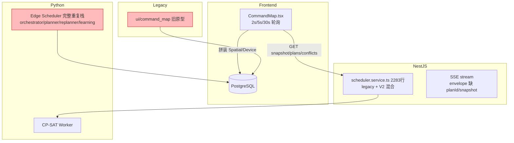
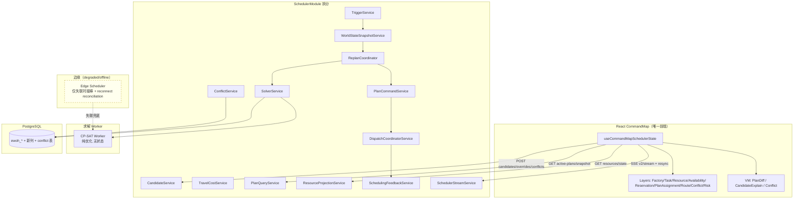
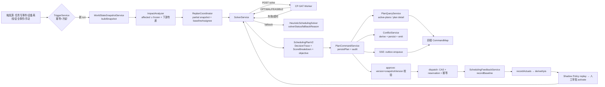
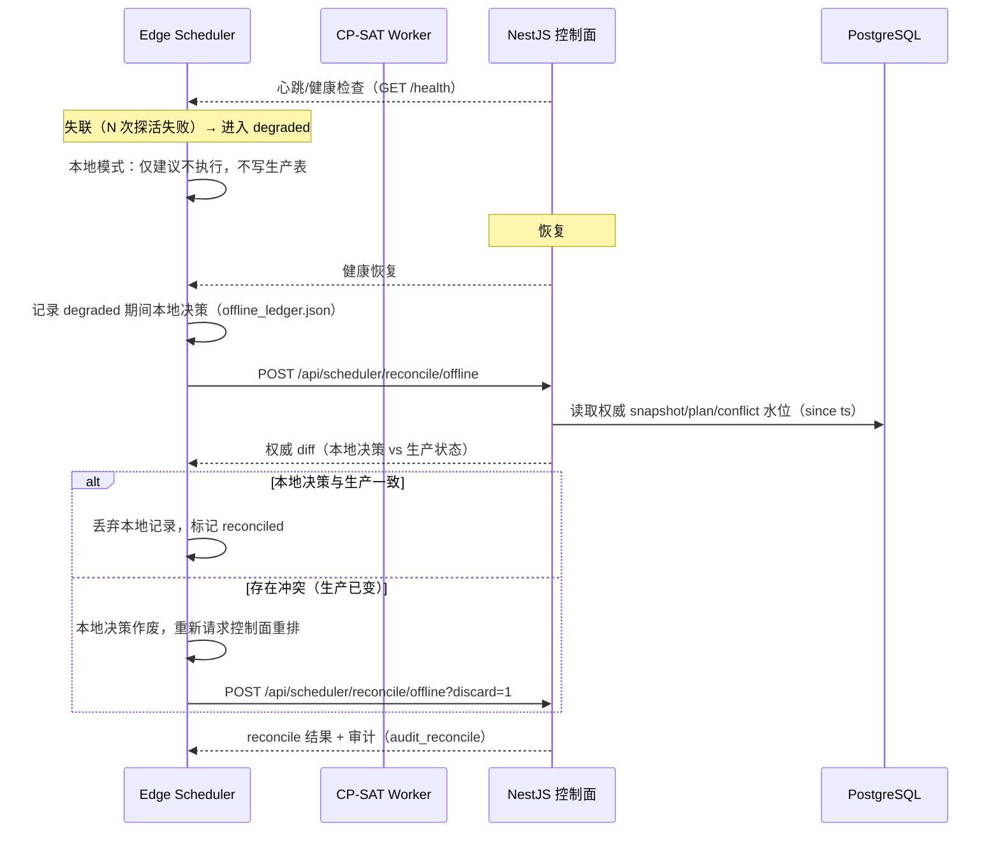
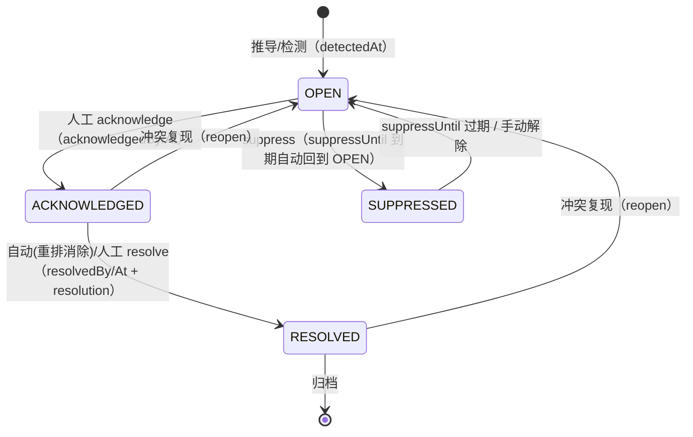
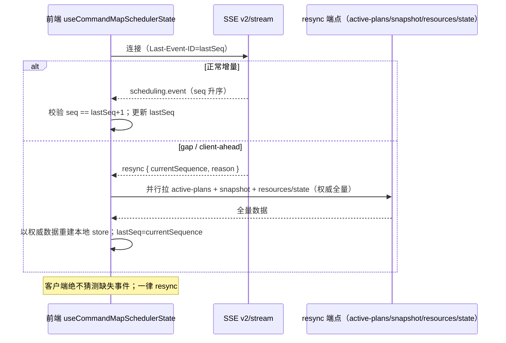
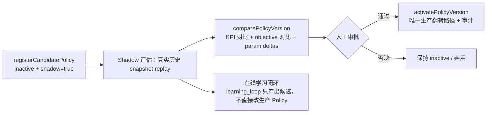

# 02 增量架构设计（Architecture Design）

> 项目：EWOH 指挥地图智能调度能力升级
> 基线：现状核验（01-current-state-review.md）
> 原则：增量演进、公开 API 兼容、SSOT 收敛、业务规则留后端

---

## 1. SSOT 决策

| 领域 | SSOT（唯一权威） | 消费方 | 不得再作为权威 |
|---|---|---|---|
| 调度控制面 | **NestJS Scheduler**（run/plan/approve/dispatch/feedback/conflict/policy） | 前端 CommandMap、移动端、外部系统 | Python Edge Scheduler（降级为 degraded/offline）、Legacy API |
| 世界状态快照 | `WorldStateSnapshotService.buildSnapshot`（`GET /api/scheduler/snapshot`） | 求解器、审批新鲜度校验、SSE resync | 前端本地拼装 |
| 资源状态 | `ResourceProjectionService`（`GET /api/scheduler/resources/state`） | 地图、ResourcePool、调度、派发 | 前端直接拼装 SpatialEntity/DeviceInfo |
| 活跃方案 | `PlanQueryService`（`GET /api/scheduler/active-plans` + `plans/:planId`） | 前端 Plan 面板、SSE resync | 前端本地缓存猜测 |
| 冲突 | **新 `ConflictService` + ewoh_scheduling_conflict 表**（生命周期持久化） | 冲突中心、SSE、审计 | 实时推导（现状，迁移到"推导+落库"双写） |
| 路由成本 | `TravelCostService`（RouteCostProvider 演进） | 候选、求解器、Plan Diff | 前端几何计算 |
| 策略/目标函数 | `SchedulingPolicyService`（ewoh_scheduling_policy，版本化） | 求解器、Shadow 评估 | 魔法数默认（buildPolicy 仅作无策略兜底） |
| 求解引擎 | **Python CP-SAT Worker（纯优化）** | NestJS `CpSatSchedulingSolver` | — |

**决策要点**：
1. NestJS 是唯一写路径（调度命令只经 NestJS 落库）；Python CP-SAT Worker 无状态、只读请求-响应。
2. Python Edge Scheduler 保留代码，但**不再主动调度**；仅在控制面失联（health 探活失败）时以 degraded 模式临时接棒，恢复后做 reconnect reconciliation（见 §5）。
3. `ui/command_map` 冻结；新 CommandMap 为唯一前端实现。
4. Legacy Scheduler API 制定迁移/删除方案（见 §9），V2 路径为唯一新开发目标。

---

## 2. Before / After 架构图

### 2.1 Before（现状）



### 2.2 After（目标）



---

## 3. 调度数据流图（目标态）



---

## 4. NestJS 模块 / 服务拆分方案（保留公开 API）

> 现状 `scheduler.service.ts`（2283 行）是唯一瓶颈。拆分**不改变任何 HTTP 端点路径/请求/响应形状**；Controller 保持薄层，按域委托。

### 4.1 新增服务（对应需求 #16）

| 服务 | 职责（从 scheduler.service.ts 迁出） | 公开 API 保持 |
|---|---|---|
| `SchedulingRunService` | createRun/listRuns/getRun/injectSchedulingEvent（run 生命周期） | POST /runs、GET /runs、POST /events |
| `CandidateService` | getTaskCandidates（资格 + 排序 + 评分分解 + rejected + route ETA/distance） | GET /tasks/:id/candidates |
| `ConflictService` | 冲突推导 + 持久化生命周期 + acknowledge/resolve/suppress + SSE 发射 | GET /conflicts、GET /conflicts/:id、**新增 POST /conflicts/:id/acknowledge\|resolve\|suppress** |
| `PlanCommandService` | approve/reject/dispatch/replan/applyOverrides/constraints 生命周期/comparePlans | POST /plans/:planId/{approve,reject,dispatch,replan,overrides}、GET/POST constraints |
| `PlanQueryService` | getActivePlans/getPlanDetail/getSnapshot 只读 | GET /active-plans、GET /plans/:planId、GET /snapshot |
| `SchedulingSnapshotService` | 快照构建/新鲜度/版本（WorldStateSnapshotService 演进，增加领域新列装配） | 内部 |
| `TravelCostService` | RouteCostProvider 演进：Task×Candidate RouteCostMatrix + fallbackReason/routeCostMode/dataQuality | GET /routes、POST /routes/calculate |
| `FeedbackService` | SchedulingFeedbackService 演进：KPI 扩展（on-time/lateness P95/travel/workload/churn/conflict rate/replan success） | POST /feedback/actuals、GET /metrics/feedback* |

### 4.2 保持不变的公开 API 面

- `GET /api/scheduler/resources/state`（SSOT）
- `GET /api/scheduler/active-plans`、`GET /api/scheduler/snapshot`、`GET /api/scheduler/runs*`
- `POST /api/scheduler/runs`、`POST /api/scheduler/events`
- `POST /api/scheduler/plans/:planId/{approve,reject,dispatch,replan,overrides}`、`GET /plans/:planId/compare/:otherPlanId`、`GET/POST constraints`
- `GET /api/scheduler/tasks/:id/candidates`、`GET/POST routes*`
- `GET /api/scheduler/conflicts*`（响应扩展 status 字段，向后兼容）
- `GET/POST /api/scheduler/policy*`
- `SSE GET /api/scheduler/v2/stream`（envelope 增加字段，兼容旧字段）

### 4.3 前端拆分（需求 #16/#10）

```
client/src/pages/CommandMap/
├── hooks/
│   ├── useCommandMapSchedulerState.ts     // 聚合 snapshot/ResourceProjection/plans/routes/conflicts/SSE
│   ├── schedulerQueries.ts                // react-query 查询（active-plans/snapshot/resources/state/candidates）
│   └── schedulerCommands.ts               // react-query 变更（approve/dispatch/override/conflict actions/boost）
├── layers/                                // 每个 Layer 一个渲染组件，纯视觉叠加
│   ├── FactoryLayer.tsx  TaskLayer.tsx  ResourceLayer.tsx  AvailabilityLayer.tsx
│   ├── ReservationLayer.tsx  PlanAssignmentLayer.tsx  RouteLayer.tsx  ConflictLayer.tsx  RiskLayer.tsx
├── vm/
│   ├── planDiffVM.ts                      // changed assignments/ETA delta/lateness delta/workload delta/waiting delta/risk delta/churn count
│   ├── candidateExplainVM.ts              // eligible+ranking+score breakdown+rejected reasons
│   └── conflictVM.ts                      // lifecycle/acknowledge/resolve/suppress 视图
└── panels/                                // 现有面板改为消费 hooks/VM（不改业务规则）
```

---

## 5. Python Worker 边界与 reconnect reconciliation 设计

### 5.1 边界（需求 #1）

```
┌─────────────────────────────────────────────────────────┐
│ 生产调度（唯一写路径）                                    │
│   NestJS Scheduler（控制面）                             │
│     └─ 求解委托: HTTP POST /api/scheduler/v2/solve       │
│          └─ Python cpsat/worker.py（纯优化、无状态、只读）│
└─────────────────────────────────────────────────────────┘
┌─────────────────────────────────────────────────────────┐
│ 边缘 degraded/offline 模式（仅控制面失联时）              │
│   Python Edge Scheduler（orchestrator/planner/replanner）│
│   - 本地影子运行 → 建议，不自动执行                       │
│   - 恢复后：reconnect reconciliation                     │
└─────────────────────────────────────────────────────────┘
```

**硬规则**：
- 生产 authoritative state 只存在于 PostgreSQL（NestJS 写入）。边缘模式产生的建议**不写入生产表**，仅本地文件/内存。
- CP-SAT Worker 不持有状态、不写 DB、不做人在回路；`solverStatus` 为 `OPTIMAL/FEASIBLE/UNAVAILABLE`。
- OR-Tools 版本固定：`pyproject.toml`/`requirements.txt` 锁定（如 `ortools==9.x.y`），`solver.py` 的 `SOLVER_VERSION` 与 NestJS `SchedulingPolicy.solverVersion` 对齐。

### 5.2 reconnect reconciliation（边缘 → 控制面恢复）



**实现要点**：
- 新增 `POST /api/scheduler/reconcile/offline`（带 `offlineWindow`/`localDecisions[]`/`edgeVersion`），由 `SchedulingRunService` 处理并审计。
- 新增 `GET /api/scheduler/health`（已存在于 worker；控制面侧可加 `GET /api/scheduler/health/live`）。
- 边缘本地决策必须带 `offline: true` 标记，任何导入生产前强制走重排校验。

---

## 6. Conflict Lifecycle 持久化设计（需求 #8）

### 6.1 状态机



**规则**：
- `OPEN`：新推导或复现的冲突；SSE 推 `conflict.detected`。
- `ACKNOWLEDGED`：人工确认，记录 acknowledgedBy/At。
- `RESOLVED`：重排消除（自动，记 resolution=`replanned`）或人工 resolve；记录 resolvedBy/At/resolution。
- `SUPPRESSED`：suppressUntil 内不再告警/推 SSE；到期自动回 OPEN。
- 全部转移写 `ewoh_schedule_audit`（action=`conflict.acknowledge|resolve|suppress|reopen`）。

### 6.2 新表 `ewoh_scheduling_conflict`

```sql
CREATE TABLE IF NOT EXISTS ewoh_scheduling_conflict (
  id uuid PRIMARY KEY DEFAULT gen_random_uuid(),
  conflict_id varchar(255) NOT NULL UNIQUE,      -- 内容种子哈希，跨推导稳定
  type varchar(50) NOT NULL,                     -- SchedulingConflictType
  severity varchar(20) NOT NULL,
  scope varchar(20) NOT NULL,
  status varchar(20) NOT NULL DEFAULT 'OPEN',    -- OPEN/ACKNOWLEDGED/RESOLVED/SUPPRESSED
  task_ids jsonb NOT NULL DEFAULT '[]',
  resource_ids jsonb NOT NULL DEFAULT '[]',
  plan_id varchar(255),
  snapshot_version varchar(255),
  detected_at timestamptz(6) NOT NULL,
  acknowledged_by varchar(255),
  acknowledged_at timestamptz(6),
  resolved_by varchar(255),
  resolved_at timestamptz(6),
  resolution varchar(255),
  suppress_until timestamptz(6),
  message text NOT NULL,
  data jsonb,
  org_id varchar(255),
  created_at timestamptz(6) DEFAULT CURRENT_TIMESTAMP,
  updated_at timestamptz(6) DEFAULT CURRENT_TIMESTAMP
);
CREATE INDEX IF NOT EXISTS idx_conflict_status ON ewoh_scheduling_conflict (status, detected_at DESC);
CREATE INDEX IF NOT EXISTS idx_conflict_type ON ewoh_scheduling_conflict (type);
CREATE INDEX IF NOT EXISTS idx_conflict_org ON ewoh_scheduling_conflict (org_id);
```

### 6.3 新端点（Controller 增加，公开 API 向后兼容）

```
POST /api/scheduler/conflicts/:id/acknowledge   body: { operator, reason? }
POST /api/scheduler/conflicts/:id/resolve       body: { operator, reason?, resolution? }
POST /api/scheduler/conflicts/:id/suppress      body: { operator, reason?, suppressUntilMs }
```

---

## 7. SSE envelope schema 与 resync 协议（需求 #9）

### 7.1 目标 envelope（扩展，兼容旧字段）

```jsonc
{
  "eventId": "EVT-...",
  "eventType": "plan.created | assignment.dispatched | conflict.detected | ...",
  "entityId": "task-123",
  "entityType": "task",
  "entityVersion": 7,
  "sequence": 1024,             // outbox 单调 seq（SSE id 字段同值）
  "snapshotVersion": "WS-20250203-0007",   // 新增：关联快照
  "planId": "PLAN-...A",                    // 新增：关联方案（无则 null）
  "occurredAt": "2025-02-03T10:00:00.000Z", // 新增：业务发生时间
  "sourceTs": "2025-02-03T10:00:00.000Z",
  "serverTs": "2025-02-03T10:00:01.000Z",
  "payload": {}
}
```

### 7.2 客户端协议（seq gap / reconnect）



**实现要点**：
- `scheduler-stream.service.ts` `toEvent()` 增加 envelope 字段（从 outbox payload 透传）。
- 前端 `useCommandMapSchedulerState` 内建 SSE 客户端（EventSource），收到 `resync` 事件后调 `schedulerQueries` 的权威端点。
- 轮询降级：SSE 可用时关闭 world 2s/overview 5s/plan 30s 轮询；SSE 断开且重试失败时降级回 15s/30s 轮询（保留退路，不猜状态）。

---

## 8. DB 新字段清单与 Migration 计划

### 8.1 领域模型落库（需求 #2）

| 表 | 新列 | 类型 | 说明 |
|---|---|---|---|
| `ewoh_production_task` | `base_priority` | varchar(50) | Task.basePriority（不再从 title/taskType 猜） |
| | `earliest_start_ms` / `latest_finish_ms` | bigint | 时间窗 |
| | `safety_critical` | boolean NOT NULL DEFAULT false | 真实安全关键标记（替代 deriveSafetyCritical） |
| | `preemptible` | boolean NOT NULL DEFAULT false | 替代固定 false |
| | `skill_match_mode` | varchar(10) DEFAULT 'ALL' | ALL/ANY |
| | `production_impact` | real DEFAULT 0 | 替代 deriveProductionImpact |
| | `downstream_impact` | real DEFAULT 0 | 下游影响度 |
| | `required_station_capabilities` | jsonb DEFAULT '[]' | 工位能力需求 |
| | `preferred_resources` / `excluded_resources` | jsonb DEFAULT '[]' | 偏好/排除资源（约束层已有，落库到任务） |
| `ewoh_personnel` | `shift` | varchar(100) | 班次 |
| | `workload` | real | 当前负载（现有 currentLoad jsonb 提升为列） |
| | `current_task_id` | varchar(255) | 当前任务 |
| `ewoh_device` | `capabilities` | jsonb DEFAULT '[]' | 真实能力集合（替代白名单派生） |
| | `location_lat`/`location_lng`/`location_updated_at` | real/timestamptz | 设备自身位置（替代借用人员） |
| | `location_confidence` | real DEFAULT 0 | 位置置信度 |
| | `telemetry_updated_at` | timestamptz(6) | 遥测时间戳 |
| | `available_windows` | jsonb DEFAULT '[]' | 设备可用窗口（替代恒空） |
| `ewoh_spatial_entity` | `capacity` | integer | 工位容量（替代 extra.capacity） |
| | `queue` | jsonb DEFAULT '[]' | 工位队列 |
| | `available_windows` | jsonb DEFAULT '[]' | 工位可用窗口 |
| `ewoh_certification`（若存在）或 personnel 侧 | `certification_expiry` | timestamptz | 证书到期（资格判定用） |
| `ewoh_scheduling_run` | `failure_reason` | text | 失败原因落库（替代仅日志） |
| `ewoh_scheduling_policy` | `shadow` | boolean DEFAULT false | Shadow 标记 |
| `ewoh_scheduling_policy` | `weights_json` | jsonb | 完整 8 权重（W_lateness/W_travel/W_wait/W_workload/W_station/W_change/W_risk/W_energy） |
| **新表** | `ewoh_scheduling_conflict` | — | §6.2 |
| **新表** | `ewoh_route_cost_matrix`（可选） | — | Task×Candidate 快照级 RouteCost 缓存（确定性 replay） |

### 8.2 Migration 计划

```
db/migrations/
standalone_012_domain_columns.sql          -- 领域模型新列（forward + rollback + verify）
standalone_013_conflict_lifecycle.sql      -- ewoh_scheduling_conflict + audit 兼容
standalone_014_policy_weights.sql          -- policy shadow/weights_json
standalone_015_route_cost_matrix.sql       -- 可选缓存表
standalone_016_device_location.sql         -- 设备位置/遥测新列
```

- 每个 migration 配套 `.rollback.sql`（DROP COLUMN IF EXISTS / DROP TABLE IF EXISTS）与 `db/verify/` 校验 SQL。
- 策略：**先加列（可空/默认值）→ 后端 Adapter 读新列 → 数据回填/迁移脚本 → 切换 world-state 装配 → 弃用派生函数**，保证零停机。
- 禁止破坏公开 API：新列默认值保证旧行兼容。

---

## 9. Legacy Scheduler API 迁移/删除方案（需求 #1）

| Legacy | V2 等价 | 迁移动作 |
|---|---|---|
| `POST /api/scheduler/plans` | `POST /api/scheduler/runs` | 保留 deprecated 包装；`X-EWOH-Deprecated: true` 响应头 + 审计；**T+3 个月删除** |
| `GET /api/scheduler/plans` | `GET /api/scheduler/active-plans` + `GET /plans/:planId` | 同上 |
| `POST /api/scheduler/plans/:planId/confirm` | `POST /api/scheduler/plans/:planId/approve` | 同上 |
| `scheduler.service.ts` 内 legacy 方法 | 拆入 PlanCommandService/PlanQueryService | 拆分时同步删除，仅保留 deprecated 包装壳 |

删除守卫：删除前检查调用方（前端 grep `/plans` 消费点）+ 审计日志中出现 deprecated 调用即延期。

---

## 10. Route Cost Matrix 设计（需求 #4）

### 10.1 数据结构

```jsonc
{
  "matrixId": "RCM-20250203-0001",
  "snapshotVersion": "WS-20250203-0007",
  "policyVersion": 3,
  "solverVersion": "heuristic-v2",
  "taskId": "task-001",
  "candidates": [
    {
      "personId": "p1", "deviceId": "d2", "stationId": "s5",
      "travelCost": {
        "etaSeconds": 180,
        "distanceMeters": 240,
        "congestion": 1.0,          // 边拥塞系数
        "blocked": false,           // 是否存在 blocked 边
        "forbiddenZone": false,     // 是否穿越禁入区
        "risk": 1.0,                // 沿路最高风险折算
        "energy": 0.3,              // 能量消耗（可选）
        "routeCostMode": "route_graph",        // route_graph | euclidean_fallback
        "fallbackReason": null,                // 回退原因（如 no_route_edge）
        "dataQuality": "FRESH"                 // FRESH/STALE/UNKNOWN（坐标/图新鲜度）
      }
    }
  ],
  "generatedAt": "2025-02-03T10:00:00.000Z"
}
```

### 10.2 接入点

- `TravelCostService`（RouteCostProvider 演进）输出 `RouteCostMatrix`；`heuristic-scheduling-solver` 的 `computeCandidateScore` 与 CP-SAT `buildRequest` 消费同一矩阵。
- 前端 Candidate Explain / Plan Diff 读取矩阵中 `etaSeconds/distanceMeters/routeCostMode/fallbackReason/dataQuality` 展示。
- **Euclidean 仅显式 fallback**：`source=euclidean_fallback` 必须带 `fallbackReason` 与 `dataQuality`（坐标缺失→UNKNOWN；图不可达→no_route_edge）。
- 修复现状：`routing.service.ts` 中 `from ?? {x:0,y:0}` 的 0,0 兜底改为显式 `UNKNOWN` 不可行。

---

## 11. Solver Objective 接入方案（需求 #12/#13）

### 11.1 目标函数（版本化）

```
Objective = W_lateness × lateness
          + W_travel   × routeETA
          + W_wait     × waiting
          + W_workload × workloadImbalance
          + W_station  × stationQueue
          + W_change   × assignmentChurn
          + W_risk     × routeRisk
          + W_energy   × energyCost
```

- 权重隶属 `SchedulingPolicy.weights_json`（完整 8 项），`policyVersion` 归属，可审计、可回滚、可 Shadow Compare。
- `SchedulingPolicy` 接口扩展：保留旧字段（latenessWeight/walkingWeight/...）映射为兼容别名，新增 `weights: { lateness, travel, wait, workload, station, change, risk, energy }` 作为权威；`buildPolicy` 去掉魔法数派生（无 weights_json 时用默认常量，仅作兜底）。
- Plan 保存实际 `policyVersion` + `weights_json` 快照（persistPlan 已存 policyVersion，扩展存 weights）。

### 11.2 Solver 工程化

- 固定 OR-Tools 版本（Python `requirements`/`pyproject` 锁定）；`SOLVER_VERSION` 对齐 `SchedulingPolicy.solverVersion`。
- `solverStatus` 枚举：`OPTIMAL/FEASIBLE/HEURISTIC/FALLBACK/UNAVAILABLE/INFEASIBLE`；fallback 必须带 `fallbackReason`；UI 显示 CP-SAT vs fallback；metrics 统计 fallback rate。
- 固定 fixtures 目录（新）：
```
server/modules/scheduler/__fixtures__/
  normal.json  skill-mismatch.json  cert-expired.json  offline.json  low-battery.json
  predecessor.json  no-double-booking.json  station-capacity.json  forbidden-zone.json
  safety-block.json  route-blocked.json  infeasible.json  locked.json  partial-replan.json
```
- 确定性 replay：`snapshot.snapshotVersion + policyVersion + solverVersion + objective weights + fixtures` 可完全复现（已有 base，补 fixtures 规范化）。

### 11.3 Shadow Policy 流程（需求 #14）



- 现状 `comparePolicyVersion` 仅参数 delta + objective 估算 → 升级为**真实历史 snapshot replay**（从 ewoh_world_state_snapshot 取历史快照 + feedback 行驱动，回放候选 vs 生效策略）。
- 在线学习（Python learning_loop）产出候选权重，经 registerCandidatePolicy → Shadow → 人工审批 → activate，**绝不直接改生产 Policy**。

---

## 12. 类图（Class Diagram）

```mermaid
classDiagram
  class WorldStateSnapshot {
    +string snapshotVersion
    +number worldVersion
    +Map entityVersions
    +Person[] persons
    +Task[] tasks
    +Device[] devices
    +Station[] stations
    +Reservation[] reservations
    +ForbiddenZone[] forbiddenZones
    +LockedAssignment[] lockedAssignments
  }
  class Task {
    +string id
    +string basePriority
    +number earliestStartMs
    +number latestFinishMs
    +boolean safetyCritical
    +boolean preemptible
    +string skillMatchMode
    +number productionImpact
    +number downstreamImpact
    +string[] requiredSkills
    +string[] requiredCertifications
    +string[] requiredDeviceCapabilities
    +string[] requiredStationCapabilities
    +string[] preferredResources
    +string[] excludedResources
  }
  class Resource {
    +string id
    +string status
    +string shift
    +Window[] availableWindows
    +string[] skills
    +Cert[] certifications
    +string[] capabilities
    +number batteryPct
    +number workload
    +string currentTaskId
    +Reservation[] reservations
    +Location location
    +number locationConfidence
    +number telemetryUpdatedAt
    +string dataQuality
  }
  class Station {
    +string id
    +number capacity
    +string[] capabilities
    +Window[] availableWindows
    +string[] queue
    +string zoneId
  }
  class SchedulingConflict {
    +string conflictId
    +ConflictType type
    +ConflictSeverity severity
    +ConflictStatus status
    +string[] taskIds
    +string[] resourceIds
    +string planId
    +string snapshotVersion
    +string detectedAt
    +string acknowledgedBy
    +string acknowledgedAt
    +string resolvedBy
    +string resolvedAt
    +string resolution
    +string suppressUntil
  }
  class SchedulingEvent {
    +string eventId
    +string eventType
    +number sequence
    +string snapshotVersion
    +string planId
    +string occurredAt
  }
  class RouteCostMatrix {
    +string matrixId
    +string snapshotVersion
    +string taskId
    +CandidateRouteCost[] candidates
  }
  class CandidateRouteCost {
    +string personId
    +string deviceId
    +number etaSeconds
    +number distanceMeters
    +number congestion
    +boolean blocked
    +boolean forbiddenZone
    +number risk
    +number energy
    +string routeCostMode
    +string fallbackReason
    +string dataQuality
  }
  class SchedulingPolicy {
    +number version
    +string solverVersion
    +ObjectiveWeights weights
    +boolean shadow
  }

  class TriggerService {
    +evaluate(type, entityId, ctx) SchedulingRun
  }
  class WorldStateSnapshotService {
    +buildSnapshot(ctx) WorldStateSnapshot
    +isSnapshotFresh(version) boolean
    +assertFreshForApprove(version)
  }
  class ImpactAnalyzer {
    +analyze(snapshot, event) ImpactResult
  }
  class ReplanCoordinatorService {
    +handleTrigger(type, entityId, ctx) RunResult
    +dispatchStateTriggers(snapshot, ctx)
  }
  class TravelCostService {
    +buildMatrix(snapshot, task, candidates) RouteCostMatrix
  }
  class EligibilityService {
    +check(person, task, device, ctx) EligibilityResult
  }
  class SolverService {
    +solveVariants(snapshot, constraints, opts) SchedulingPlanV2[]
    +solve(snapshot, constraints, opts) SchedulingPlanV2
  }
  class CpSatSchedulingSolver {
    +solve(snapshot, constraints, opts) SchedulingPlanV2
  }
  class HeuristicSchedulingSolver {
    +solve(snapshot, constraints, opts) SchedulingPlanV2
  }
  class PlanCommandService {
    +persistPlan(plan, ctx)
    +approvePlan(planId, body, ctx)
    +dispatchPlan(planId, ctx)
    +replan(planId, body, ctx)
    +applyOverrides(planId, body, ctx)
  }
  class PlanQueryService {
    +getActivePlans() SchedulingPlanV2[]
    +getPlanDetail(planId) SchedulingPlanV2
    +comparePlans(a, b) PlanDiff
  }
  class ConflictService {
    +derive(snapshot) SchedulingConflict[]
    +persist(conflicts, ctx)
    +acknowledge(id, actor, reason)
    +resolve(id, actor, reason, resolution)
    +suppress(id, actor, reason, until)
  }
  class ResourceProjectionService {
    +getUnifiedResourceState() ResourceState[]
  }
  class DispatchCoordinatorService {
    +dispatch(planId, ctx) DispatchResult
  }
  class SchedulingFeedbackService {
    +recordBaseline(planId, ctx)
    +recordActuals(body, ctx)
    +deriveKpis() SchedulingFeedbackKpis
  }
  class SchedulerStreamService {
    +replaySince(seq, lastId) ReplayResult
    +events() Observable
  }
  class SchedulingPolicyService {
    +getActivePolicy() SchedulingPolicy
    +registerCandidatePolicy(config, orgId, by)
    +activatePolicyVersion(version, orgId, by)
    +shadowCompare(version) SchedulingPolicyComparison
  }

  TriggerService --> WorldStateSnapshotService
  ReplanCoordinatorService --> ImpactAnalyzer
  ReplanCoordinatorService --> SolverService
  SolverService --> CpSatSchedulingSolver
  SolverService --> HeuristicSchedulingSolver
  CpSatSchedulingSolver --> TravelCostService
  HeuristicSchedulingSolver --> EligibilityService
  HeuristicSchedulingSolver --> TravelCostService
  PlanCommandService --> PlanQueryService
  PlanCommandService --> DispatchCoordinatorService
  ConflictService --> ResourceProjectionService
  ConflictService --> SchedulerStreamService
  SchedulingFeedbackService --> DispatchCoordinatorService
  SchedulingPolicyService --> SolverService
  WorldStateSnapshotService --> SchedulingPolicyService
```



---

## 13. 共享知识与横切约定（Shared Knowledge）

- 所有 API 响应沿用 `{code, data, message}` 约定；新增端点遵循现有 error 语义（ConflictException `PLAN_STALE` 等）。
- 所有时间存储为 ISO 8601 UTC；调度内部时间计算用 epoch ms（`*Ms` 后缀字段）。
- 未知/缺失字段必须显式 `UNKNOWN`/`STALE`/`null`，禁止用 0/空字符串/默认坐标冒充真实值。
- `safetyCritical` 任务不可被任何 override 覆盖（硬校验在 PlanCommandService 前置）。
- 调度不替代设备级安全：dispatch 不下发设备安全控制指令。
- demo/simulated 数据带 `demo: true` 标记，绝不写入生产 authoritative state。
- 禁止 `unsafe as unknown as` 逃避类型检查：Legacy/JSONB 数据一律走 Adapter + runtime validation（zod/class-validator）。
- 前端不生成正式调度结论：资格/评分/冲突结论只读后端。
- DB 变更 forward migration + rollback + verify；API 变更同步 shared types + OpenAPI + route manifest + contracts。
- 全链路追踪：runId → snapshotVersion → planId → assignmentId → dispatch → feedback，日志与 outbox payload 携带完整 id 链。
- RBAC/org isolation/RLS 保留并在新端点沿用（org-context interceptor + GUC settings）。

---

## 14. 开放问题决策记录（主理人拍板，审计追溯）

> 以下 5 项开放问题由主理人拍板确认，全部按架构师推荐执行。本记录用于审计追溯；决策已落实到 02 对应章节与 03 任务定义，无需再改动设计主体。

| # | 决策项 | 拍板结论 | 落点（文档/任务） |
|---|---|---|---|
| D-A | 证书到期字段 | **新增 `certification_expiry` 平行列保兼容**（不将 `ewoh_personnel.certifications` string[] 升级为对象数组，避免破坏 API 形状）；资格判定读取平行列 | 02 §8.1（ewoh_personnel 新列）、P1-T1/P1-T2 |
| D-B | Legacy API 删除窗口 | **deprecated 保留 + T+3 个月删除**；删除前检查调用方与审计日志中的 deprecated 调用，有调用即延期 | 02 §9、P1 拆分时保留 deprecated 壳 |
| D-C | Conflict 自动 RESOLVED | **推导消失即自动 RESOLVED**（resolution=`auto_cleared` + audit），同时保留人工 resolve；reopen 逻辑不变 | 02 §6.1/§6.3、P3-T1 |
| D-D | RouteCostMatrix 落库 | **落库 `ewoh_route_cost_matrix`**（P2-T1 正式子项，非可选），支撑确定性 replay | 02 §8.1（新表）、02 §10、P2-T1 |
| D-E | `as unknown as` 治理范围 | **分期治理**：优先 scheduler 写路径 + 新代码禁止；存量 Legacy 读取走 Adapter + runtime validation | 02 §13、P1-T2（world-state 装配） |

