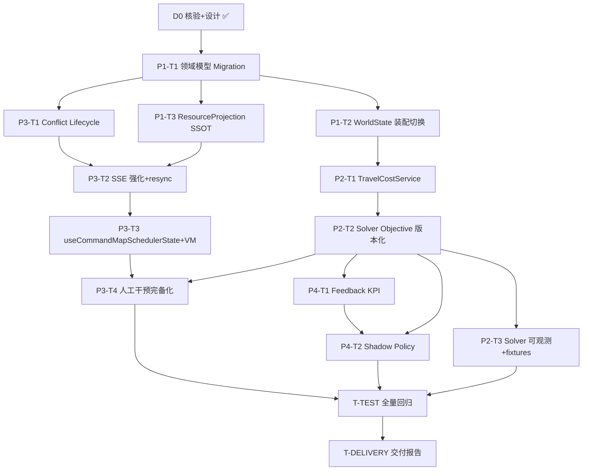

# 03 任务分解（Task Breakdown）

> 项目：EWOH 指挥地图智能调度能力升级
> 阶段：Phase 0–4（Phase 0 为核验与设计，已由架构师完成）
> 约定：每个任务给出【目标/改动文件/依赖/关键实现点/验收标准】，工程师可直接执行。
> 依赖图见文末。

---

## Phase 0 — 现状核验 + SSOT 架构治理设计（已完成 ✅）

| ID | 任务 | 状态 |
|---|---|---|
| D0 | 现状核验（01-current-state-review.md）、增量架构设计（02-architecture-design.md）、任务分解（03-task-breakdown.md） | 完成 |

Phase 0 产出即本三文档 + 独立 mermaid 文件（`docs/scheduler-commandmap-upgrade/class-diagram.mermaid`、`sequence-diagram.mermaid`）。

---

## Phase 1 — Production Data Model（领域模型落库 + ResourceProjection SSOT）

### P1-T1 领域模型 DB Migration（Task/Resource/Station 新列）

- **目标**：将需求 #2 的领域字段落库（替代 taskType/priority 白名单派生与 extra 非正式字段），forward migration + rollback + verify。
- **改动文件**：
  - `db/migrations/standalone_012_domain_columns.sql` + `.rollback.sql`
  - `db/verify/standalone_012_domain_columns.verify.sql`
  - `ewoh-spark-app/server/database/schema.ts`（新增列定义）
  - `db/seed/`（可选补 seed 数据）
- **依赖**：D0
- **关键实现点**：
  - `ewoh_production_task` 加：`base_priority`、`earliest_start_ms`、`latest_finish_ms`、`safety_critical`、`preemptible`、`skill_match_mode`、`production_impact`、`downstream_impact`、`required_station_capabilities`、`preferred_resources`、`excluded_resources`
  - `ewoh_personnel` 加：`shift`、`workload`、`current_task_id`
  - `ewoh_device` 加：`capabilities`、`location_lat/lng`、`location_updated_at`、`location_confidence`、`telemetry_updated_at`、`available_windows`
  - `ewoh_spatial_entity` 加：`capacity`、`queue`、`available_windows`
  - 证书到期：`ewoh_personnel` 侧 `certifications` 升级为对象数组或新增 `certification_expiry`（评审决定，见 §开放问题）
  - `ewoh_scheduling_run` 加 `failure_reason`
- **验收标准**：
  - migration 可重复执行（re-entrant），rollback 可还原；verify SQL 校验新列存在且默认值正确
  - 旧行在新列默认值下可正常读写（零停机）
  - `db/runner` 通过 012 全量跑通

### P1-T2 WorldState 装配切换（Adapter 读新列，淘汰派生函数）

- **目标**：`world-state.service.ts` 从新列读取真实字段；保留派生函数仅作无值兜底（带 `derived: true` 标记）；消除 hardcode。
- **改动文件**：
  - `ewoh-spark-app/server/modules/scheduler/world-state.service.ts`
  - `ewoh-spark-app/shared/scheduler.ts`（WorldStateSnapshot Task/Device/Station 类型扩展）
  - `ewoh-spark-app/server/modules/scheduler/__tests__/world-state-derive.spec.ts`（更新）
- **依赖**：P1-T1
- **关键实现点**：
  - Task 装配改为：`safetyCritical = row.safety_critical ?? deriveSafetyCritical(taskType)`，缺省时记录 `derived`；`preemptible`/`skillMatchMode`/`productionImpact` 同法
  - 新增 `earliestStartMs/latestFinishMs/downstreamImpact/requiredStationCapabilities/preferredResources/excludedResources` 透传
  - Device：能力用 `capabilities` 列；位置用 `location_lat/lng`（无则 UNKNOWN，**不再借用人员坐标**）；`availableWindows` 读列；补 `locationConfidence/telemetryUpdatedAt`
  - Station：`capacity` 读列；补 `queue`
  - person x/y 缺失 → 显式 `UNKNOWN`（不填 0）；freshness 规则不变
  - `replan-coordinator` run 失败写 `failure_reason` 列
- **验收标准**：
  - 新列有值时装配取真实值；无值时走派生兜底且带标记，快照字段不出现 0/空冒充
  - 现有 `world-state-derive`/`v0.7 A1`/`Batch5.3` 测试适配后全绿
  - 设备位置不再出现 `boundPerson.x` 借用

### P1-T3 ResourceProjection SSOT 收敛（resources/state 字段补齐 + 双源一致性）

- **目标**：`/api/scheduler/resources/state` 补齐领域字段（locationConfidence/telemetryUpdatedAt/certification expiry/station capacity+queue），并消除与 world-state 的 device capabilities 双源不一致。
- **改动文件**：
  - `ewoh-spark-app/server/modules/scheduler/resource-projection.service.ts`
  - `ewoh-spark-app/shared/scheduler.ts`（ResourceState 类型扩展）
  - `ewoh-spark-app/server/modules/scheduler/__tests__/resource-state.spec.ts`（更新）
  - `ewoh-spark-app/server/modules/scheduler/__tests__/rls-org-filter.audit.spec.ts`（若影响）
- **依赖**：P1-T1
- **关键实现点**：
  - device `capabilities` 与 world-state 统一读取 `ewoh_device.capabilities` 列（移除 `[deviceModel]` 裸串）
  - station 投影补 `capacity/queue`
  - person 补 `shift/workload/currentTaskId`；certifications 带到期信息
  - 字段级 `locationUpdatedAt/locationConfidence/telemetryUpdatedAt` 落投影
  - 保持 `dataQuality` FRESH/STALE/UNKNOWN 语义；未知字段显式 null/UNKNOWN
- **验收标准**：
  - resources/state 与 world-state 对同一设备的 capabilities 完全一致（单测断言）
  - 新字段全部出现在响应且来源可追溯（有背衬列才填充）
  - 现有 resource-state/RLS 测试全绿

---

## Phase 2 — Solver / Routing（Route Cost Matrix + CP-SAT objective + fallback 可观测 + fixtures）

### P2-T1 TravelCostService（RouteCostMatrix + fallback 明细）

- **目标**：将 RouteCostProvider 演进为 `TravelCostService`，产出 Task×Candidate RouteCostMatrix（ETA/distance/congestion/blocked/forbiddenZone/risk/energy + routeCostMode/fallbackReason/dataQuality）；Euclidean 仅显式 fallback。
- **改动文件**：
  - `ewoh-spark-app/server/modules/scheduler/route-cost.provider.ts` → 演进/新建 `travel-cost.service.ts`
  - `ewoh-spark-app/server/modules/scheduler/routing.service.ts`（修复 `from ?? {x:0,y:0}` 兜底为 UNKNOWN 不可行）
  - `ewoh-spark-app/shared/scheduler.ts`（RouteCostMatrix/CandidateRouteCost 类型）
  - `ewoh-spark-app/server/modules/scheduler/scheduler.module.ts`、`scheduler.controller.ts`（`GET /routes`、`POST /routes/calculate` 委托）
  - `ewoh-spark-app/server/modules/scheduler/__tests__/routing.spec.ts`、`cp-sat-fallback.spec.ts`（更新）
- **依赖**：P1-T2
- **关键实现点**：
  - `buildMatrix(snapshot, task, candidates)` 聚合每候选的 RouteCost
  - euclidean fallback 必须带 `fallbackReason`（no_route_edge / coords_unknown / graph_unavailable）与 `dataQuality`
  - blocked/forbidden zone 在矩阵层显式标记（读 routeStatus + forbiddenZones）
  - heuristic 与 CP-SAT 请求消费同一矩阵
- **验收标准**：
  - fixtures 中 route-blocked/forbidden-zone 场景矩阵字段正确
  - 无坐标任务候选返回 `dataQuality=UNKNOWN`、`feasible=false`，**绝不返回 0,0 伪坐标**
  - 现有 routing/fallback 测试全绿

### P2-T2 Solver Objective 版本化接入（8 权重 + policyVersion 保存）

- **目标**：SchedulingPolicy 权威化 `weights_json`（W_lateness/W_travel/W_wait/W_workload/W_station/W_change/W_risk/W_energy）；去掉 buildPolicy 魔法数派生；Plan 持久化实际权重。
- **改动文件**：
  - `ewoh-spark-app/shared/scheduler.ts`（SchedulingPolicy/SchedulingPolicyConfig 扩展）
  - `ewoh-spark-app/server/modules/scheduler/scheduling-policy.service.ts`
  - `db/migrations/standalone_014_policy_weights.sql` + rollback/verify
  - `ewoh-spark-app/server/modules/scheduler/heuristic-scheduling-solver.ts`（computeCandidateScore 消费 8 权重）
  - `ewoh-spark-app/server/modules/scheduler/cp-sat-scheduling-solver.ts`（buildRequest 携带 weights）
  - `ewoh-spark-app/server/modules/scheduler/plan.service.ts`（persistPlan 存 weights_json）
  - `ewoh-spark-app/server/modules/scheduler/__tests__/policy-version.spec.ts`、`solver-invariants.spec.ts`（更新）
- **依赖**：P2-T1
- **关键实现点**：
  - 旧字段（latenessWeight/walkingWeight/...）保留为兼容别名，内部统一读 `weights`
  - `weights_json` 缺省时用默认常量（不再从 priority 系数相乘派生）
  - Plan 持久化 `policyVersion + solverVersion + weights` 快照
- **验收标准**：
  - 相同 snapshot+policyVersion+solverVersion 下两次求解 objective 完全一致（确定性）
  - policy-version/solver-invariants 测试全绿
  - 旧配置无 weights_json 时行为向后兼容

### P2-T3 Solver 可观测 + 固定 fixtures

- **目标**：solverStatus/fallbackReason 全链路可见；metrics 补 candidate 数/hard reject 数/affected 数/churn；统一固定 fixtures 集。
- **改动文件**：
  - 新建 `ewoh-spark-app/server/modules/scheduler/__fixtures__/`（normal/skill-mismatch/cert-expired/offline/low-battery/predecessor/no-double-booking/station-capacity/forbidden-zone/safety-block/route-blocked/infeasible/locked/partial-replan）
  - `ewoh-spark-app/server/modules/scheduler/scheduler-metrics.service.ts`（新增 counters）
  - `ewoh-spark-app/server/modules/scheduler/solver.service.ts`、`cp-sat-scheduling-solver.ts`（metrics 埋点）
  - `ewoh-spark-app/server/modules/scheduler/__tests__/scheduler-metrics.spec.ts`、`failure-injection.spec.ts`（更新）
  - Python：`src/edge_platform/scheduler/cpsat/` requirements 锁定 OR-Tools 版本 + `SOLVER_VERSION` 常量
- **依赖**：P2-T2
- **关键实现点**：
  - metrics：`scheduler_candidate_count`、`scheduler_hard_reject_total`、`scheduler_partial_replan_affected`、`scheduler_plan_churn_total`（counter/gauge）
  - fixtures JSON schema 统一（snapshot+policy+weights+solverVersion），供 deterministic replay
- **验收标准**：
  - 每个 fixture 有对应单测且断言 solverStatus/objective 可复现
  - metrics 端点输出新指标；fallback 场景 fallback_total 递增
  - Python 侧 OR-Tools 版本号被锁定且与 solverVersion 一致

---

## Phase 3 — Realtime CommandMap（SSE + useCommandMapSchedulerState + Candidate Explain + Plan Diff + Conflict Lifecycle + Override）

### P3-T1 Conflict Lifecycle 持久化 + API（后端）

- **目标**：新增 `ewoh_scheduling_conflict` 表与 `ConflictService`，冲突从"实时推导"升级为"推导+落库+生命周期"，新增 acknowledge/resolve/suppress 端点。
- **改动文件**：
  - `db/migrations/standalone_013_conflict_lifecycle.sql` + rollback/verify
  - `ewoh-spark-app/server/database/schema.ts`（ewohSchedulingConflict）
  - 新建 `ewoh-spark-app/server/modules/scheduler/conflict.service.ts`
  - `ewoh-spark-app/shared/scheduler.ts`（SchedulingConflict 类型扩展：status/detectedAt/acknowledgedBy/.../suppressUntil/planId）
  - `ewoh-spark-app/server/modules/scheduler/scheduler.controller.ts`（POST conflicts/:id/acknowledge|resolve|suppress）
  - `ewoh-spark-app/server/modules/scheduler/scheduler.module.ts`
  - `ewoh-spark-app/server/modules/scheduler/__tests__/conflicts.spec.ts`（更新 + 新生命周期测试）
- **依赖**：P1-T1
- **关键实现点**：
  - 推导保留（scheduler.service listConflicts 逻辑迁入 ConflictService），每次推导与已落库行按 `conflictId` 归并（复现→OPEN，消失→自动 RESOLVED）
  - 全部转移写 audit；SSE 推 `conflict.detected/resolved/acknowledged/suppressed`
  - 状态机严格按 02 §6.1
- **验收标准**：
  - 生命周期测试：OPEN→ACKNOWLEDGED→RESOLVED、OPEN→SUPPRESSED→(到期)→OPEN 全绿
  - acknowledge/resolve/suppress 端点审计行存在；suppressUntil 内不重复推 SSE
  - 现有 conflicts 列表/详情测试兼容（新字段向后兼容）

### P3-T2 SSE envelope 强化 + 前端 resync

- **目标**：envelope 增加 snapshotVersion/planId/occurredAt；前端接入 SSE，gap/reconnect 走权威 resync（active-plans/snapshot/resources/state），逐步关停轮询。
- **改动文件**：
  - `ewoh-spark-app/server/modules/scheduler/scheduler-stream.service.ts`（toEvent 扩展）
  - `ewoh-spark-app/shared/scheduler.ts`（SchedulingEvent 类型扩展）
  - `ewoh-spark-app/server/modules/scheduler/outbox.service.ts`（enqueue 透传新字段）
  - 前端新建 `client/src/pages/CommandMap/hooks/schedulerQueries.ts`（含 SSE EventSource + resync 编排）
  - `ewoh-spark-app/server/modules/scheduler/__tests__/scheduler-sse-events.spec.ts`、`scheduler-stream-last-event-id.spec.ts`（更新）
- **依赖**：P3-T1、P1-T3
- **关键实现点**：
  - envelope 兼容旧字段；`id` 仍为 sequence
  - 前端收到 `resync` 事件 → 并行拉 3 个权威端点重建 store；**不猜状态**
  - SSE 断开重试失败 → 降级 15s/30s 轮询（退路），恢复后切回 SSE
- **验收标准**：
  - SSE envelope 新字段在事件中出现且与 outbox 一致
  - 前端 gap 场景测试：模拟 seq 跳变 → 触发 resync → 全量重建（组件测试）
  - world 2s/overview 5s 轮询在 SSE 可用时停止

### P3-T3 useCommandMapSchedulerState + Layers + VM（前端聚合）

- **目标**：前端聚合权威状态（snapshot/ResourceProjection/plans/routes/conflicts/SSE），本地只存 UI state；Layers 视觉叠加；Plan Diff / Candidate Explain / Conflict VM。
- **改动文件**：
  - 新建 `client/src/pages/CommandMap/hooks/useCommandMapSchedulerState.ts`
  - 新建 `client/src/pages/CommandMap/vm/planDiffVM.ts`、`vm/candidateExplainVM.ts`、`vm/conflictVM.ts`
  - 新建 `client/src/pages/CommandMap/layers/*.tsx`（Factory/Task/Resource/Availability/Reservation/PlanAssignment/Route/Conflict/Risk）
  - `client/src/pages/CommandMap/CommandMap.tsx`、`FactoryMap.tsx`（改为消费 hooks/VM；UI state 集中 selectedTaskId/selectedResourceId/selectedPlanId/activeLayer/panelMode/viewport）
  - `client/src/pages/CommandMap/panels/SchedulePanel.tsx`、`ConflictCenterPanel.tsx`、`OverridePanel.tsx`、`ResourcePoolPanel.tsx`（消费 VM，不重算资格）
  - 新增/更新组件测试（`use-command-map-scheduler-state.test.ts`、`plan-diff-vm.test.ts`、`candidate-explain-vm.test.ts`）
- **依赖**：P3-T2、P1-T3
- **关键实现点**：
  - `useCommandMapSchedulerState` 聚合 SSE store + react-query；UI state 与权威 state 分离
  - 任务点击 → 调 `GET /tasks/:id/candidates` → Candidate Explain VM 展示 eligible+ranking+score breakdown+rejected reasons（前端不判资格）
  - 方案点击 → `GET /plans/:planId/compare/:otherPlanId` → Plan Diff VM（changed assignments/ETA delta/lateness delta/workload delta/waiting delta/risk delta/churn count）
  - Layers 纯视觉叠加，业务规则留后端
- **验收标准**：
  - 组件测试：VM 纯函数单测 + 状态聚合测试全绿
  - 手动验收：切换 Layers 不触发调度资格计算；候选/方案详情展示后端返回字段
  - 现有 schedule-panel/conflict-center-panel 测试适配后全绿

### P3-T4 人工干预完备化（change resource + safetyCritical 硬校验 + override 闭环）

- **目标**：补 `change resource` 动作；`safetyCritical` 任务 override 前置硬校验；override/approve/reject/dispatch 全审计。
- **改动文件**：
  - `ewoh-spark-app/server/modules/scheduler/scheduler.service.ts`（actionsToConstraints 扩展 → 拆分时迁入 PlanCommandService）
  - `ewoh-spark-app/server/modules/scheduler/plan.service.ts`（approve/replan 校验）
  - `ewoh-spark-app/shared/api.interface.ts`（PlanOverrideRequest 扩展 changeResource）
  - `ewoh-spark-app/server/modules/scheduler/__tests__/overrides.spec.ts`、`constraint-lifecycle.spec.ts`（更新）
- **依赖**：P3-T3、P2-T2
- **关键实现点**：
  - `CHANGE_RESOURCE` → SchedulingConstraint（LOCKED_PERSON/DEVICE/STATION + 新 assignee）
  - approve/override 前置：任务 `safetyCritical` 且操作会改变分配/时间 → 拒绝并返回原因（`SAFETY_CRITICAL_LOCKED`）
  - Before/After/Diff 保持 buildPlanDiff 输出
- **验收标准**：
  - safetyCritical 任务 override/replan 被拒绝的单测通过
  - change resource 产生正确约束且 replan 继承；audit 含 reason+operator+before/after
  - 现有 override 测试全绿

---

## Phase 4 — Feedback / Policy（planned-vs-actual KPI + Shadow Policy + guarded activate）

### P4-T1 Feedback KPI 扩展

- **目标**：KPI 增加 on-time rate、mean/P95 lateness、total travel、workload balance、plan churn、conflict rate、replan success rate；修复 plannedWait 恒 null、plannedTravel 语义。
- **改动文件**：
  - `ewoh-spark-app/server/modules/scheduler/scheduling-feedback.service.ts`
  - `ewoh-spark-app/shared/scheduler.ts`（SchedulingFeedbackKpis 扩展）
  - `ewoh-spark-app/server/modules/scheduler/scheduler-metrics.controller.ts`（feedback 端点）
  - `ewoh-spark-app/server/modules/scheduler/__tests__/scheduling-feedback.spec.ts`、`scheduler-feedback-actuals-controller.spec.ts`（更新）
- **依赖**：P2-T2
- **关键实现点**：
  - recordBaseline：`plannedTravel` 记录 ETA 时间语义（etaSeconds），补 `plannedWait` 计算（等待 = start - 前一任务 end）
  - deriveKpis 扩展：lateness 分布（mean/P95）、on-time rate、total travel、workload imbalance、churn、conflict rate、replan success
- **验收标准**：
  - KPI 计算有单测（构造已知数据断言数值）
  - 旧 KPI 字段保持兼容；新 KPI 出现在响应

### P4-T2 Shadow Policy 真实 replay + guarded activate

- **目标**：comparePolicyVersion 从"参数 delta + 估算"升级为"真实历史 snapshot replay"；activate 前置人工审批 + 审计；在线学习只产出候选。
- **改动文件**：
  - `ewoh-spark-app/server/modules/scheduler/scheduler.service.ts`（comparePolicyVersion 逻辑迁入 SchedulingPolicyService/SchedulingRunService）
  - `ewoh-spark-app/server/modules/scheduler/scheduling-policy.service.ts`（shadow replay、activate 守卫）
  - `ewoh-spark-app/shared/scheduler.ts`（SchedulingPolicyComparison 扩展：replay 结果/objective 对比/KPI 对比）
  - `ewoh-spark-app/server/modules/scheduler/__tests__/policy-version.spec.ts`、`batch10-shadow-eval.spec.ts`（更新）
  - Python `src/edge_platform/scheduler/learning_loop.py`（候选产出接入 registerCandidatePolicy，不直接改生产）
- **依赖**：P4-T1、P2-T2
- **关键实现点**：
  - replay：从 `ewoh_world_state_snapshot` 取历史快照，分别以 active/candidate 策略求解，对比 objective+KPI
  - activate 仅允许 `status=shadow` 完成评估且经人工审批（body 带 `approver/reason`），审计 `policy.activate`
  - learning_loop 输出经 registerCandidatePolicy（shadow=true）进入候选池
- **验收标准**：
  - shadow replay 单测：给定历史快照，候选策略得分/KPI 对比可复现
  - activate 无审批信息被拒绝；审计完整
  - 现有 policy-version 测试兼容

---

## 跨阶段 — 测试与交付

| ID | 任务 | 依赖 | 内容 |
|---|---|---|---|
| T-TEST | 全量回归 + 契约 + Migration 测试 | P1–P4 全部 | 单元/集成/契约（OpenAPI+route manifest+shared types）/组件/E2E；db verify；`__fixtures__` 驱动确定性 replay |
| T-DELIVERY | 最终交付报告（12 节） | T-TEST | 汇总差异、设计决策、任务清单、风险与遗留、验收证据 |

---

## 任务依赖图

**关键路径**：D0 → P1-T1 → P1-T2 → P2-T1 → P2-T2 → P2-T3/P3-T4/P4-T1/P4-T2 → T-TEST → T-DELIVERY

---

## 风险与开放问题（需主理人拍板）

1. **证书到期字段**：`ewoh_personnel.certifications` 现为 string[]，资格判定无到期校验。升级为 `[{name, expiry}]` 会破坏 API 形状 —— 建议新增 `certification_expiry` 平行列（评审决定，倾向平行列保兼容）。
2. **Legacy API 删除窗口**：建议 T+3 个月；删除前需确认前端/外部系统消费点（当前仓库内 CommandMap 已用 V2）。
3. **Conflict 自动 RESOLVED 策略**：推导消失即自动 RESOLVED（推荐，附 resolution=`auto_cleared`）vs 仅人工 resolve —— 推荐自动+审计。
4. **RouteCostMatrix 缓存表**：`ewoh_route_cost_matrix` 为可选（确定性 replay 需要）；若成本可接受建议落库（P2-T1 可选子项）。
5. **`as unknown as` 治理范围**：全仓清理工作量较大，建议先治理 scheduler 模块写路径 + 新代码禁止；存量 Legacy 读取走 Adapter+runtime validation。
6. **SSE 心跳频率**：15s 心跳保留（已实现），轮询降级频率 15s/30s 沿用现状。
