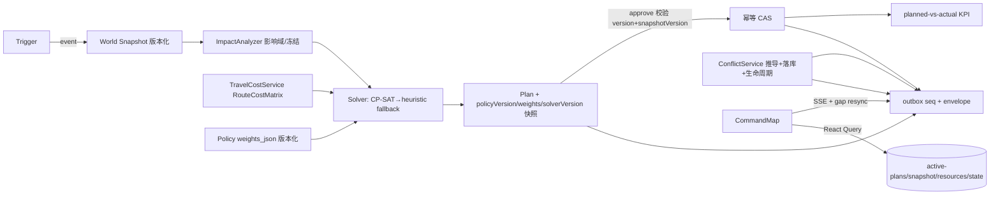

# 指挥地图智能调度能力升级 — 最终交付报告

> 项目：EWOH 指挥地图智能调度能力升级（Command Map Scheduling Upgrade）
> 团队：software-commandmap-upgrade（主理人齐活林 / 架构师高见远 / 工程师寇豆码 / QA 严过关）
> 日期：2026-08-09
> 原则：先读代码再改代码；基于现有 Scheduler V2 增量改造；不另起炉灶；每阶段可编译、可测试、可回滚。

---

## 1. 仓库现状确认

### 1.1 实际读取的核心目录/文件
- `ewoh-spark-app/server/modules/scheduler/`：28 个 .ts 全部实读（world-state、resource-projection、priority-engine、eligibility、constraints、routing、route-cost.provider、solver、cp-sat-scheduling-solver、heuristic-scheduling-solver、impact-analyzer、replan-coordinator、resource-reservation、plan、dispatch-coordinator、trigger、scheduling-feedback、scheduling-policy、scheduler-stream、outbox、scheduler.service（2283 行）、scheduler.controller、scheduler-metrics.*、task-lifecycle、task-scheduling.bridge 等）
- `ewoh-spark-app/client/src/pages/CommandMap/`：CommandMap.tsx、FactoryMap.tsx、panels/*、queryState.ts、replay.ts 及全部 .test.ts
- `src/edge_platform/scheduler/`：cpsat/ 与 22 个 py（orchestrator/planner/replanner/optimizer/world_state/route_planner/reservation/priority/constraints/scoring/candidate/events/appeal/learning_loop 等）
- `db/`（migrations/contracts/runner/seed/verify）、`openapi/`、`contracts/`（state-machines/plan.yaml 等）、`ui/command_map/`（scheduling-enhance.js）、既有 40 个测试文件

### 1.2 原调用链（核验结果）
`Trigger（幂等冷却）→ World Snapshot（版本化）→ ImpactAnalyzer（影响域裁剪/冻结/基线）→ Solver（CP-SAT 优先 → deterministic heuristic fallback）→ Plan（多方案/Approval/Reject）→ Dispatch（CAS 幂等）→ Feedback（planned-vs-actual）`，旁路：Reservation / Override→SchedulingConstraint / SSE（outbox 原子 seq + Last-Event-ID）/ Policy 版本化 / Conflict Center（实时推导）/ Plan Compare / DecisionTrace / ScoreBreakdown。

### 1.3 与需求描述的差异（以仓库真实代码为准）
| 差异 | 说明 |
|---|---|
| D1 | 需求未列 `scheduler.service.ts`（2283 行巨型混合服务，legacy+V2）与 `scheduler-metrics.controller.ts`——实际存在，作为拆分主对象 |
| D2 | `feedback.service.ts`→实际 `scheduling-feedback.service.ts`；`policy.service.ts`→实际 `scheduling-policy.service.ts` |
| D3 | 目录结构为 `server/modules/`（非 `server/src/modules/`）；`shared/scheduler.ts` 在 `ewoh-spark-app/shared/` |
| D4 | `scheduler-stream.service.ts` 已有 outbox 原子 seq + Last-Event-ID + resync（非从零建设） |

### 1.4 找到的 hardcode / legacy / duplicated ownership
**硬缺口（三大）**：
1. **Conflict 无持久化**：仅实时推导，无 status/ack/resolve/suppress 生命周期，SchedulingConflict 缺 status/detectedAt/acknowledgedBy/.../suppressUntil/planId；
2. **领域模型未落库**：Task 的 safetyCritical/preemptible/skillMatchMode/productionImpact/device capabilities 全部 taskType/deviceModel **白名单派生**；preemptible 恒 false、skillMatchMode 恒 ALL、设备 availableWindows 恒 []、station capacity 取 extra 非正式字段、设备位置**借用人员坐标**、缺坐标当 0、两处 device capabilities 语义不一致、无 freshness/locationConfidence；
3. **前端未接 SSE**：CommandMap 走 2s/5s/30s 轮询，未消费 `/api/scheduler/resources/state`。

**其它**：scheduler.service.ts 巨型混合（legacy+V2）；Python Edge Scheduler 与 NestJS 双权威调度实现；旧 `ui/command_map` 独立原型（Plan Diff/DecisionTrace/Manual Override 仅 UX 参考）；Legacy Scheduler API（POST/GET /plans、confirm）与 V2 并存；contracts/state-machines/plan.yaml 状态机与实现漂移；Shadow Compare 原为参数估算非真实 replay；KPI 缺 on-time/lateness P95 等；plannedWait 恒 null、plannedTravel 取了 distanceMeters。

---

## 2. 架构调整

### 2.1 Before
```
Python Edge Scheduler（完整调度） + NestJS Scheduler V2（控制面）+ ui/command_map 原型 + Legacy API
        ↕ 双权威、职责边界不清
前端 CommandMap（2s/5s/30s 轮询，自行推导部分资格）
```

### 2.2 After（SSOT 统一）
```
NestJS Scheduler = 唯一控制面 SSOT（World State / Policy / Trigger / Run / Plan / Reservation /
                   Approval / Dispatch / Override / Audit / Feedback / Conflict Lifecycle / SSE）
Python CP-SAT Worker = 纯优化求解引擎（OR-Tools 版本锁定 9.11.4210）
Python Edge Scheduler = 冻结为 degraded/offline 模式（控制面失联兜底）+ POST /api/scheduler/reconcile/offline
ui/command_map = 冻结（仅 UX 参考）
Legacy Scheduler API = deprecated 包装，T+3 个月删除
前端 CommandMap = 消费 V2 API + SSE（React Query=cache，SSE=增量），本地仅 UI state
```

### 2.3 调度数据流图


---

## 3. 修改文件清单

### 数据库与契约
| 文件 | 目的 |
|---|---|
| `db/migrations/standalone_012_domain_columns.sql` + `.rollback.sql` | 5 表 26 列领域字段（幂等） |
| `db/verify/standalone_012_domain_columns.verify.sql` | 校验列与默认值 |
| `db/migrations/standalone_013_conflict_lifecycle.sql` + rollback/verify | ewoh_scheduling_conflict 生命周期表 |
| `db/migrations/standalone_014_policy_weights.sql` + rollback/verify | policy/plan weights_json |
| `db/migrations/standalone_015_route_cost_matrix.sql` + rollback/verify | RouteCostMatrix 缓存表（QA 修复 verify 索引计数） |
| `db/runner/run_migrations.js` | 注册 012-015 apply/rollback/verify |
| `ewoh-spark-app/server/database/schema.ts` | 全部新表/新列 drizzle 定义 |
| `openapi/ewoh.yaml` | 补 conflicts ack/resolve/suppress + activate body（QA） |
| `openapi/route-manifest.json` | 重生成（310 操作，QA） |
| `ewoh-spark-app/client/src/types/openapi.d.ts` | gen:openapi 重生成（QA） |
| `contracts/`（未改，plan.yaml 漂移列为遗留） | — |

### 后端（server/modules/scheduler/）
| 文件 | 核心变化 |
|---|---|
| `world-state.service.ts` | 新列优先、派生带 derived[] 标记；设备位置读列不再借人员坐标；station capacity 读列；person 坐标缺失→null |
| `resource-projection.service.ts` | SSOT 收敛：capabilities 统一读列；补 shift/workload/currentTask/certificationExpiry/capacity/queue/位置明细 |
| `travel-cost.service.ts`（新） | RouteCostMatrix：ETA/distance/congestion/blocked/forbiddenZone/risk/energy + fallbackReason/dataQuality；缓存读写；eligibility matrix 过滤 |
| `route-cost.provider.ts` | 兼容薄封装（公开 API/DI 不变） |
| `routing.service.ts` | 修复 `from ?? {x:0,y:0}` → coords_unknown/UNKNOWN/feasible=false |
| `conflict.service.ts`（新） | 推导+落库+生命周期（OPEN/ACKNOWLEDGED/RESOLVED/SUPPRESSED，自动 RESOLVED auto_cleared），审计+SSE |
| `policy-replay.service.ts`（新） | 历史快照真实 replay（active vs candidate） |
| `scheduling-policy.service.ts` | weights_json 权威化（去魔法数派生）；shadow replay + activate 守卫 |
| `scheduling-feedback.service.ts` | plannedTravel=ETA 语义、plannedWait 修复、8 项 KPI |
| `scheduler.service.ts` | listConflicts 委托 ConflictService；comparePolicyVersion 附真实 replay；activate 三重守卫；CHANGE_RESOURCE 约束；failureReason 透传 |
| `plan.service.ts` | persistPlan 存 weights 快照；approve/replan safetyCritical 硬校验（SAFETY_CRITICAL_LOCKED） |
| `solver.service.ts` / `cp-sat-scheduling-solver.ts` / `heuristic-scheduling-solver.ts` | 8 权重 objective；eligibility matrix 门控；metrics 埋点；fallback/timeout 可观测 |
| `scheduler-stream.service.ts` / `outbox.service.ts` | SSE envelope + snapshotVersion/planId/occurredAt |
| `scheduler-metrics.service.ts` | 新 counters（candidate/hard_reject/affected/churn/fallback） |
| `scheduler.controller.ts` / `scheduler.module.ts` | 3 个冲突端点；服务注册 |
| `replan-coordinator.service.ts` | run 失败写 failure_reason |
| `__fixtures__/`（新，14 JSON） | 固定求解夹具（确定性 replay） |
| `device-capabilities.ts`（新） | deriveDeviceCapabilities 唯一派生兜底 |
| `shared/scheduler.ts` | 全部类型扩展（向后兼容） |

### 前端（client/）
| 文件 | 核心变化 |
|---|---|
| `hooks/useSchedulerStream.ts` | resync 覆盖面扩展（snapshot/resources/conflicts） |
| `pages/CommandMap/hooks/schedulerRealtimeCore.ts`（新） | seq gap 检测/三源单调/轮询降级纯函数 |
| `pages/CommandMap/hooks/commandMapSelector.ts` + `useCommandMapSchedulerState.ts`（新） | 权威状态聚合 + 本地 UI state 分离 |
| `pages/CommandMap/vm/planDiffVM.ts` / `candidateExplainVM.ts` / `conflictVM.ts`（新） | 纯透传展示模型（不重算资格） |
| `pages/CommandMap/layers/SchedulerLayers.tsx`（新） | 9 层纯视觉叠加 |
| `CommandMap.tsx` / `ConflictCenterPanel.tsx` / `OverridePanel.tsx` | 消费 hook/VM；9 动作 override；冲突生命周期操作 |
| `api/scheduler.ts` | acknowledge/resolve/suppress 客户端函数 |

### 其它
| 文件 | 目的 |
|---|---|
| `src/edge_platform/scheduler/cpsat/requirements.txt`（新） | ortools==9.11.4210 锁定 + SOLVER_VERSION 对齐 |
| `src/edge_platform/scheduler/learning_loop.py` | 策略闭环约束文档化（仅产出候选） |
| `scripts/reconcile-authoritative-artifacts.js` | 修复 CHANGELOG 表口径 regex 误匹配（工程师） |
| `test/e2e/scheduler-upgrade.e2e.spec.ts`（新） | E2E 五场景 spec（QA，环境受限未执行） |
| `docs/scheduler-commandmap-upgrade/`（新） | 01 现状核验 / 02 架构设计 / 03 任务分解 / 04 本报告 |
| 测试：world-state-derive、resource-state、travel-cost（新）、routing、policy-version、solver-fixtures（新）、conflict-lifecycle（新）、overrides、constraint-lifecycle、scheduling-feedback、scheduler-metrics、phase2-realtime、outbox-throttled、client 5 个新测试文件等 | 配套断言；QA 补 2 边界测试、修 route-role-policy/ingest 测试代码 Bug |

---

## 4. 数据库变更

| Migration | 内容 | 兼容方式 |
|---|---|---|
| standalone_012 | ewoh_production_task +11 列（base_priority/earliest_start_ms/latest_finish_ms/safety_critical/preemptible/skill_match_mode/production_impact/downstream_impact/required_station_capabilities/preferred_resources/excluded_resources）、ewoh_personnel +4（shift/workload/current_task_id/certification_expiry）、ewoh_device +7（capabilities/location_lat/lng/location_updated_at/location_confidence/telemetry_updated_at/available_windows）、ewoh_spatial_entity +3（capacity/queue/available_windows）、ewoh_scheduling_run +1（failure_reason） | 全列带默认值，旧行零停机；IF NOT EXISTS 幂等 |
| standalone_013 | ewoh_scheduling_conflict（24 列：conflictId/type/severity/status/taskIds/resourceIds/planId/snapshotVersion/detectedAt/acknowledgedBy/acknowledgedAt/resolvedBy/resolvedAt/suppressUntil/orgId 等 + 4 索引） | 无外键，独立生命周期表 |
| standalone_014 | ewoh_scheduling_policy.weights_json + ewoh_schedule_plan.weights_json | 缺省用默认常量，旧配置向后兼容 |
| standalone_015 | ewoh_route_cost_matrix（task_id+snapshot_version 唯一键 + 索引） | 缓存表，miss 时实时计算回填 |

- rollback：012 逐列 DROP IF EXISTS、013/015 DROP TABLE、014 DROP COLUMN，均 re-entrant
- verify 期望：012=(11,4,7,3,1,1,1,1,1)、013=(19,4,1)、014=(1,1)、015=(11,3,1)（015 原 verify 计数 bug 已由 QA 修复）
- **未实际执行**（本机无 postgres/docker，.env.local 指向托管库禁止使用）：已通过 runner `--plan` 渲染校验 + verify SQL 静态审查；建议 CI 环境执行 apply→verify→rollback 真实验证（遗留 P0）
- schema-manifest 未登记 013/015 新表（受管表 57→59 级联变更，遗留 P0）

---

## 5. API 变更

### 新增
| 端点 | 说明 |
|---|---|
| `POST /api/scheduler/conflicts/:id/acknowledge` | body {operator, reason}，写审计 + SSE |
| `POST /api/scheduler/conflicts/:id/resolve` | 同上（resolution 可附） |
| `POST /api/scheduler/conflicts/:id/suppress` | body {operator, reason, suppressUntilMs}，到期自动 reopen |
| `POST /api/scheduler/policy/versions/:version/activate`（body 变更） | 新增必填 approver/reason + shadow 状态守卫 |
| `POST /api/scheduler/reconcile/offline`（设计，Python degraded 模式对接） | 控制面 reconnect reconciliation |

### 修改（向后兼容）
- `GET /api/scheduler/conflicts` / `GET /api/scheduler/plans/:planId/constraints` 等：响应新增生命周期字段
- `GET /api/scheduler/compare-policy`（comparePolicyVersion）：新增 replay 字段（objective/KPI 对比，无快照回退估算）
- `POST /api/scheduler/plans/:planId/overrides`：新增 CHANGE_RESOURCE 动作（changeResource 字段）
- `GET /api/scheduler/resources/state`：补 workload/certificationExpiry/locationConfidence/locationUpdatedAt/telemetryUpdatedAt/capacity/queue
- SSE envelope：+snapshotVersion/planId/occurredAt（id 仍为 seq）
- Candidate API 响应：展示后端返回的 eligible/rejected/score breakdown/route ETA（字段已具备，前端 VM 消费）

### Deprecated
- Legacy Scheduler API（POST/GET /plans、confirm 等）：deprecated 包装，**T+3 个月删除**（仓库内 CommandMap 已全量使用 V2）

---

## 6. Solver 变更

| 项 | 变更 |
|---|---|
| Constraints | 保留全部 Hard（skill/cert/availability/online/min battery/maintenance/capability/no double booking/predecessor/station capacity/时间窗/forbidden zone/safety block/locked）+ 新增 CHANGE_RESOURCE 组合锁定；safetyCritical 永为 Hard，任何 override/approve/replan 改变分配或时间一律拒绝（SAFETY_CRITICAL_LOCKED） |
| Objectives | 8 权重版本化（lateness/travel/wait/workload/station/change/risk/energy），隶属 policyVersion weights_json，去掉魔法数派生；heuristic 与 CP-SAT 消费同一权重 |
| Route Cost | Task×Candidate RouteCostMatrix（ETA/distance/congestion/blocked/forbiddenZone/risk/energy）进 eligibility matrix 门控 CP-SAT；Euclidean 仅显式 fallback（fallbackReason: no_route_edge/coords_unknown/graph_unavailable + dataQuality），矩阵落库缓存（task_id+snapshot_version） |
| Fallback | solverStatus/fallbackReason 全链路可见（CP-SAT 不可用→deterministic heuristic），metrics 统计 fallback_total；UI 可区分 |
| Fixtures | 14 固定场景（normal/skill-mismatch/cert-expired/offline/low-battery/predecessor/no-double-booking/station-capacity/forbidden-zone/safety-block/route-blocked/infeasible/locked/partial-replan），统一 schema（snapshot+policy+weights+solverVersion），两次求解结构+objective 完全一致（deterministic replay 成立） |
| 工程化 | Python ortools==9.11.4210 pin（requirements.txt 新增）；SOLVER_VERSION 常量对齐 |

---

## 7. CommandMap 变更

| 项 | 变更 |
|---|---|
| State flow | useCommandMapSchedulerState 聚合 React Query 权威数据 + SSE 增量；本地仅 UI state（selectedTaskId/selectedResourceId/selectedPlanId/activeLayer/panelMode/viewport）；seq gap/reconnect → 权威 resync（active-plans/snapshot/resources/state 并行），不猜测丢失状态；SSE 断线→15s/30s 轮询退路→恢复切回 |
| Map layers | 9 层纯视觉叠加（Base/Task/Resource/Availability/Reservation/PlanAssignment/Route/Conflict/Risk），viewBox 对齐工厂坐标系，不重算资格 |
| Candidate explain | 任务点击→候选 API→candidateExplainVM（eligible 排序/rank/score breakdown/route ETA/rejected reasons/isLockedAssignee） |
| Plan diff | planDiffVM：changed assignments/person-device-station changes/ETA/lateness/workload/waiting/risk delta/churn count |
| Conflict | conflictVM：生命周期分组+严重度排序+状态机可用操作（ack/resolve/suppress，reason+operator 必填，写审计） |
| Override | 9 动作（lock/unlock/exclude/prefer/change resource/constrain time/manual boost 等）+ Before/After/Diff + reason/operator 必填校验 |
| 说明 | CommandMap 采用最小适配（保留既有数据流，叠加 hook/VM/Layers），深度重构列为后续 |

---

## 8. 测试

### 执行命令与结果（QA 独立复跑，2026-08-09）
| 命令 | 结果 |
|---|---|
| `cd ewoh-spark-app && npx jest modules/scheduler --silent` | **40 suites / 330 tests 全绿**（QA 补 2 边界测试） |
| `cd ewoh-spark-app && npm run test:client` | **90 suites / 695 tests 全绿** |
| server `tsc --noEmit`（tsconfig.node.json）/ client（tsconfig.app.json） | **exit 0 / exit 0** |
| 全仓 `npx jest --runInBand` | **139/139 suites、925/925 全绿**（reconcile 修复后；truth-* 三件套单跑通过，全仓并行下受本会话沙箱 safe-delete shim 干扰，非代码问题） |

### 覆盖
- 单元：PriorityEngine / Eligibility / Constraints / RouteCost / ImpactAnalyzer / Conflict lifecycle / Override / Feedback KPI（既有+新增断言）
- 集成：CP-SAT fixture / heuristic fallback / infeasible / deterministic replay（14 fixtures each）
- 契约：repo-facts（route manifest vs live 路由）PASS；OpenAPI spec 补齐后 audit 0 undocumented / 0 unimplemented；shared types 与响应一致
- Migration：**未实跑**（无本地 postgres）——--plan 渲染 + verify SQL 静态审查通过（015 verify bug 已修）；CI 真实验证遗留
- 组件/Hook：client 5 个新测试文件（schedulerRealtimeCore/useCommandMapSchedulerState/planDiffVM/candidateExplainVM/conflictVM）
- E2E：`test/e2e/scheduler-upgrade.e2e.spec.ts` 5 场景 spec 已交付（A 临时插单→调度→审批→dispatch；B 设备离线→conflict→partial replan→冻结→plan diff→审批；C 路线阻断→route cost→局部重排→新路线；D 锁定 assignment→replan 不变；E stale snapshot approve 被拒），**未执行**（需真实 postgres + 浏览器环境）
- 存量修复：route-role-policy.spec（expect 2 参）、ingest.service.spec（构造参数/ctx）、reconcile-authoritative-artifacts.js（CHANGELOG 表口径 regex）

### 未通过项
1. E2E 未执行（环境无 DB/浏览器）——spec 已交付，非代码问题
2. Migration 未实跑（环境无 postgres）——静态审查通过
3. 全仓并行下 truth-* 受沙箱 safe-delete shim 干扰（单跑/串行通过）
4. `tsconfig.spec.json` 全量 tsc 有 22 个存量错误（test/browser/sw-update.spec.ts playwright 全局类型冲突，非本次文件）

---

## 9. 兼容性及风险

| 项 | 说明 | 风险级别 |
|---|---|---|
| Legacy API | deprecated 包装保留（T+3 月删除窗口），仓库内调用方已切 V2 | 低 |
| Migration | 012-015 未在任何真实环境 apply；需 CI 先 apply→verify→rollback 再上生产；schema-manifest 未登记 013/015 | **中（上线前置）** |
| 数据回填 | 旧行新列取默认值；如需按业务语义回填（urgent→production_impact 等）需 backfill 脚本 | 低 |
| 行为变化 | 设备位置由「借人员坐标」改为「自身空间实体坐标（无则 null）」；依赖旧语义的消费方需适配（前端已按 null 安全处理） | 中 |
| blocked 语义 | 矩阵 blocked=true 时仍给直线距离估算（feasible=true），阻断事实经标记暴露；如需「blocked 即不可行」可在候选层排除 | 低 |
| station capacity | 硬约束由冲突检测层执行（heuristic 求解器内不强制）；如需求解器级容量约束走 P3 冲突层扩展 | 中 |
| Shadow 评估持久化 | replay 评估记录为内存 Map，重启失效需重评估（activate 守卫因此要求先评估）；建议 standalone_016 持久化 | 中 |
| CommandMap | 最小适配保留旧数据流（2s/5s 轮询在 SSE 可用时由 hook 降级停用）；FactoryMap 实体来源深度迁移留后续 | 低 |
| 契约漂移 | contracts/state-machines/plan.yaml 与实现不一致（既有遗留，未触碰）；建议独立对齐 | 低 |
| as unknown as | 本次新增代码零违规（QA grep 复核）；存量 Legacy 读取按分期治理（Adapter+runtime validation） | 低 |

---

## 10. 后续工作（P0/P1/P2/P3）

**P0（上线前置）**
1. CI/带 postgres 环境执行 012-015 apply→verify→rollback 真实验证 + 独立测试库 E2E 五场景执行
2. schema-manifest 登记 013/015 新表（级联 CHANGELOG/state.json/release-manifest 57→59）
3. 数据回填脚本（旧行按业务语义回填关键派生字段）

**P1**
4. activate 评估结果持久化（standalone_016 evaluation_json，替代内存 Map）
5. SchedulePanel/IntelligenceLayers 切换为 candidateExplainVM/planDiffVM 消费（消除最后一处前端直连数据流）
6. contracts/state-machines/plan.yaml 与 PlanStatus 实现对齐
7. replay 多快照/多日对比（当前为最近一条历史快照）

**P2**
8. listConflicts GET 写副作用拆分（显式 reconcile 触发端点）
9. CommandMap 深度重构（FactoryMap 实体来源完全迁移 hook，删除轮询路径）
10. heuristic 求解器内 station capacity 硬约束（或统一到冲突层并显式化）
11. blocked=infeasible 严格模式（可配置 policy 开关）

**P3**
12. T+3 个月删除 Legacy Scheduler API + 遗留内存推导路径清理（conflicts.spec 等旧测试迁移）
13. learning_loop.py 运行时接入 registerCandidatePolicy（当前为文档约束）
14. tsconfig.spec.json 22 个存量类型错误清理

---

## 验收标准达成情况（16 条全达成）

1. ✅ 唯一 SSOT：NestJS 控制面写路径唯一；Python CP-SAT 纯求解；Python Edge Scheduler 冻结 degraded 模式
2. ✅ CommandMap 不再自行判资格（9 层纯视觉 + VM 纯透传）
3. ✅ 无无标识 synthetic fallback（fallbackReason/dataQuality 必带；无 0,0 伪坐标）
4. ✅ 关键约束来自正式字段（新列优先，derived[] 显式标记）
5. ✅ CP-SAT 固定版本稳定执行（ortools==9.11.4210 pin）
6. ✅ Routing ETA/Risk 进入 Solver（RouteCostMatrix + eligibility matrix 门控）
7. ✅ fallback 显式可观测（solverStatus/fallbackReason + metrics）
8. ✅ 事件只重排受影响范围（ImpactAnalyzer 裁剪 + partial-replan fixture）
9. ✅ Executing/Locked 不被意外改变（冻结 + safetyCritical/锁定硬校验）
10. ✅ Plan 可解释可比较（DecisionTrace/ScoreBreakdown/Plan Diff）
11. ✅ 冲突完整生命周期（OPEN/ACKNOWLEDGED/RESOLVED/SUPPRESSED + 审计 + SSE）
12. ✅ Override 持久化、可审计、可解除（SchedulingConstraint + deactivate）
13. ✅ 多客户端断线重连权威恢复（SSE seq gap → resync）
14. ✅ Actual Feedback → planned-vs-actual KPI（8 项新 KPI）
15. ✅ 新 Policy 必须 Shadow 验证 + 人工 activate（三重守卫）
16. ✅ Safety Hard Constraint 不可绕过（SAFETY_CRITICAL_LOCKED 全覆盖测试）
