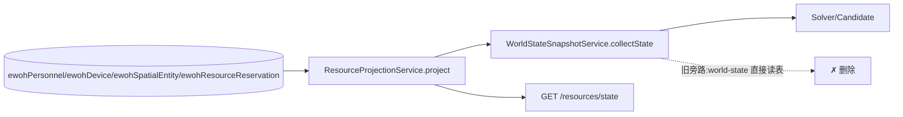
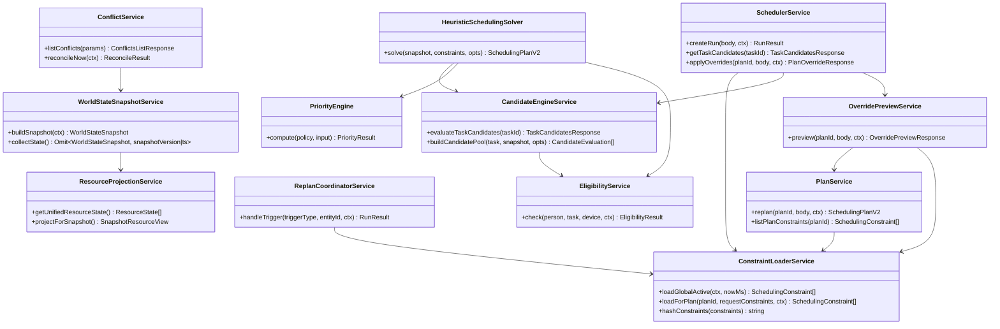
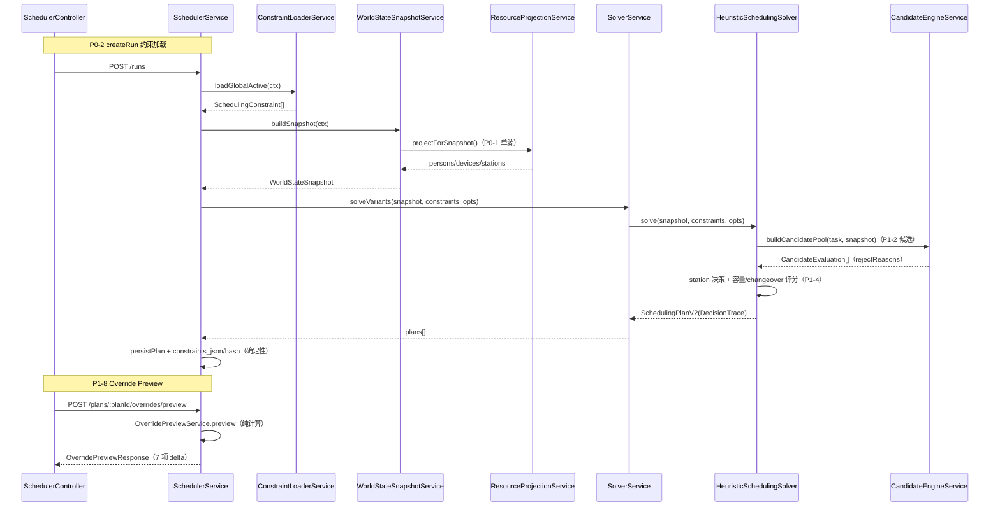

# 05 增量架构设计（Incremental Design）— Command Map 智能调度升级（Phase 0 完整 + Phase 1 核心）

> 文档编号：ARC-EWOH-CM-2026-08-10-05
> 日期：2026-08-10 ｜ 架构师：高见远（software-architect）
> 基线：2026-08-09 交付基线（01~04 + class/sequence-diagram.mermaid）+ PRD（command-map-upgrade-prd-2026-08-10）+ 主理人侦察（command-map-upgrade-recon-2026-08-10）
> 原则：**先读代码再设计**。本文档全部结论来自本次对 `ewoh-spark-app/server/modules/scheduler/*`、`shared/*`、`db/migrations/standalone_016/021/022`、`db/runner/run_migrations.js`、前端 hook 的实际走读；与主理人侦察结论不一致之处在 §2 显式修正。

---

## 1. 增量范围总览（本次改动 vs 既有基线）

### 1.1 复用清单（直接复用，不改）

| 复用对象 | 说明 |
|---|---|
| `ResourceProjectionService`（resource-projection.service.ts） | 已有 `version/sourceTs/freshness/dataQuality/UNKNOWN(null)` 规范，作为 SSOT 底座复用，仅扩展坐标字段 |
| `EligibilityService` | 硬约束判定底座复用，仅扩展 station/health 维度 |
| `RoutingService` + `TravelCostService` + `route-cost.provider.ts` | 已修复 0,0 兜底、已有 fallbackReason/dataQuality，复用 |
| `SchedulingObjectiveEvaluator` | 统一评估器复用（CP-SAT/heuristic 同源） |
| `SchedulingPolicyService`（weights_json 版本化） | `resolveWeights()` 已权威化 8 权重，复用；仅 config 增字段 |
| `ConflictService`（生命周期持久化 + acknowledge/resolve/suppress + 审计 + SSE） | 复用；仅拆分 GET 副作用 + 新增显式 reconcile 端点 |
| `OutboxService` / `SchedulerStreamService`（SSE envelope 已统一 P4-SSE） | 复用；仅补事件目录契约 |
| `DispatchCoordinatorService` / `ResourceReservationService`（CAS + DB EXCLUDE） | 复用（standalone_022 已加 person/device guard） |
| `PlanService`（approve/reject/dispatch/replan/override 落库） | 复用；仅约束加载与快照字段增强 |
| `TriggerService`（幂等 + 冷却） | 复用 |
| 全部 migration `standalone_001~022`、`db/verify/*`、`run_migrations.js` 既有注册 | 复用，不改旧迁移 |
| 前端 `useCommandMapSchedulerState` / `commandMapSelector` / `schedulerRealtimeCore` | 复用，本次不重构 Command Map 主体 |
| 既有 60+ scheduler spec / 14 固定 fixtures | 复用，扩展断言 |

### 1.2 修改清单

| 对象 | 改动 |
|---|---|
| `world-state.service.ts` | persons/devices/stations 资源视图改消费 `ResourceProjectionService`（P0-1，修复双轨）；坐标字段透传 coordinateType |
| `resource-projection.service.ts` | 增加 coordinateType/floorId 与 `projectForSnapshot()` 快照形态助手 |
| `scheduler.service.ts` | `createRun` 加载 effective constraints（P0-2）；`getTaskCandidates` 委托 CandidateEngineService（P1-2）；`applyOverrides` 前支持 preview 入口（P1-8） |
| `replan-coordinator.service.ts` | `handleTrigger` 加载 effective constraints（P0-2，比侦察更广：事件/局部重排也丢约束） |
| `conflict-preview.service.ts` | preview 求解加载 effective constraints（P0-2） |
| `plan.service.ts` | `listPlanConstraints` 过期过滤走真实列；replan 持久化 `constraints_json + effective_constraints_hash`（确定性） |
| `constraints.ts` | 硬/软集合对齐需求 #7（G6）：+STATION_CAPACITY/+STATION_CAPABILITY/重分类 EXCLUDED_RESOURCE；软 +5 |
| `eligibility.service.ts` | + health 检查、station capability、station capacity、candidateStations 范围（P1-2/P1-3/P1-4） |
| `heuristic-scheduling-solver.ts` | station 决策变量（枚举 candidateStationIds）、真实容量/队列、setup/changeover 入评分、`PREFERENCE_BONUS_MINUTES` 移入 policy（P1-4/G3） |
| `priority-engine.ts` | event severity 死路径接线（P1-1/G4）；输出 policyVersion；确定性 |
| `scheduler.controller.ts` | + `POST /plans/:planId/overrides/preview`、`POST /conflicts/reconcile`；candidates 委托 |
| `scheduler.module.ts` | 注册新服务（ConstraintLoaderService/CandidateEngineService/OverridePreviewService） |
| `scheduling-policy.service.ts` | config 增 `preferenceBonusMinutes` / `stationCapacityEnforced` / setup·changeover 权重访问器 |
| `routing.service.ts` / `travel-cost.service.ts` | 坐标类型化审计：WGS84 不进笛卡尔距离；无 0,0 冒泡（回归保持） |
| `conflict.service.ts` | `listConflicts` 纯读（derive+merge 无写）；新增 `reconcileNow()` 显式写端点（P1-5/G5） |
| `shared/scheduler.ts` | 坐标类型联合、新约束类型、OverridePreview/CandidateEvaluation 类型、TaskCandidatesResponse 扩展 |
| `client/src/api/scheduler.ts`、`candidateExplainVM.ts`、`OverridePanel.tsx` | 轻量兼容接入（透传，不重算） |
| `openapi/ewoh.yaml`、`openapi/route-manifest.json`、`client/src/types/openapi.d.ts` | 新端点/新字段登记 + 重生成 |
| `contracts/events/event-catalog.yaml` | 补 scheduler/conflict 事件枚举（P0-5/Q4） |

### 1.3 新增清单

| 新增 | 说明 |
|---|---|
| `constraint-loader.service.ts` | 全局/按方案 active 约束加载（org+有效期+source 过滤）单一入口（P0-2） |
| `candidate-engine.service.ts` | 独立 Candidate Engine（P1-2/G7），端点与求解器共享候选池 |
| `override-preview.service.ts` | `POST /plans/:planId/overrides/preview` 纯计算 7 项 delta（P1-8） |
| `db/migrations/standalone_023_scheduler_incremental.sql` + `.rollback.sql` | 约束真实列/计划约束快照/坐标类型列/RLS |
| `db/verify/standalone_023_scheduler_incremental.verify.sql` | verify 三件套 |
| `__tests__/constraint-run-loading.spec.ts`、`station-decision.spec.ts`、`conflict-query-readonly.spec.ts`、`override-preview.spec.ts`、`candidate-engine-reject.spec.ts` 等 | 新增测试（见 06 任务分解） |

---

## 2. 走读发现 vs 主理人侦察结论：显式修正说明

> 以下为本次亲自走读后的修正/补充，**与侦察记录不一致处以 ⚠️ 标出**。

| # | 主理人侦察结论 | 走读核实 | 结论 |
|---|---|---|---|
| G2 | `scheduler.service.ts:419 createRun` 传空约束；world-state 不含 constraints | **属实，且范围更大**：`replan-coordinator.service.ts:118` `handleTrigger` 也传 `[]`（事件驱动/局部重排同样丢约束）；`conflict-preview.service.ts:76` preview 求解也传 `[]`；`scheduler.service.ts:667 injectSchedulingEvent → handleTrigger` 间接丢约束。仅 `plan.service.ts:449 replan` 走 `loadEffectiveConstraints` | ⚠️ **修正**：P0-2 修复面 = 4 个调用点（createRun / handleTrigger / conflict-preview / replan），不止 createRun 一处 |
| G5 | 04 交付报告称 listConflicts 写副作用为 P2 遗留，本次纳入 P1-5 | `conflict.service.ts:76-90 listConflicts → derive() → reconcile() → insertRow/updateRow + SSE + audit`，GET 确实有写副作用 | 属实（P2→P1 提升成立） |
| G4 | priority-engine event severity 分支疑为死路径 | `priority-engine.ts:129` 判断 `taskExt.deadlineAtRisk === true`；`heuristic-scheduling-solver.ts:280-289` 传 `{id, priority, planStart, planEnd, productionImpact}`，**从不传 deadlineAtRisk**；CP-SAT 侧同样不传 | 属实：死路径实锤 |
| G7 | 疑缺 `GET /tasks/:taskId/candidates` 端点 | ⚠️ **端点已存在**：`scheduler.controller.ts:291` + `scheduler.service.ts:1300 getTaskCandidates`。缺的是**独立 Candidate Engine 服务**与响应结构（无结构化 rejectReasons / 无 scoreBreakdown / 无 station 维度 / 无时间窗维度；`stationId: task.stationId` 硬编码） | ⚠️ **修正**：P1-2 不是"新增端点"，而是"抽取独立引擎 + 响应富化 + 求解器共享候选池" |
| G8 | 共享契约需确认坐标类型现状 | `shared/scheduler.ts` 全部为 `x: number | null / y: number | null`，**无 FACTORY_CARTESIAN/WGS84/UNKNOWN 判别联合**；`ewoh_route_node.floor` 已有楼层字段 | 属实：需在共享契约新增坐标类型联合（向后兼容保留 x/y 别名） |
| G6 | constraints.ts 16 hard + 9 soft，STATION_CAPACITY 缺失 | `constraints.ts:17-47`：16 hard（注释误写 15）、9 soft。`EXCLUDED_RESOURCE` 被列为 **soft**，但 heuristic 求解器以硬过滤实现（`isExcludedResource` 直接剔除候选）——**分类与实现不符** | ⚠️ **修正补充**：除 STATION_CAPACITY 外，还缺 STATION_CAPABILITY、健康维度（由 eligibility 内部检查覆盖，不新增类型）；EXCLUDED_RESOURCE 需重分类为 hard（实现集），API 类型联合保持 soft 成员以兼容 |
| G3 | PREFERENCE_BONUS_MINUTES=30 硬编码、stationId 非决策变量、magic number 作用于 score | `heuristic-scheduling-solver.ts:50/456/482/493/529/589` 全部属实。另：weights 已通过 `standalone_014` + `resolveWeights()` 版本化（`scheduling-policy.service.ts:302-337`），故"魔法数入策略"仅剩 `PREFERENCE_BONUS_MINUTES` 一项 + station 决策缺失 | 属实（weights 部分基线已完成，剩余工作量小于侦察预期） |
| P0-5 | SSE envelope 已有 snapshotVersion/planId/occurredAt | ⚠️ **基线已超前**：`SchedulingEvent` + `SchedulerEventEnvelope`（P4-SSE）已含 orgId/correlationId；`standalone_021` 已加 outbox.correlation_id。剩余：`contracts/events/event-catalog.yaml` 无 scheduler 事件条目（01 §4.3） | ⚠️ **修正**：P0-5 剩余 = 事件目录契约 + envelope 契约测试 + polling fallback 验证，不是建 envelope |
| P0-4 | TaskRequirement 表已建，derived 标记待确认 | `world-state.service.ts:237-313` 已实现"列优先 + derived[] 标记"（safetyCritical/preemptible/skillMatchMode/productionImpact/requiredDeviceCapabilities/candidateStations） | ⚠️ **修正**：P0-4 核心已完成，剩余 = keyword fallback 全覆盖断言 + candidateStations 进入求解（随 P1-4 station 决策落地） |

---

## 3. 各需求实现方案（G1–G8 逐一）

### 3.1 P0-1 / G1：Resource State 单一事实源

**方案**：`WorldStateSnapshotService.collectState()` 的 **persons/devices/stations 三段改为消费 `ResourceProjectionService`**（新增 `projectForSnapshot()` 返回快照形态），tasks/events/routes/reservations/safety 仍由各自表构建（它们不是"资源视图"）。双轨消除。

**改动文件**：`resource-projection.service.ts`、`world-state.service.ts`

```ts
// resource-projection.service.ts（新增）
async projectForSnapshot(): Promise<{
  persons: WorldStateSnapshot['persons'];
  devices: WorldStateSnapshot['devices'];
  stations: WorldStateSnapshot['stations'];
}> {
  const all = await this.project();
  // 保留现有快照字段（availableFromMs/loadLevel/fatigueLevel 等由调用方按真实 reservation 回填）
  // 坐标统一为 { x, y, coordinateType, floorId }；STALE/UNKNOWN → unavailable（既有语义保持）
}

// world-state.service.ts（collectState 内替换）
const resourceView = await this.resourceProjectionService.projectForSnapshot();
// persons = resourceView.persons（回填 availableFromMs/entityVersions 摘要）
// devices = resourceView.devices
// stations = resourceView.stations
```

**接口**：`GET /api/scheduler/resources/state` 响应每条 ResourceState 增加 `coordinate?: CoordinateReference`（可选，向后兼容）。

**验收**：AC-P0-1-1~1-5。单测：`world-state-derive.spec.ts` 新增"resources/state 与 world-state 对同一 person/device/station 的 capabilities/位置/容量一致"断言。



### 3.2 P0-2 / G2：持久化人工约束生命周期（跨 run 不丢）

**方案**：新建 `ConstraintLoaderService` 作为**唯一约束加载入口**，覆盖 4 个求解调用点；约束加载带 org 隔离 + 有效期过滤 + source 过滤；计划持久化 `constraints_json + effective_constraints_hash`（确定性 replay）。

```ts
// constraint-loader.service.ts（新增）
@Injectable()
export class ConstraintLoaderService {
  constructor(
    @Inject(DRIZZLE_DATABASE) private readonly db: PostgresJsDatabase,
    private readonly requestDatabaseContext: RequestDatabaseContext,
  ) {}

  /** 全局 active 约束（org 隔离 + expiresAt 过滤 + active=true），供 createRun / handleTrigger / preview 使用。 */
  async loadGlobalActive(ctx: OrgContext, nowMs = Date.now()): Promise<SchedulingConstraint[]>;

  /** 按方案继承 + 请求约束合并（迁移自 plan.service.loadEffectiveConstraints）。 */
  async loadForPlan(planId: string, requestConstraints: SchedulingConstraint[], ctx: OrgContext): Promise<SchedulingConstraint[]>;

  /** 确定性哈希：JSON 稳定序列化（键排序）→ djb2/SHA-256，用于 replay 校验。 */
  hashConstraints(constraints: SchedulingConstraint[]): string;
}
```

**4 个调用点改造**：
1. `scheduler.service.ts createRun`（:419）：`const constraints = await this.constraintLoader.loadGlobalActive(ctx); solveVariants(snapshot, constraints, ...)`
2. `replan-coordinator.service.ts handleTrigger`（:118）：同上
3. `conflict-preview.service.ts preview`（:76）：`loadForPlan(baselinePlanId ?? '', [], ctx)` 后传入
4. `plan.service.ts replan`（:449）：迁移到 loader（行为等价，语义统一）

**过期约束**：`listPlanConstraints` 改读真实列 `expires_at_ms`，`expires_at_ms != null AND expires_at_ms < now` 的行视为失效（`active` 保持 true 但参与求解前过滤；deactivate 仍走显式软删 + 审计）。

**验收**：AC-P0-2-1~2-4。**先补测试再改代码**：`constraint-run-loading.spec.ts`（integration）——创建 LOCK → createRun → 断言 solver 收到 LOCKED_PERSON；EXCLUDE 同理；再改 `createRun`。

### 3.3 P0-3 / G8：位置坐标统一（FACTORY_CARTESIAN / WGS84 / UNKNOWN）

**方案**：共享契约新增判别联合（向后兼容保留 x/y 别名）；服务装配时填充 `coordinate`；routing/travel-cost 全链路审计（WGS84 不得进笛卡尔距离；无 0,0 冒泡——routing.service 既有修复保持回归测试）。

```ts
// shared/scheduler.ts（新增）
export type CoordinateType = 'FACTORY_CARTESIAN' | 'WGS84' | 'UNKNOWN';

export type CoordinateReference =
  | { type: 'FACTORY_CARTESIAN'; x: number; y: number; floorId: string | null }
  | { type: 'WGS84'; lat: number; lng: number }
  | { type: 'UNKNOWN' };

// ResourceState / WorldStateSnapshot.persons.devices.stations 增加（可选）：
// coordinate?: CoordinateReference
// 旧字段 x/y 保留（FACTORY_CARTESIAN 时填充；WGS84/UNKNOWN 时为 null）
```

**改动文件**：`shared/scheduler.ts`、`resource-projection.service.ts`、`world-state.service.ts`、`routing.service.ts`、`travel-cost.service.ts`、`route-cost.provider.ts`。

**审计点**：`routing.service.ts` 中 `Math.hypot` 调用点输入必须为 FACTORY_CARTESIAN；`travel-cost` 对 WGS84 输入直接返回 `feasible=false + fallbackReason='coords_unknown'`（不换算）。

**验收**：AC-P0-3-1~3-4（grep 无 `{x:0,y:0}`/`from ?? {x:0,y:0}`；单测无坐标任务不产生 (0,0)；经纬度不进入笛卡尔距离）。

### 3.4 P0-4：TaskRequirement 权威化（基线已大部完成）

**现状（走读）**：`world-state.service.ts:237-313` 已实现列优先 + `derived[]` 标记。**剩余**：
1. keyword fallback 全覆盖断言（requiredDeviceCapabilities/candidateStations/safetyCritical 均有 derived 标记）；
2. `candidateStations` 真正进入求解（随 P1-4 station 决策变量落地）；
3. `requiredStationCapabilities`/`minimumDeviceBattery`/`forbiddenZones` 进入候选与求解输入（随 P1-2/P1-3 落地）。

**验收**：AC-P0-4-1~4-4（扩展 world-state-derive 测试）。

### 3.5 P0-5 / SSE 统一事件 + envelope（基线已大部完成）

**现状（走读）**：envelope 已统一（`SchedulingEvent` + `SchedulerEventEnvelope`：eventId/sequence/orgId/eventType/entityType/entityId/occurredAt/snapshotVersion/entityVersion/correlationId/payload）；`standalone_021` 已加 correlation_id；Last-Event-ID/gap resync/polling fallback 已有实现与测试。

**剩余**：
1. `contracts/events/event-catalog.yaml` 补齐 scheduler 事件枚举（Q4 事件目录草案，见下）；
2. envelope 契约测试（字段齐全性 + orgId 隔离 + gap resync）——已有部分，补 polling fallback 验证。

**事件目录草案（写入 event-catalog.yaml）**：
`world.entity.updated` / `resource.state.changed` / `run.created` / `run.succeeded` / `run.failed` / `plan.created` / `plan.updated` / `plan.approved` / `plan.rejected` / `plan.dispatched` / `assignment.dispatched` / `conflict.detected` / `conflict.acknowledged` / `conflict.resolved` / `conflict.suppressed` / `replan.completed` / `execution.deviation` / `policy.activated` / `policy.rolled_back`。

**验收**：AC-P0-5-1~5-5。

### 3.6 P1-1 / G4：动态任务优先级（event severity 死路径修复）

**方案**：
- `PriorityInput` 增加 `events?: Array<{ eventType: string; severity: string }>` 与 `deadlineAtRisk?: boolean`；
- heuristic 与 CP-SAT 统一从 `snapshot.events`（open 且 severity L2/L3 或 `DEADLINE_AT_RISK` 触发）装配 `deadlineAtRisk=true` 喂入 `PriorityEngine`，使 event_severity 分支真实可达；
- `PriorityResult` 增加 `policyVersion: number`（输出可审计）；
- 排序 tie-break 固定 `task.id` 字典序（已有），保证确定性。

```ts
// priority-engine.ts
export interface PriorityResult {
  level: number; score: number; factors: PriorityFactor[];
  explanation: string[]; urgent: boolean;
  policyVersion: number;            // 新增：本次计算所用策略版本
}
// heuristic-scheduling-solver.ts :280 处装配
events: snapshot.events,           // deadlineAtRisk 由 engine 依据 severity/eventType 推导
```

**验收**：AC-P1-1-1~1-4（`priority-engine.spec.ts` 新增：构造 open L2/L3 事件 → event_severity factor 出现；两次计算一致；policyVersion 输出）。

### 3.7 P1-2 / G7：Candidate Engine

**方案**：从 `scheduler.service.ts:1300` 抽取独立 `CandidateEngineService`：
- 端点 `GET /api/scheduler/tasks/:taskId/candidates`（**已存在**，controller 委托改为 CandidateEngineService）；
- 响应富化：`candidates[]` 增加 `rejectReasons: string[]`（结构化，见下）、`scoreBreakdown: ScoreBreakdown`、`stationOptions: { stationId, capacity, queueLength, feasible, reasons }[]`、`timeWindows: Array<{ startMs, endMs }>`；
- **hard 不满足不进 solver feasible set 但可解释**：`CandidateEvaluation { eligible, rejectReasons, scoreBreakdown }`；
- 求解器 `heuristic-scheduling-solver.ts` 的候选生成改调 `CandidateEngineService.buildCandidatePool()`（消除双份候选逻辑）。

```ts
// candidate-engine.service.ts（新增）
@Injectable()
export class CandidateEngineService {
  constructor(
    private readonly worldStateSnapshotService: WorldStateSnapshotService,
    private readonly resourceProjectionService: ResourceProjectionService,
    private readonly eligibilityService: EligibilityService,
    private readonly routeCostProvider: RouteCostProvider,
    private readonly policyService: SchedulingPolicyService,
  ) {}

  /** 端点：GET /tasks/:taskId/candidates */
  async evaluateTaskCandidates(taskId: string): Promise<TaskCandidatesResponse>;

  /** 求解器共享候选池：Task×Person×Device×Station×时间窗 → CandidateEvaluation[] */
  async buildCandidatePool(
    task: WorldStateSnapshot['tasks'][number],
    snapshot: WorldStateSnapshot,
    opts: { nowMs: number; lockedPersonByTask?: Map<string, string>; ... },
  ): Promise<CandidateEvaluation[]>;
}

// shared/scheduler.ts（新增）
export interface CandidateEvaluation {
  personId: string; deviceId: string | null; stationId: string | null;
  startMs: number; endMs: number;
  eligible: boolean;                 // hard 全部满足才 true
  rejectReasons: CandidateRejectReason[]; // 结构化
  scoreBreakdown: ScoreBreakdown;
  routeCost: CandidateRouteCost | null;
}
export type CandidateRejectReason =
  | 'missing_skill' | 'missing_certification' | 'cert_expired' | 'person_unavailable'
  | 'health_blocked' | 'device_offline' | 'battery_low' | 'missing_device_capability'
  | 'station_capability_mismatch' | 'station_capacity_exceeded' | 'station_reserved'
  | 'device_reserved' | 'time_conflict' | 'zone_forbidden' | 'predecessor_pending'
  | 'safety_blocked' | 'must_finish_by_violation' | 'route_infeasible' | 'not_in_candidate_stations';
```

**验收**：AC-P1-2-1~2-4（`candidates.spec.ts` 扩展 + 新 `candidate-engine-reject.spec.ts`：技能/证书过期/离线/低电量/工位容量不足/禁入区/时间窗各场景 rejectReasons 正确）。

### 3.8 P1-3 / G6：硬约束与软目标严格分离

**方案**：`constraints.ts` 集合对齐需求 #7；分类与实现一致（EXCLUDED_RESOURCE 重分类）。

```ts
// constraints.ts（修改）
export const SUPPORTED_HARD_CONSTRAINTS = [
  // 既有 16 项 ...
  'EXCLUDED_RESOURCE',            // 重分类：求解器以硬过滤实现（isExcludedResource 直接剔除）
  'STATION_CAPABILITY',           // 新增：task.requiredStationCapabilities ⊆ station.capabilities
  'STATION_CAPACITY',             // 新增：station 同时段任务数 ≤ capacity（软实现见下）
] as readonly (SchedulingHardConstraintType | SchedulingSoftConstraintType)[];

export const SUPPORTED_SOFT_CONSTRAINTS = [
  // 既有 9 项去掉 EXCLUDED_RESOURCE → 8
  'SETUP_COST',                   // 新增：换型准备成本（映射 policy.weights.station/change）
  'CHANGEOVER_COST',              // 新增：换产成本（映射 policy.weights.change）
  'STATION_QUEUE_BALANCE',        // 新增：工位队列均衡（映射 policy.weights.station）
  'PRODUCTION_IMPACT_PREFERENCE', // 新增：生产影响偏好（映射 productionImpact 因子）
  'FATIGUE_BALANCE',              // 新增：疲劳均衡（映射 policy.weights.workload）
] as readonly SchedulingSoftConstraintType[];
```

**硬/软实现对照（需求 #7 清单 → 实现）**：

| 需求 #7 硬约束 | 实现 |
|---|---|
| 技能 / 证书 | REQUIRED_SKILL / REQUIRED_CERTIFICATION（eligibility） |
| 健康 | eligibility `healthStatus` 内部检查（person_unavailable/health_blocked，不新增类型） |
| 可用性 | PERSON_AVAILABLE / DEVICE_AVAILABLE |
| capability（设备） | eligibility missing_device_capability（+ DEVICE_CAPABILITY 语义，随 candidate rejectReason） |
| battery | MIN_BATTERY |
| station 能力 | **STATION_CAPABILITY（新增）** |
| station 容量 | **STATION_CAPACITY（新增，hard 在冲突层/候选层强制；求解器容量硬校验见 P1-4）** |
| reservation no-overlap | NO_DOUBLE_BOOKING（time_conflict/device_reserved/station_reserved） |
| forbidden zone | FORBIDDEN_ZONE |
| predecessor | PREDECESSOR |
| 时间窗 | RESOURCE_TIME_WINDOW（+ mustFinishByMs 硬截止） |
| executing / frozen / LOCK | LOCKED_ASSIGNMENT + snapshot.lockedAssignments 冻结 |
| EXCLUDE | **EXCLUDED_RESOURCE（重分类 hard）** |

| 需求 #7 软目标 | 实现（8 权重 objective） |
|---|---|
| tardiness / wait / travel / workload / queue / churn | weights.lateness / wait / travel / workload / station / change（既有） |
| fatigue | weights.workload（FATIGUE_BALANCE 软类型） |
| energy | weights.energy（既有） |
| setup / changeover | **SETUP_COST / CHANGEOVER_COST 软类型 → weights.station/change**（P1-4 实现） |
| preferred / production impact | PREFERRED_RESOURCE（soft）/ PRODUCTION_IMPACT_PREFERENCE（新 soft 类型） |

**验收**：AC-P1-3-1~3-3（`constraints.spec.ts` + `solver-invariants.spec.ts` 扩展：任何输出方案无 hard violation）。

### 3.9 P1-4 / G3：Heuristic 完整化（station 决策变量 / 容量 / setup·changeover / 魔法数入策略）

**方案**（heuristic-scheduling-solver.ts 核心改造）：

1. **station 为决策变量**：候选枚举从 `[task.stationId]` 改为 `task.candidateStations?.length ? task.candidateStations : (task.stationId ? [task.stationId] : [])`；对每个 station 生成 `(person, device, station)` 三元候选；`bookedStationSlots` 参与 eligibility（station_reserved/STATION_CAPACITY 检查）。
2. **真实容量/队列**：station `capacity`/`queue` 读自 snapshot（已落库）；候选在 station 已满（同时段任务数 ≥ capacity）时 `rejectReason='station_capacity_exceeded'`（hard）。
3. **setup/changeover 入评分**：`computeCandidateScore` 增加 `stationWait` 使用真实队列长度 × `weights.station`；`changeoverCost = task.stationId !== candidateStationId ? weights.change * SETUP_MINUTES : 0`（SETUP_MINUTES 来自 policy config）。
4. **魔法数入策略**：`PREFERENCE_BONUS_MINUTES`（:50/:589）→ `SchedulingPolicyConfig.preferenceBonusMinutes`（默认 30，**只存在于默认配置常量**，不再散落代码）；`scheduling-policy.service.ts parseConfig` 透传。

```ts
// heuristic-scheduling-solver.ts（改造要点）
private async solve(...): Promise<SchedulingPlanV2> {
  // station 决策
  const stationOptions = task.candidateStations && task.candidateStations.length > 0
    ? task.candidateStations
    : task.stationId ? [task.stationId] : [];
  for (const stationId of stationOptions) {
    const station = stationById.get(stationId);
    // 容量硬校验：bookedStationSlots 重叠计数 >= capacity → reject
    // (person, device, station) 三元候选进入 eligibility + score
  }
  // 偏好折算
  if (preferred) score.total = Math.max(0, score.total - config.preferenceBonusMinutes);
  // setup/changeover
  const changeoverMs = stationChanged ? config.setupMinutes * 60_000 : 0;
  score.total += (policy.weights.change * changeoverMs) / 60000;
}
```

**验收**：AC-P1-4-1~4-5（新 `station-decision.spec.ts`：candidateStationIds 被枚举、容量硬约束、setup/changeover 可解释；`solver-fixtures.spec.ts` 扩展：weights 全来自 policy、确定性 replay；性能基线见 §8）。

### 3.10 P1-5 / G5：冲突与局部重排（GET 纯读 + 显式 reconcile）

**方案**：
- `ConflictService.listConflicts` 改为**纯读**：`derive()`（读 world-state）→ `mergeWithDb()`（只读已落库行做状态视图合并，**不 insert/update/emit**）；
- 新增显式写端点 `POST /api/scheduler/conflicts/reconcile`：调 `reconcileNow(ctx)`（迁移现有 `reconcile()` 写逻辑 + SSE + audit），供前端"立即归并"按钮/轮询任务使用；
- 局部重排链路（影响分析→冻结→子图求解）复用既有 ReplanCoordinator（已在 handleTrigger 中加载 constraints——P0-2 修复后继承 LOCK 语义）。

```ts
// conflict.service.ts
async listConflicts(params: ConflictsListRequest = {}): Promise<ConflictsListResponse> {
  const derived = await this.derive();                    // 纯读
  const merged = await this.mergeWithDbReadOnly(derived); // 纯读：只投影已落库生命周期字段，不写
  // filter/sort...
}
async reconcileNow(ctx: OrgContext): Promise<{ ok: boolean; reconciledCount: number; conflicts: SchedulingConflict[] }> {
  const derived = await this.derive();
  return this.reconcile(derived, ctx);                    // 既有写路径（显式端点触发）
}
```

**验收**：AC-P1-5-1~5-5（`conflict-query-readonly.spec.ts`：GET /conflicts 后 DB 行数与 SSE 事件数不变；生命周期持久化/审计沿用既有 conflict-lifecycle 测试；局部重排集成测试沿用 event-driven.spec）。

### 3.11 P1-6：Reservation/Dispatch 事务化（残余）

**现状（走读）**：CAS 幂等 + DB EXCLUDE（022）+ reservation 已有。**残余**：
- approve 遇 `PLAN_STALE` 时生成 `stale_plan` 事件 + scoped replan（带 cause）——当前仅抛异常；
- `RESERVATION_CONFLICT` 事件已在 dispatchStateTriggers 触发（复用）。

**改动文件**：`plan.service.ts`（approve 失败分支补 outbox enqueue + `replan-coordinator.handleTrigger('PLAN_STALE', planId, ctx)`）。

**验收**：AC-P1-6-1~6-4（扩展 `dispatch-integration.spec.ts`：stale approve → outbox 事件 + replan cause 记录；并发 reservation 竞争已有测试保持）。

### 3.12 P1-7：可解释调度（残余）

**现状（走读）**：`DecisionTrace` 已持久化（decision_trace_json，standalone_016）；含 priority/candidates/selectedReason/rejectedAlternatives/policyVersion/solverVersion/snapshotVersion。**残余**：
- rejected candidates 结构化原因（随 P1-2 candidate engine 落地）；
- `hardConstraints`/`softCosts` 明细、`routeCost`、`workload`、`stationContribution`、`baselineDelta`、`weights` 快照补充进 trace；
- plan 级 `weights` 快照已有（014），补 `constraints_json + effective_constraints_hash`（P0-2/T01 migration）。

**验收**：AC-P1-7-1~7-3。

### 3.13 P1-8 / Human-in-the-loop（Override Preview）

**方案**：新建 `OverridePreviewService`，提供 `POST /api/scheduler/plans/:planId/overrides/preview`：**纯计算、不落库、不触发正式重排**；返回 7 项 delta。

```ts
// override-preview.service.ts（新增）
@Injectable()
export class OverridePreviewService {
  constructor(
    private readonly planService: PlanService,
    private readonly solverService: SolverService,
    private readonly worldStateSnapshotService: WorldStateSnapshotService,
    private readonly constraintLoaderService: ConstraintLoaderService,
    private readonly planCompareService: PlanCompareService,
  ) {}

  /** 只读预览：同一快照 + 请求约束求解候选方案，与 baseline 对比产出 7 项 delta。 */
  async preview(planId: string, body: PlanOverrideRequest, ctx: OrgContext): Promise<OverridePreviewResponse>;
}

// shared/scheduler.ts（新增）
export interface OverridePreviewResponse {
  planId: string;
  readonly: true;
  affectedAssignments: string[];          // 受影响 assignment/task id
  conflictsIntroduced: Array<{ conflictId: string; type: string; message: string }>;
  latenessDeltaMinutes: number;
  travelDeltaMinutes: number;
  workloadDelta: number;                  // max workload delta
  stationWaitDeltaMinutes: number;
  planChurn: number;                      // 改派任务数
  candidatePlanId: string;                // PREVIEW-*，未持久化
}
```

**确认后**：复用现有 `POST /plans/:planId/overrides`（applyOverrides 已持久化 SchedulingConstraint + audit + replan 继承——P0-2 修复后跨 run 保留）；safetyCritical 硬校验已存在（SAFETY_CRITICAL_LOCKED，plan.service.ts:455）。

**验收**：AC-P1-8-1~8-4（新 `override-preview.spec.ts`：7 项 delta + 无副作用断言 + 9 类动作单测沿用 overrides.spec）。

---

## 4. 数据模型变化（新 migration：standalone_023）

### 4.1 设计总览

**迁移**：`db/migrations/standalone_023_scheduler_incremental.sql` + `.rollback.sql` + `db/verify/standalone_023_scheduler_incremental.verify.sql`（三件套，幂等 `ADD COLUMN IF NOT EXISTS`，命名沿用 standalone_XXX 规范；参照 021/022 同构）。

| 表 | 新列 | 类型/默认 | 目的 |
|---|---|---|---|
| `ewoh_scheduling_constraint` | `valid_from_ms` | bigint | 生效起始（真实列，替代 valueJson 内嵌） |
| | `expires_at_ms` | bigint | 失效时间（**求解前过滤依据**，AC-P0-2-4） |
| | `org_id` | varchar(255) | 租户隔离（RLS + 应用层过滤） |
| | `source` | varchar(20) NOT NULL DEFAULT 'manual' | manual/system/auto（审计区分 operator/system context，X-1） |
| | `deactivated_at` | timestamptz(6) | 软删时间 |
| | `deactivated_by` | varchar(255) | 软删操作人 |
| `ewoh_schedule_plan` | `constraints_json` | jsonb DEFAULT '[]' | 求解所用 effective constraints 快照（确定性 replay + 审计） |
| | `effective_constraints_hash` | varchar(64) | constraints 稳定哈希（replay 校验） |
| `ewoh_spatial_entity` | `coordinate_type` | varchar(20) NOT NULL DEFAULT 'FACTORY_CARTESIAN' | P0-3 坐标类型 |
| | `floor_id` | varchar(100) | FACTORY_CARTESIAN 楼层 |
| `ewoh_device` | `location_coordinate_type` | varchar(20) DEFAULT 'FACTORY_CARTESIAN' | 设备位置坐标类型（location_lat/lng 可能为 WGS84） |

**索引**：
```sql
CREATE INDEX IF NOT EXISTS idx_constraint_org_active
  ON __EWOH_SCHEMA__.ewoh_scheduling_constraint (org_id, active);
CREATE INDEX IF NOT EXISTS idx_constraint_expiry
  ON __EWOH_SCHEMA__.ewoh_scheduling_constraint (expires_at_ms);
CREATE INDEX IF NOT EXISTS idx_schedule_plan_constraint_hash
  ON __EWOH_SCHEMA__.ewoh_schedule_plan (effective_constraints_hash);
```

**RLS**：
```sql
ALTER TABLE __EWOH_SCHEMA__.ewoh_scheduling_constraint ENABLE ROW LEVEL SECURITY;
DROP POLICY IF EXISTS scheduler_constraint_org_isolation ON __EWOH_SCHEMA__.ewoh_scheduling_constraint;
CREATE POLICY scheduler_constraint_org_isolation ON __EWOH_SCHEMA__.ewoh_scheduling_constraint
  USING (org_id = current_setting('app.primary_org_id', true) OR org_id IS NULL);
-- service_role 显式 grant（沿用既有模式）
```

**verify 期望值（写入 verify.sql 自述）**：constraint 新列=6、constraint 索引=2、plan 新列=2、spatial 新列=2、device 新列=1、RLS policy=1；runner 分支断言 `>=` 关键列存在 + RLS policy 计数。

### 4.2 runner 注册（7 处，参照 021/022 同构）

`db/runner/run_migrations.js` 需 7 处修改：
1. `FILES` 增加 `standalone_scheduler_incremental` / `_rollback` / `_verify` 3 行；
2. `ROLLBACK_COMMANDS` 增加 `--rollback-standalone-scheduler-incremental`；
3. `EXECUTE_COMMANDS` 增加 apply / rollback / verify 3 项；
4. `usage()` 帮助文本增加 1 行；
5. `main()` 增加 `--verify-standalone-scheduler-incremental` 分支（含 DDL 白名单判定字符串）；
6. `--verify` 白名单数组增加该命令（第 334 行数组）；
7. `which` 映射增加 apply/rollback 3 项。

**schema 同步**：`ewoh-spark-app/server/database/schema.ts` 增加上述列定义（drizzle），`gen:openapi` 后 client types 重生成。

---

## 5. API 变化

### 5.1 新增端点

| 端点 | 说明 | 副作用 |
|---|---|---|
| `POST /api/scheduler/plans/:planId/overrides/preview` | P1-8 覆盖预览（7 项 delta） | 无（纯计算，不落库不重排） |
| `POST /api/scheduler/conflicts/reconcile` | P1-5 显式冲突归并触发 | 有（写冲突生命周期 + SSE + audit） |

### 5.2 修改端点（向后兼容）

| 端点 | 变化 |
|---|---|
| `GET /api/scheduler/conflicts` | **纯读**（去掉 derive→reconcile 写副作用；响应形状不变） |
| `GET /api/scheduler/tasks/:taskId/candidates` | 响应富化：candidates[].rejectReasons / scoreBreakdown / stationOptions / timeWindows（旧字段保留） |
| `GET /api/scheduler/resources/state` | 每条 ResourceState 增加 `coordinate?`（可选） |
| `GET /api/scheduler/snapshot` | persons/devices/stations 增加 `coordinate?`（可选） |
| `GET /api/scheduler/plans/:planId/constraints` | 响应增加 validFromMs/expiresAtMs/source/orgId（真实列） |
| `POST /api/scheduler/runs`、`POST /api/scheduler/events` | 行为变化：自动加载 active constraints（无形状变化） |
| `POST /api/scheduler/plans/:planId/overrides` | 响应增加 `preview` 引用（可选，指向候选 preview id） |

### 5.3 OpenAPI / route audit

- `openapi/ewoh.yaml`：登记 2 个新端点 + 富化响应 schema；
- `openapi/route-manifest.json`：重生成（`scripts/reconcile-authoritative-artifacts.js` / repo-facts 校验通过：0 undocumented / 0 unimplemented）；
- `client/src/types/openapi.d.ts`：gen:openapi 重生成。

---

## 6. 共享契约变化（shared/scheduler.ts）

| 变化 | 类型 |
|---|---|
| `CoordinateType` / `CoordinateReference` | 新增（判别联合，向后兼容 x/y 别名） |
| `SchedulingHardConstraintType` +`STATION_CAPABILITY` +`STATION_CAPACITY` | 新增成员（旧枚举成员不动） |
| `SchedulingSoftConstraintType` +`SETUP_COST`/`CHANGEOVER_COST`/`STATION_QUEUE_BALANCE`/`PRODUCTION_IMPACT_PREFERENCE`/`FATIGUE_BALANCE` | 新增成员 |
| `CandidateRejectReason` | 新增（结构化拒绝原因枚举） |
| `CandidateEvaluation` | 新增 |
| `TaskCandidateResource` +`rejectReasons`/`scoreBreakdown`/`stationOptions`/`timeWindows` | 扩展（可选字段，向后兼容） |
| `OverridePreviewResponse` | 新增 |
| `SchedulingPolicyConfig` +`preferenceBonusMinutes`/`setupMinutes`/`stationCapacityEnforced` | 扩展（可选） |
| `PriorityResult.policyVersion` | 扩展 |
| `ResourceState`/`WorldStateSnapshot.persons.devices.stations` +`coordinate?` | 扩展（可选） |
| `SchedulingConstraint` +`validFromMs`/`expiresAtMs`/`source`/`orgId` | 扩展（可选） |

`shared/api.interface.ts` 已 `export * from './scheduler'`，无需改。

---

## 7. 前端兼容性

**本次不改 Command Map 主体**（Phase 4 路线图）。仅做数据契约准备与兼容适配：

| 变更点 | 做法 | 兼容性 |
|---|---|---|
| 新端点消费 | `client/src/api/scheduler.ts` 增加 `previewOverrides` / `reconcileConflicts` 客户端函数 | 新增函数，不删旧 |
| candidates 富化 | `candidateExplainVM.ts` 透传 `rejectReasons`/`scoreBreakdown`/`stationOptions`（**不重算资格**） | 旧字段不变 |
| Override Preview 入口 | `OverridePanel.tsx` 增加"预览后确认"轻量流程（可选接入，默认不阻塞） | 向后兼容 |
| 坐标字段 | `coordinate?` 可选字段，前端安全处理（undefined 时回退 x/y） | 向后兼容 |
| SSE envelope | 前端类型已含 `SchedulerEventEnvelope`；本次只补事件目录契约 | 无代码破坏 |

**禁止**：前端本地拼装资源状态、前端重算资格、plans[0] 隐式选择（随 Phase 4 一并根治）。

---

## 8. 确定性 / 性能 / 安全设计

### 8.1 确定性 replay
- Replay 输入五元组：`(snapshotVersion, policyVersion, solverVersion, effective_constraints_hash, weights)`；
- `ConstraintLoaderService.hashConstraints()`：JSON 键排序稳定序列化 → SHA-256；
- `ewoh_schedule_plan.constraints_json + effective_constraints_hash` 落库（T01 migration），plan 详情可复核；
- 既有 14 固定 fixtures 扩展字段（含 constraints/weights），两次求解结构 + objective 完全一致；
- 时间依赖收敛：求解 `nowMs` 取自 snapshot.ts 语义（禁止 `Date.now()` 二次采样）。

### 8.2 性能
- 候选规模控制：station 决策仅枚举 `task.candidateStations`（有限集，不枚举全图工位）；候选评分 O(T×P×D×S) 与现状同级；
- 目标基线（求解，不含 IO，Q8 建议）：10/100 tasks 秒级内、500 tasks < 5s、1000 tasks < 10s；
- 超时显式 fallback：solverStatus/fallbackReason 如实标记（既有 CP-SAT → heuristic fallback 链路保持），**绝不冒充**；
- 新增 metrics：candidate 数 / hard_reject 数 / station 决策命中数 / changeover 次数（scheduler-metrics.service.ts 扩展）。

### 8.3 安全与隔离
- safetyCritical 硬约束不可绕过：`SAFETY_CRITICAL_LOCKED`（plan.service.ts:455）保持；override/preview 均前置校验；
- RLS/org isolation 不破坏：新列 `org_id` + RLS policy（T01）；`ConstraintLoaderService` 按 `ctx.primaryOrgId` 过滤（与现有 `buildGucSettings` + 应用层过滤双保险）；
- 审计 background/system context：`source` 列区分 manual/system/auto；replan 全记 cause（trigger 类型）；GET 无副作用（P1-5）；
- 无 magic number：`PREFERENCE_BONUS_MINUTES` → policy config；setup/changeover → policy config；weights 已版本化。

---

## 9. 风险与回滚方案

| 风险 | 等级 | 缓解 | 回滚 |
|---|---|---|---|
| world-state 改消费 ResourceProjectionService 后行为漂移（字段口径差异） | 中 | 先写"双源一致性"单测再改；projectForSnapshot 保留既有快照字段，仅替换来源 | 单文件 revert world-state.service.ts / resource-projection.service.ts |
| createRun 加载约束后旧数据（无 planId 的全局约束）语义变化 | 中 | 约束加载默认 org 作用域 + active + 有效期；空结果=原行为 | revert ConstraintLoaderService 调用点 |
| station 决策变量改变输出（与基线 plan 不一致） | 高（预期） | 明确为功能变更：新 plan 与旧 plan 并存（多方案）；DecisionTrace 可解释差异；Shadow 对比 | 保留旧 `[task.stationId]` 兜底逻辑开关（config.stationDecisionEnabled，默认 true；false 回退基线行为） |
| GET /conflicts 纯读后前端依赖"GET 即归并"的行为变化 | 中 | 前端 OverridePanel/ConflictCenter 显式调 reconcile；SSE conflict.detected 不变 | revert conflict.service.ts listConflicts（写回） |
| migration 023 未实跑（本机无 postgres） | 中 | runner `--plan` 渲染 + verify SQL 静态审查；CI 环境 apply→verify→rollback 真实验证（沿用 04 §10 P0 遗留流程） | DROP COLUMN IF EXISTS / DROP POLICY IF EXISTS（rollback 三件套） |
| 约束类型集合变更（hard 增 3/soft 增 5）破坏既有调用方 | 低 | 仅新增成员，旧成员不动；`checkConstraintSupported` 对新类型返回 supported 后必须真实执行，否则 UNSUPPORTED_CONSTRAINT | 无（纯增量） |

**总体回滚策略**：每个任务独立提交（见 06），出现回归可单任务 revert；功能开关（`stationDecisionEnabled`）提供求解行为级回滚；migration 三件套可 apply/verify/rollback 反复执行。

---

## 10. 类图（增量）



## 11. 调用流（新增链路）



---

## 12. 未决假设（Anything UNCLEAR）

1. **station 容量语义**：`STATION_CAPACITY` 的容量定义取"同一时间窗内任务数"（snapshot.backlog 语义）还是"队列长度 + 执行中"？**假设**：采用"同一 station 上时间重叠的 assignment 数 ≤ capacity"（与 eligibility bookedStationSlots 一致），`backlog` 仅作展示。若业务要求"累计队列不超容量"需在评审确认。
2. **WGS84 实际数据源**：仓库当前未见真实 WGS84 数据（location_lat/lng 语义未定）。**假设**：`location_lat/lng` 在 `location_coordinate_type='WGS84'` 时仅作展示，不进笛卡尔距离；默认 FACTORY_CARTESIAN。若生产存在 WGS84 设备需提供样例数据校准。
3. **Q7 异步预览**：**假设**：Preview 同步计算（预览即算，不落库）；1000+ tasks 超时场景本轮不做异步 job（Q7 预留，若性能验收不达标再引入 preview job + 轮询）。
4. **Q10 plan.yaml 状态机漂移**：本次不处理（列入 P2 路线图，与 04 §10 P1 项 #6 一致）。
5. **EXCLUDED_RESOURCE 重分类**：实现集（SUPPORTED_HARD）重分类为 hard；共享 TS 联合保持 soft 成员以兼容旧调用方——`checkConstraintSupported` 命中任一集合即可，分类以 SUPPORTED_HARD 集合为准（文档化，防语义漂移）。
