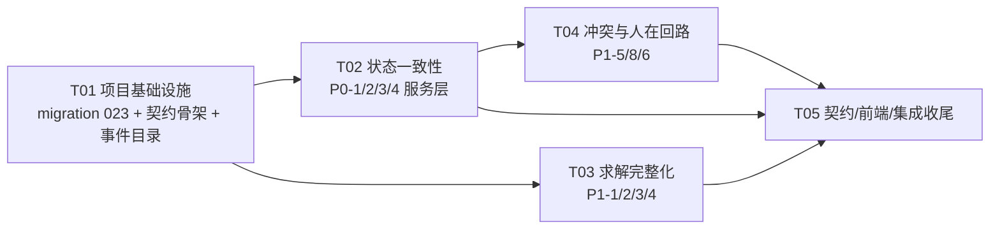

# 06 增量任务分解（Task Breakdown）— Command Map 智能调度升级（Phase 0 完整 + Phase 1 核心）

> 文档编号：TASK-EWOH-CM-2026-08-10-06
> 日期：2026-08-10 ｜ 架构师：高见远（software-architect）
> 依据：05-incremental-design-2026-08-10.md（设计全文）+ PRD + 侦察记录
> 执行顺序：**先补测试暴露问题 → 再改代码**（T02/T03/T04 均按此顺序，G2/G5/G4 明确列出"先写测试"步骤）
> 粒度说明：遵循任务分解硬上限（≤5 任务）；每个任务内按"服务/模块"列出实现顺序，**每个服务可独立提交**（commit 粒度 = 服务/模块），满足"每个任务 ≤ 1 服务改动可独立提交"的粒度要求。

---

## T01 项目基础设施（增量基线：迁移 + 契约骨架 + 事件目录）

**目标**：为本次增量建立可编译、可回滚的基线：新 migration `standalone_023` 三件套 + runner 7 处注册 + drizzle schema 同步 + 共享契约类型骨架 + SSE 事件目录契约。

**改动文件**
- `db/migrations/standalone_023_scheduler_incremental.sql`（新建：约束真实列 valid_from_ms/expires_at_ms/org_id/source/deactivated_at/deactivated_by + 计划 constraints_json/effective_constraints_hash + 空间实体 coordinate_type/floor_id + 设备 location_coordinate_type + 索引 + RLS policy）
- `db/migrations/standalone_023_scheduler_incremental.rollback.sql`（新建：DROP COLUMN IF EXISTS / DROP POLICY IF EXISTS，re-entrant）
- `db/verify/standalone_023_scheduler_incremental.verify.sql`（新建：列计数 + 索引计数 + RLS policy 计数，期望值写入自述）
- `db/runner/run_migrations.js`（修改：7 处注册——FILES / ROLLBACK_COMMANDS / EXECUTE_COMMANDS / usage / verify 分支 / verify 白名单数组 / which 映射）
- `ewoh-spark-app/server/database/schema.ts`（修改：新增列定义）
- `ewoh-spark-app/shared/scheduler.ts`（修改：新增 `CoordinateType`/`CoordinateReference`、`CandidateRejectReason`/`CandidateEvaluation`、`OverridePreviewResponse`、新硬/软约束类型成员、`SchedulingPolicyConfig.preferenceBonusMinutes/setupMinutes/stationCapacityEnforced`、`PriorityResult.policyVersion`、`SchedulingConstraint.validFromMs/expiresAtMs/source/orgId` —— 全部可选/新增，向后兼容）
- `contracts/events/event-catalog.yaml`（修改：补 scheduler/conflict 事件枚举，见 05 §3.5 草案）
- `openapi/ewoh.yaml`（修改：新端点与富化字段的 schema 骨架，实现在 T04 后定稿）

**依赖**：无

**关键实现点**
1. migration 严格参照 `standalone_021/022` 同构（`__EWOH_SCHEMA__` 占位 + `IF NOT EXISTS` 幂等 + `GRANT` + `COMMENT`）；RLS policy 与 `ewoh_scheduling_conflict` 模式一致（`current_setting('app.primary_org_id')` + NULL 放行）。
2. runner 7 处注册后执行 `node db/runner/run_migrations.js --plan standalone_scheduler_incremental` 渲染校验；本机无 postgres 时 CI 环境 apply→verify→rollback 真实验证。
3. 共享契约只做**增量**（新类型/新可选字段），禁止改动既有枚举成员。
4. `ConstraintLoaderService` 尚在 T02 实现；本任务仅落库契约字段，不接调用方。

**验收标准**
- `--plan` 渲染 SQL 无 `__EWOH_SCHEMA__` 残留；rollback/verify 文件齐全且 re-entrant。
- `shared/scheduler.ts` 全部新类型通过 `tsc --noEmit`（tsconfig.node.json + tsconfig.app.json 双端）。
- `contracts/events/event-catalog.yaml` 含 ≥18 个 scheduler 事件条目。
- 不引入任何运行时代码（纯 schema/契约/文档），既有 330 个 scheduler 测试保持全绿。

---

## T02 状态一致性（P0-1 / P0-2 / P0-3 / P0-4 服务层）

**目标**：消除资源视图双轨（G1）；持久化人工约束在全部 4 个 run 路径不丢（G2）；坐标类型化装配（G8）；TaskRequirement 权威化收尾（P0-4）。

**改动文件**（按实现顺序，每项可独立提交）
1. `ewoh-spark-app/server/modules/scheduler/__tests__/constraint-run-loading.spec.ts`（新建，**先写**）：integration 断言 createRun / handleTrigger / preview 三条路径收到 DB 中 active LOCKED_PERSON / EXCLUDED_RESOURCE；断言过期约束（expiresAtMs < now）不参与求解。
2. `constraint-loader.service.ts`（新建）：`loadGlobalActive(ctx, nowMs)` / `loadForPlan(planId, requestConstraints, ctx)` / `hashConstraints(constraints)`；org 过滤 + 有效期过滤 + active 过滤。
3. `plan.service.ts`（修改）：`listPlanConstraints` 读真实列 + 有效期过滤；replan 落 `constraints_json + effective_constraints_hash`；`loadEffectiveConstraints` 迁移到 loader（保持行为等价）。
4. `scheduler.service.ts`（修改）：`createRun` :419 改 `loadGlobalActive(ctx)` 后传 solveVariants。
5. `replan-coordinator.service.ts`（修改）：`handleTrigger` :118 改 `loadGlobalActive(ctx)` 后传 solveVariants。
6. `conflict-preview.service.ts`（修改）：preview :76 改 `loadForPlan(baselinePlanId, [], ctx)` 后传 solveVariants。
7. `resource-projection.service.ts`（修改）：新增 `projectForSnapshot()`；资源投影增加 `coordinate?`。
8. `world-state.service.ts`（修改）：collectState 的 persons/devices/stations 改消费 `projectForSnapshot()`（任务/事件/路由/安全逻辑保留）；坐标装配 `coordinate?`。
9. `__tests__/world-state-derive.spec.ts`（修改，**先补断言后改代码**）：双源一致性断言（world-state vs resources/state 的 capabilities/位置/容量一致）；derived[] 全覆盖断言（P0-4）。
10. `routing.service.ts` / `travel-cost.service.ts` / `route-cost.provider.ts`（修改）：坐标类型化审计（WGS84 不进笛卡尔距离；0,0 兜底回归测试保持）。

**依赖**：T01

**关键实现点**
- **先跑红**：第 1/9 步测试先写并确认失败（createRun 目前传 []，双源目前不一致）→ 再改实现。
- `projectForSnapshot()` 必须保留既有快照字段（availableFromMs/loadLevel/fatigueLevel/dataQuality 等），只换来源不换形状，避免求解器行为漂移。
- 约束加载默认作用域：`ctx.primaryOrgId` + active + 有效期；空结果 = 原行为（向后兼容）。
- 注意：`injectSchedulingEvent → handleTrigger` 与 `dispatchStateTriggers → handleTrigger` 自动获得约束（无需单独改）。

**验收标准**
- `constraint-run-loading.spec.ts` 全绿：LOCK 在 createRun/事件重排/预览后仍生效；EXCLUDE 同理；过期约束不参与。
- `world-state-derive.spec.ts` 全绿：resources/state 与 world-state 对同一 person/device/station 完全一致；无 0,0（grep 断言）；derived[] 标记齐全。
- `routing.spec.ts` / `travel-cost.spec.ts` 全绿（含回归：`from ?? {x:0,y:0}` 不再出现）。
- scheduler 全量 jest 全绿 + `tsc --noEmit` exit 0。

---

## T03 求解完整化（P1-1 / P1-2 / P1-3 / P1-4）

**目标**：Candidate Engine 独立化 + 响应富化（G7）；station 决策变量 + 真实容量/队列 + setup/changeover + 魔法数入策略（G3）；event severity 死路径修复（G4）；硬/软约束集合对齐（G6）。

**改动文件**（按实现顺序，每项可独立提交）
1. `__tests__/candidate-engine-reject.spec.ts`（新建，**先写**）：技能不匹配/证书过期/离线/低电量/工位容量不足/禁入区/时间窗各场景 rejectReasons 正确；hard 不满足不进 feasible set。
2. `__tests__/station-decision.spec.ts`（新建，**先写**）：candidateStationIds 被枚举；容量硬约束；setup/changeover 入评分可解释；两次求解一致。
3. `candidate-engine.service.ts`（新建）：`evaluateTaskCandidates(taskId)` / `buildCandidatePool(task, snapshot, opts)`；复用 EligibilityService + RouteCostProvider + ResourceProjectionService；输出 `CandidateEvaluation[]`（eligible/rejectReasons/scoreBreakdown/routeCost/stationOptions/timeWindows）。
4. `eligibility.service.ts`（修改）：+ health 检查（healthStatus→health_blocked）、station capability（requiredStationCapabilities ⊆ station.capabilities）、station capacity（bookedStationSlots 重叠计数 ≥ capacity → station_capacity_exceeded）、候选 station 范围（not_in_candidate_stations）。
5. `heuristic-scheduling-solver.ts`（修改）：候选生成改调 `buildCandidatePool`；station 决策变量（枚举 candidateStationIds，回退 task.stationId）；容量硬校验；`computeCandidateScore` 增加 station/changeover 项；`PREFERENCE_BONUS_MINUTES` → `config.preferenceBonusMinutes`（:50/:589 移除 magic number）；DecisionTrace 增加 rejected 结构化原因 + hard/soft 明细 + weights 快照。
6. `scheduler.service.ts`（修改）：`getTaskCandidates` 委托 CandidateEngineService（响应富化，旧字段保留）。
7. `constraints.ts`（修改）：SUPPORTED_HARD +STATION_CAPABILITY/+STATION_CAPACITY/重分类 EXCLUDED_RESOURCE；SUPPORTED_SOFT +5（SETUP_COST/CHANGEOVER_COST/STATION_QUEUE_BALANCE/PRODUCTION_IMPACT_PREFERENCE/FATIGUE_BALANCE）；`checkConstraintSupported` 对新类型必须真实执行，否则 UNSUPPORTED_CONSTRAINT。
8. `priority-engine.ts`（修改）：`PriorityInput.events` + `deadlineAtRisk` 装配（snapshot.events open L2/L3 或 DEADLINE_AT_RISK）；输出 `policyVersion`；`computeEffectivePriorityResults` 同步。
9. `heuristic-scheduling-solver.ts`（修改，priority 接线）：:280 处传 `events`（修复 G4 死路径）。
10. `scheduling-policy.service.ts`（修改）：config 透传 `preferenceBonusMinutes/setupMinutes/stationCapacityEnforced`；`parseConfig` runtime validation。
11. `__tests__/priority-engine.spec.ts`（修改）：event_severity factor 出现断言 + 确定性 + policyVersion。
12. `__tests__/solver-fixtures.spec.ts`（修改）：14 fixtures 扩展 constraints/weights 字段；deterministic replay 断言。

**依赖**：T01（可与 T02 并行：solver 消费快照契约不变，T05 做集成）

**关键实现点**
- **先跑红**：第 1/2 步测试先写并确认失败（现状 stationId 硬编码、无 rejectReasons）→ 再改实现。
- `buildCandidatePool` 必须与端点 `evaluateTaskCandidates` 共享同一候选语义（消除双份候选逻辑）。
- station 决策默认开启 `stationDecisionEnabled=true`；false 回退基线 `[task.stationId]`（风险回滚开关，05 §9）。
- 约束分类：新 hard 类型必须真实执行；soft 类型只影响 score（通过 weights）。

**验收标准**
- `candidate-engine-reject.spec.ts` / `station-decision.spec.ts` 全绿。
- `priority-engine.spec.ts`：event_severity 分支真实触发；policyVersion 输出。
- `solver-fixtures.spec.ts`：14 场景两次求解结构 + objective 完全一致；weights 全部来自 policy（无魔法数）。
- `constraints.spec.ts` / `solver-invariants.spec.ts`：任何输出方案无 hard violation。
- 性能基线（求解，不含 IO）：10/100 tasks 秒级、500 < 5s、1000 < 10s；超时显式 fallback（solverStatus/fallbackReason）。

---

## T04 冲突与人在回路（P1-5 / P1-8 / P1-6）

**目标**：GET /conflicts 纯读无副作用 + 显式 reconcile（G5）；Override Preview 端点（P1-8）；PLAN_STALE 事件化 + 局部重排（P1-6 残余）。

**改动文件**（按实现顺序，每项可独立提交）
1. `__tests__/conflict-query-readonly.spec.ts`（新建，**先写**）：GET /conflicts 后 DB 冲突行数不变、SSE 无 conflict.detected 发射。
2. `conflict.service.ts`（修改）：`listConflicts` 改纯读（derive + `mergeWithDbReadOnly`，不 insert/update/emit）；新增 `reconcileNow(ctx)`（迁移既有 reconcile 写逻辑 + SSE + audit）。
3. `scheduler.controller.ts`（修改）：+ `POST /conflicts/reconcile`（调 reconcileNow）。
4. `__tests__/override-preview.spec.ts`（新建，**先写**）：7 项 delta 正确；无副作用（不落库、不触发正式重排）。
5. `override-preview.service.ts`（新建）：`preview(planId, body, ctx)` 纯计算；同一快照 + 请求约束求解候选方案（`PREVIEW-*`，不持久化），与 baseline 对比产出 affectedAssignments/conflictsIntroduced/latenessDelta/travelDelta/workloadDelta/stationWaitDelta/planChurn。
6. `scheduler.controller.ts`（修改）：+ `POST /plans/:planId/overrides/preview`（调 OverridePreviewService）。
7. `scheduler.service.ts`（修改）：`applyOverrides` 前置 safetyCritical 校验（复用 plan.service 守卫）；响应附 preview 引用（可选）。
8. `plan.service.ts`（修改，P1-6）：approve 遇 PLAN_STALE 时 outbox enqueue `stale_plan` 事件 + `replan-coordinator.handleTrigger('PLAN_STALE', planId, ctx)`（带 cause）。
9. `__tests__/dispatch-integration.spec.ts`（修改）：stale approve → outbox 事件 + replan cause 断言。
10. `scheduler.module.ts`（修改）：注册 OverridePreviewService（及 T02/T03 新服务统一登记）。
11. `openapi/ewoh.yaml` / `openapi/route-manifest.json`（修改）：2 个新端点定稿 + route-manifest 重生成。

**依赖**：T01、T02（preview 依赖约束加载；约束生命周期字段在 T01 migration 落库）

**关键实现点**
- **先跑红**：第 1/4 步测试先写并确认失败（现状 GET /conflicts 有写副作用；无 preview 端点）→ 再改实现。
- `mergeWithDbReadOnly` 只投影已落库生命周期字段（status/detectedAt/acknowledgedBy/...），不产生任何 INSERT/UPDATE。
- Preview 为纯计算：planId 前缀 `PREVIEW-`，不调 persistPlan/dispatch；safetyCritical 任务不可被预览动作改变（复用守卫）。
- `conflicts/reconcile` 幂等（同 conflictId 归并语义不变）。

**验收标准**
- `conflict-query-readonly.spec.ts`：GET 后 DB 行数与 SSE 计数不变；`reconcileNow` 显式触发后行数与状态正确。
- `override-preview.spec.ts`：7 项 delta + 无副作用 + 9 类动作单测全绿。
- `dispatch-integration.spec.ts`：PLAN_STALE → outbox stale_plan 事件 + scoped replan（cause=PLAN_STALE）。
- openapi/route-manifest 重生成后 repo-facts 校验 0 undocumented / 0 unimplemented。

---

## T05 契约 / 前端兼容 / 集成收尾

**目标**：全链路集成、契约一致性、前端轻量兼容接入、确定性 replay 最终化、全量回归。

**改动文件**
1. `client/src/types/openapi.d.ts`（重生成：gen:openapi）。
2. `client/src/api/scheduler.ts`（修改）：+ `previewOverrides(planId, body)` / `reconcileConflicts()` 客户端函数。
3. `client/src/pages/CommandMap/vm/candidateExplainVM.ts`（修改）：透传 rejectReasons/scoreBreakdown/stationOptions（不重算资格）。
4. `client/src/pages/CommandMap/panels/OverridePanel.tsx`（修改）："预览后确认"轻量流程（可选，默认不阻塞）。
5. `scheduler-metrics.service.ts`（修改）：+ candidate_count / hard_reject / station_decision / changeover 计数埋点。
6. `__tests__/scheduler-metrics.spec.ts`（修改）：新 metrics 断言。
7. `test/e2e/scheduler-upgrade.e2e.spec.ts`（修改）：+ 约束跨 run 场景、station 决策场景、override preview 场景（环境允许时执行）。
8. `docs/scheduler-commandmap-upgrade/06-incremental-task-breakdown-2026-08-10.md`（本文件）核对验收项。

**依赖**：T02、T03、T04

**关键实现点**
- 全量回归命令：`cd ewoh-spark-app && npx jest modules/scheduler --silent`、`npm run test:client`、`tsc --noEmit`（双端）、`npm run lint`；全仓 `npx jest --runInBand`。
- 确定性 replay 最终化：固定 fixtures（14 场景 × 含 constraints/weights）两次求解结构 + objective 一致。
- 前端改动仅"透传 + 轻量接入"，禁止本地拼装/重算资格/plans[0]。
- migration 真实验证（CI 带 postgres）：apply→verify→rollback 三连。

**验收标准**
- server 全量 jest 全绿（新增 spec 全部纳入）、client 全绿、双端 tsc exit 0、lint 通过。
- repo-facts（route manifest vs live 路由）PASS；openapi 0 undocumented / 0 unimplemented。
- 前端兼容适配完成且旧数据流（SSE/轮询/resync）回归通过。
- 所有 PRD AC（P0-1~P0-5、P1-1~P1-8 全量）可对应到测试或手动验收项。

---

## 依赖图

**实现顺序建议**：T01 →（T02 与 T03 并行）→ T04（依赖 T02 的约束加载）→ T05。T02 与 T03 可在 T01 后并行推进；T04 需 T02 的 `ConstraintLoaderService` 与 T01 的约束字段；T05 收口全部。

**提交粒度**：任务内按服务/模块逐个 commit（如 T02：commit1=constraint-run-loading.spec、commit2=constraint-loader.service、commit3=plan.service、commit4=scheduler.service.createRun、...），每个 commit 可独立构建、独立回滚。
